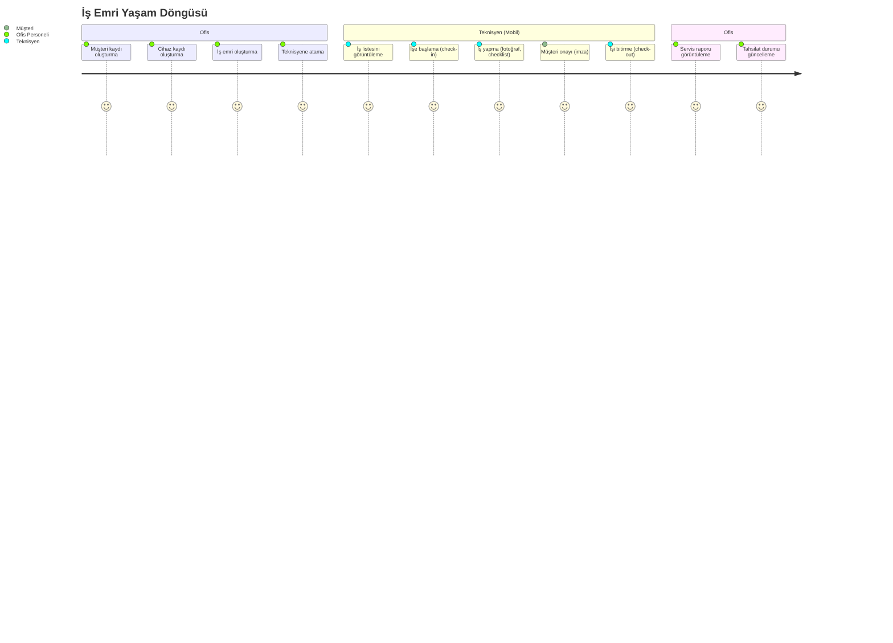

> Proje: Saha Flow
> Doküman: 02 Ürün Gereksinimleri Dokümanı (PRD)
> Durum: Draft
> Üretim tarihi: 2026-07-21
> Kaynak girdi: templates/01_PROJE_GIRDI_FORMU.yaml

# 02 Ürün Gereksinimleri Dokümanı (PRD) — Saha Flow

---

## 1. Ürün Vizyonu

**Saha Flow**, teknik servis firmalarının saha operasyonlarını kağıtsız, şeffaf ve verimli hale getiren; teknisyenin işe başlamasından müşteri onayına ve tahsilata kadar tüm süreci tek bir platformda birleştiren, mobil öncelikli SaaS çözümüdür.

İlk 12 ayda 50 firma, 500 aktif teknisyen ve aylık 250.000 TL yinelenen gelir hedeflenir.

---

## 2. Problem Tanımı

### Mevcut Durum

Küçük ve orta ölçekli teknik servis firmaları günlük operasyonlarını şu araçlarla yönetir:
- Kağıt iş emri formları (kaybolur, okunaksız, arşivlenemez)
- WhatsApp grupları (iş atama, fotoğraf paylaşımı; yapılandırılmamış, aranamaz)
- Excel tabloları (müşteri listesi, tahsilat takibi; çok kullanıcılı değil, hataya açık)
- Telefon görüşmeleri (kayıt dışı, yanlış anlaşılma)

### Sonuçları

- Ayda ortalama %8 iş emri kaybı veya eksik kapanması (sektör tahmini)
- Tahsilat gecikmesi: İş tamamlandıktan sonra ortalama 15 gün tahsilat süresi
- Müşteri şikayeti: "Daha önce ne yapıldı?" sorusuna yanıt verilememesi
- Teknisyen verimliliği ölçülemez; kim ne kadar iş yapıyor bilinemez

---

## 3. Hedef Müşteri ve Segment

| Parametre | Değer |
|---|---|
| Sektör | İklimlendirme (klima, kombi, ısı pompası), güvenlik sistemleri (kamera, alarm), teknik bakım-onarım |
| Coğrafya | Türkiye geneli; ilk aşamada İstanbul, Ankara, İzmir, Bursa, Antalya |
| Firma büyüklüğü | 5-50 saha teknisyeni, 2-10 ofis personeli |
| Karar verici | Firma sahibi (%70) veya operasyon müdürü (%30) |
| Mevcut yazılım | Yok (%60), Excel (%25), sektöre özel olmayan genel SaaS (%10), rakip ürün (%5) |

### Persona Özetleri

| Persona | Rol | Temel İhtiyaç | Teknoloji Yetkinliği |
|---|---|---|---|
| Ahmet Bey | Firma sahibi, 45 yaş | Geliri artırmak, sahadan haberdar olmak | Orta-düşük |
| Ayşe Hanım | Ofis/operasyon sorumlusu, 32 yaş | İşleri hızlı atamak, tahsilatı takip etmek | Orta |
| Mehmet | Saha teknisyeni, 28 yaş | İş listesini görmek, işi hızlı kapatmak | Orta-düşük |

---

## 4. Kullanıcı Rolleri

| Rol | Kapsam | Yetkiler |
|---|---|---|
| **Admin** | Tenant yöneticisi | Firma ayarları, kullanıcı yönetimi (ekle/çıkar/rol ata), tüm iş emirlerini görme, raporlama |
| **Ofis Personeli** | Operasyon ekibi | Müşteri/cihaz/iş emri CRUD, teknisyene atama, tahsilat durumu güncelleme, rapor görüntüleme |
| **Teknisyen** | Saha çalışanı | Kendine atanan işleri görme, iş başlatma/bitirme, fotoğraf ekleme, checklist doldurma, müşteri onayı alma; yalnızca kendi işlerini görür |
| **Müşteri (dolaylı)** | Hizmet alan | Mobil uygulamada imza atar; MVP'de bağımsız paneli yoktur |

---

## 5. Jobs to be Done (JTBD)

| # | Durum | Motivasyon | Beklenen Sonuç |
|---|---|---|---|
| JTBD-01 | Ofis personeli sabah işleri dağıtırken | Her teknisyene uygun işleri hızlı atamak ister | İş emri oluşturulur ve teknisyene anında bildirim gider |
| JTBD-02 | Teknisyen müşteriye giderken | Hangi adrese, hangi cihaza, ne için gittiğini bilmek ister | İş detayı, müşteri bilgisi ve cihaz geçmişi mobilde görünür |
| JTBD-03 | Teknisyen işe başlarken | İşe başladığını kanıtlamak ve ofisi haberdar etmek ister | Konumlu check-in ile ofise anında bilgi gider |
| JTBD-04 | Teknisyen işi bitirirken | Yapılan işi belgelemek ve müşteri onayı almak ister | Fotoğraf, checklist, imza ile iş kapanır |
| JTBD-05 | Firma sahibi ay sonunda | Hangi işlerin tahsil edilmediğini görmek ister | Tahsilat raporu ile açık kalemler listelenir |
| JTBD-06 | Ofis personeli müşteri aradığında | Daha önceki servis kayıtlarını hızlı bulmak ister | Cihaz bazında servis geçmişi görüntülenir |

---

## 6. Kullanıcı Yolculukları

### Ana İş Akışı (Mermaid)



---

## 7. Kullanıcı Hikayeleri (Gherkin Formatı)

### Müşteri Yönetimi

```gherkin
# US-001
Özellik: Yeni müşteri kaydı oluşturma
  Bir ofis personeli olarak
  Saha ekibinin hizmet vereceği müşterileri sisteme kaydetmek istiyorum
  Böylece iş emri oluştururken müşteri seçebileyim

  Senaryo: Başarılı müşteri kaydı
    Geçerli ad, soyad, telefon ve adres bilgilerini girdiğimde
    Müşteri kaydı oluşturulur ve müşteri listesinde görünür

  Senaryo: Zorunlu alan eksik
    Telefon numarası girmeden kaydetmeye çalıştığımda
    Sistem "Telefon numarası zorunludur" hatası verir
```

```gherkin
# US-002
Özellik: Müşteri adresini haritada gösterme
  Bir ofis personeli veya teknisyen olarak
  Müşteri adresinin harita üzerindeki konumunu görmek istiyorum
  Böylece navigasyona kolayca aktarabilirim

  Senaryo: Geçerli adres için harita gösterimi
    Adres bilgisi dolu bir müşteri kaydını açtığımda
    Adres harita üzerinde iğne (pin) ile gösterilir
```

### İş Emri Yönetimi

```gherkin
# US-003
Özellik: Yeni iş emri oluşturma
  Bir ofis personeli olarak
  Müşteri, cihaz ve arıza/açıklama bilgileriyle iş emri oluşturmak istiyorum
  Böylece iş kaydı sisteme girilsin ve takip edilebilsin

  Senaryo: Başarılı iş emri oluşturma
    Geçerli müşteri, cihaz ve açıklama bilgilerini girdiğimde
    İş emri "BEKLIYOR" durumunda oluşturulur ve listeye eklenir

  Senaryo: Müşteri seçilmeden oluşturma
    Müşteri seçmeden iş emri oluşturmaya çalıştığımda
    Sistem "Lütfen bir müşteri seçin" hatası verir
```

```gherkin
# US-004
Özellik: İş emrini teknisyene atama
  Bir ofis personeli olarak
  "BEKLIYOR" durumundaki bir iş emrini bir teknisyene atamak istiyorum
  Böylece teknisyen işi mobil uygulamasında görsün

  Senaryo: Başarılı atama
    BEKLIYOR durumundaki bir iş emri için uygun bir teknisyen seçtiğimde
    İş emri "ATANDI" durumuna geçer ve teknisyene bildirim gider
```

```gherkin
# US-005
Özellik: İş emri durumunu görüntüleme
  Bir ofis personeli olarak
  Tüm iş emirlerinin güncel durumlarını liste halinde görmek istiyorum
  Böylece hangi işlerin beklemede, atanmış veya tamamlanmış olduğunu takip edebileyim

  Senaryo: Durum bazlı filtreleme
    İş emri listesinde "ATANDI" filtresini seçtiğimde
    Yalnızca ATANDI durumundaki iş emirleri listelenir
```

### Mobil Saha Uygulaması

```gherkin
# US-006
Özellik: Kendi iş listesini görüntüleme
  Bir teknisyen olarak
  Bana atanmış iş emirlerini mobil uygulamada görmek istiyorum
  Böylece hangi işlere gideceğimi bileyim

  Senaryo: İş listesi gösterimi
    Mobil uygulamayı açtığımda
    Bana atanmış ve ATANDI/YOLDA/BASLADI durumundaki iş emirleri listelenir
```

```gherkin
# US-007
Özellik: Konumlu iş başlatma (check-in)
  Bir teknisyen olarak
  Müşteri adresine vardığımda işi konum bilgisiyle başlatmak istiyorum
  Böylece ofis varış zamanımı ve konumumu teyit edebilsin

  Senaryo: Başarılı check-in
    İş emri detayında "İşe Başla" butonuna bastığımda
    Konumum alınır, iş emri "BASLADI" durumuna geçer ve başlangıç zamanı kaydedilir

  Senaryo: Konum kapalıyken check-in
    Cihazda konum servisi kapalıyken "İşe Başla"ya bastığımda
    Sistem "Konum erişimi gerekli" uyarısı verir ve işlemi engeller
```

```gherkin
# US-008
Özellik: İşe fotoğraf ekleme
  Bir teknisyen olarak
  Yaptığım işi belgelemek için fotoğraf çekmek istiyorum
  Böylece servis raporunda görsel kanıt olsun

  Senaryo: Fotoğraf çekme ve kaydetme
    İş emri içinde "Fotoğraf Ekle"ye basıp fotoğraf çektiğimde
    Fotoğraf iş emrine eklenir ve küçük önizleme olarak görünür

  Senaryo: Çoklu fotoğraf limiti
    20 adet fotoğraf ekledikten sonra tekrar eklemeye çalıştığımda
    Sistem "En fazla 20 fotoğraf ekleyebilirsiniz" hatası verir
```

```gherkin
# US-009
Özellik: Kontrol listesi (checklist) doldurma
  Bir teknisyen olarak
  Önceden tanımlanmış kontrol adımlarını işaretlemek istiyorum
  Böylece işin eksiksiz yapıldığı kayıt altına alınsın

  Senaryo: Checklist tamamlama
    İş emrine bağlı checklist maddelerini tek tek işaretlediğimde
    Her madde "Tamamlandı" olarak kaydedilir ve ilerleme yüzdesi güncellenir
```

```gherkin
# US-010
Özellik: Müşteri imza onayı
  Bir teknisyen olarak
  İş tamamlandıktan sonra müşteriden dokunmatik imza almak istiyorum
  Böylece müşteri işi onayladığını teyit etsin

  Senaryo: İmza alınması
    Müşteri mobil ekranda imza alanına imzasını attığında
    İmza görüntüsü iş emrine kaydedilir ve PDF rapora eklenir
```

```gherkin
# US-011
Özellik: Konumlu iş bitirme (check-out)
  Bir teknisyen olarak
  İşi tamamladıktan sonra konum bilgisiyle işi bitirmek istiyorum
  Böylece iş süresi ve bitiş konumu kayıt altına alınsın

  Senaryo: Başarılı check-out
    Tüm zorunlu adımlar tamamlandıktan sonra "İşi Bitir"e bastığımda
    İş emri "TAMAMLANDI" durumuna geçer ve bitiş zamanı kaydedilir

  Senaryo: İmza eksikken check-out
    Müşteri imzası alınmadan "İşi Bitir"e bastığımda
    Sistem "Lütfen müşteri onayı alın" uyarısı verir
```

### Offline Çalışma

```gherkin
# US-012
Özellik: İnternetsiz ortamda iş yapabilme
  Bir teknisyen olarak
  İnternet bağlantısı olmayan bölgelerde de iş emirlerini görüntülemek ve işlem yapmak istiyorum
  Böylece bağlantı sorunu iş akışımı engellemesin

  Senaryo: Offline iş başlatma
    İnternet bağlantısı yokken "İşe Başla"ya bastığımda
    İşlem yerel olarak kaydedilir; bağlantı gelince otomatik senkronize olur

  Senaryo: Offline fotoğraf çekme
    İnternet bağlantısı yokken fotoğraf çektiğimde
    Fotoğraf cihazda saklanır; bağlantı gelince otomatik yüklenir
```

### Tahsilat Takibi

```gherkin
# US-013
Özellik: İş bazında tahsilat durumu güncelleme
  Bir ofis personeli olarak
  Tamamlanan işin tahsilat durumunu işaretlemek istiyorum
  Böylece hangi işlerin tahsil edilmediğini takip edebileyim

  Senaryo: Tahsilat durumu güncelleme
    TAMAMLANDI durumundaki bir iş için "Tahsil Edildi" seçeneğini işaretlediğimde
    İş emrinin tahsilat durumu güncellenir ve ödeme tipi kaydedilir

  Senaryo: Tamamlanmamış işte tahsilat
    TAMAMLANDI durumunda olmayan bir iş için tahsilat güncellemeye çalıştığımda
    Sistem "Yalnızca tamamlanmış işler için tahsilat girilebilir" hatası verir
```

### Servis Raporu

```gherkin
# US-014
Özellik: PDF servis raporu görüntüleme ve indirme
  Bir ofis personeli olarak
  Tamamlanan işlerin profesyonel servis raporunu PDF olarak görmek ve indirmek istiyorum
  Böylece müşteriye veya muhasebeye iletebileyim

  Senaryo: PDF rapor oluşturma
    TAMAMLANDI durumundaki bir iş için "Rapor" butonuna bastığımda
    İş detayı, fotoğraflar, checklist ve imzayı içeren PDF raporu görüntülenir
```

```gherkin
# US-015
Özellik: Temel raporlama panosu
  Bir admin veya ofis personeli olarak
  Günlük ve haftalık iş özetlerini görmek istiyorum
  Böylece ekibin performansını takip edebileyim

  Senaryo: Günlük özet
    Raporlama sayfasını açtığımda
    Bugüne ait toplam iş, tamamlanan iş ve tahsilat özeti görüntülenir
```

---

## 8. Fonksiyonel Gereksinimler

### Tenant ve Kullanıcı Yönetimi

| ID | Gereksinim | Öncelik |
|---|---|---|
| FR-001 | Sistem, çok kiracılı (multi-tenant) çalışmalı; her tenant yalnızca kendi verisine erişebilmeli | P0 |
| FR-002 | Admin kullanıcısı, kendi tenant'ı altında ofis personeli ve teknisyen kullanıcısı oluşturabilmeli | P0 |
| FR-003 | Kullanıcı rolleri (Admin, Ofis Personeli, Teknisyen) RBAC ile yönetilmeli | P0 |
| FR-004 | Kullanıcı girişi e-posta ve şifre ile JWT tabanlı yapılmalı; refresh token desteklenmeli | P0 |
| FR-005 | Şifre sıfırlama akışı e-posta ile çalışmalı | P1 |

### Müşteri Yönetimi

| ID | Gereksinim | Öncelik |
|---|---|---|
| FR-006 | Müşteri kaydı; ad, soyad, telefon (zorunlu), e-posta (opsiyonel), adres bilgilerini içermeli | P0 |
| FR-007 | Müşteri adresi, PostGIS kullanılarak koordinatlı saklanmalı ve haritada gösterilmeli | P0 |
| FR-008 | Müşteri listesi, arama (ad, telefon, adres) ve sayfalama ile sunulmalı | P0 |
| FR-009 | Müşteriye ait geçmiş iş emirleri listelenebilmeli | P1 |

### Cihaz / Envanter Yönetimi

| ID | Gereksinim | Öncelik |
|---|---|---|
| FR-010 | Cihaz kaydı; müşteriye bağlı olarak marka, model, seri numarası, cihaz tipi bilgilerini içermeli | P0 |
| FR-011 | Bir müşteriye birden fazla cihaz tanımlanabilmeli | P0 |
| FR-012 | Cihaz detay sayfasında, o cihaza ait geçmiş iş emirleri listelenmeli | P1 |

### İş Emri Yönetimi

| ID | Gereksinim | Öncelik |
|---|---|---|
| FR-013 | İş emri; müşteri, cihaz, arıza/açıklama, öncelik (düşük/orta/yüksek/acil) bilgileriyle oluşturulmalı | P0 |
| FR-014 | İş emri, aşağıdaki durumlar arasında tanımlı geçiş kurallarına göre hareket etmeli: BEKLIYOR -> ATANDI -> YOLDA -> BASLADI -> TAMAMLANDI / IPTAL | P0 |
| FR-015 | İş emri, bir teknisyene atanabilmeli; aynı anda birden fazla teknisyene atanamaz | P0 |
| FR-016 | İş emri listesi; durum, öncelik, tarih, teknisyen ve müşteriye göre filtrelenebilmeli | P0 |
| FR-017 | İş emri IPTAL edildiğinde, iptal nedeni zorunlu olarak girilmeli | P1 |
| FR-018 | İş emri numarası, her tenant için ayrı otomatik artan seri olarak üretilmeli | P0 |

### Mobil Saha Uygulaması

| ID | Gereksinim | Öncelik |
|---|---|---|
| FR-019 | Teknisyen, kendisine atanan işleri mobil uygulamada liste olarak görmeli | P0 |
| FR-020 | Teknisyen, işe başlarken konum bilgisi (GPS) ile check-in yapabilmeli | P0 |
| FR-021 | Teknisyen, iş sırasında fotoğraf çekebilmeli (kamera veya galeriden) | P0 |
| FR-022 | Teknisyen, iş emrine bağlı kontrol listesini (checklist) doldurabilmeli | P0 |
| FR-023 | Teknisyen, müşteriden dokunmatik imza alabilmeli | P0 |
| FR-024 | Teknisyen, işi bitirirken konum bilgisi ile check-out yapabilmeli | P0 |
| FR-025 | Mobil uygulama, internet bağlantısı olmadan çalışabilmeli (offline-first); bağlantı geldiğinde otomatik senkronize olmalı | P0 |
| FR-026 | Offline senkronizasyon çakışmalarında, son yazan kazanır (last-write-wins) stratejisi uygulanmalı | P0 |

### Servis Raporu

| ID | Gereksinim | Öncelik |
|---|---|---|
| FR-027 | Tamamlanan iş emrinden otomatik PDF servis raporu üretilmeli; iş detayı, fotoğraflar, checklist ve müşteri imzasını içermeli | P0 |
| FR-028 | PDF rapor, web paneli üzerinden görüntülenebilmeli ve indirilebilmeli | P0 |

### Tahsilat Takibi

| ID | Gereksinim | Öncelik |
|---|---|---|
| FR-029 | Tamamlanan iş emri için tahsilat durumu (Tahsil Edildi / Edilmedi / Kısmi) ve ödeme tipi (Nakit, Kredi Kartı, Havale) kaydedilebilmeli | P0 |
| FR-030 | Tahsil edilmemiş işler, ayrı bir listede raporlanabilmeli | P1 |

---

## 9. Fonksiyonel Olmayan Gereksinimler

| ID | Kategori | Gereksinim |
|---|---|---|
| NFR-001 | Performans | İş emri listesi (sayfalı) 2 saniye içinde yüklenmeli |
| NFR-002 | Performans | Mobil check-in/check-out işlemi 3 saniye içinde tamamlanmalı |
| NFR-003 | Kullanılabilirlik | Sistem aylık %99,5 uptime (en fazla 3,6 saat kesinti/ay) sağlamalı |
| NFR-004 | Güvenlik | Tüm API iletişimi HTTPS üzerinden yapılmalı |
| NFR-005 | Güvenlik | JWT token 15 dakika TTL, refresh token 7 gün TTL olmalı |
| NFR-006 | Güvenlik | Tüm sorgularda tenant_id filtresi zorunlu olmalı; cross-tenant veri erişimi engellenmeli |
| NFR-007 | Güvenlik | Dosya yükleme/indirme için presigned URL kullanılmalı; TTL 5 dakika |
| NFR-008 | Mobil | Android 10+ ve iOS 15+ desteklenmeli |
| NFR-009 | Mobil | Offline modda en az 50 iş emri ve 200 fotoğraf saklanabilmeli |
| NFR-010 | Veri | Müşteri kişisel verileri KVKK uyumlu saklanmalı; silme talebine karşılık anonimleştirme veya silme yapılabilmeli |
| NFR-011 | Tarayıcı | Web panel, son 2 sürüm Chrome, Firefox, Safari ve Edge tarayıcılarını desteklemeli |
| NFR-012 | Ölçeklenebilirlik | Sistem, 100 eş zamanlı ofis kullanıcısı ve 500 mobil teknisyeni desteklemeli |

---

## 10. MVP Kapsamı ve Kapsam Dışı

### MVP Kapsamı (v1.0)

- Müşteri ve adres yönetimi
- Cihaz/envanter yönetimi
- İş emri oluşturma, atama ve durum takibi
- Mobil uygulama (iş listesi, check-in/out, fotoğraf, checklist, imza, offline)
- PDF servis raporu
- Tahsilat durumu takibi (manuel)
- Temel raporlama (günlük/haftalık özet)
- Çok kiracılı (tenant) yapı
- RBAC (Admin, Ofis, Teknisyen)

### Kapsam Dışı (v2 ve sonrası)

- Stok/yedek parça yönetimi
- Canlı araç takibi
- Müşteri self-servis portalı (web)
- Rota optimizasyonu (AI)
- Ödeme entegrasyonu (POS, banka, sanal pos)
- Beyaz etiket (white label)
- Çok dilli arayüz
- Takvim/planlama panosu (drag-drop)
- API dış entegrasyonları (muhasebe, ERP)
- SLA ve garanti yönetimi
- SMS bildirimi
- Çoklu teknisyen ataması

---

## 11. Kabul Kriterleri (MVP)

| # | Kriter |
|---|---|
| AK-01 | Bir ofis personeli, 2 dakika içinde yeni müşteri kaydı oluşturup iş emrine dönüştürebilir |
| AK-02 | Teknisyen, mobil uygulamada kendine atanan işi görür ve 30 saniye içinde check-in yapabilir |
| AK-03 | Teknisyen, internet bağlantısı olmadan en az 4 saat boyunca işlem yapabilir; bağlantı geldiğinde tüm veri 5 dakika içinde senkronize olur |
| AK-04 | İş tamamlandığında, PDF servis raporu 10 saniye içinde oluşturulur |
| AK-05 | Firma sahibi, ay sonunda tahsil edilmemiş işleri tek ekranda görebilir |
| AK-06 | Bir firmaya ait veriler, başka bir firmanın kullanıcısı tarafından hiçbir koşulda görüntülenemez |
| AK-07 | Pilot kullanıcıların %80'i, 2 haftalık kullanım sonrası ürünü tavsiye eder (NPS > 30) |

---

## 12. Başarı Metrikleri

| Metrik | Hedef (İlk 6 Ay) | Ölçüm Yöntemi |
|---|---|---|
| Aktif tenant sayısı | 50 | Veritabanı sorgusu |
| Aktif teknisyen sayısı | 500 | Günlük giriş yapan tekil teknisyen |
| Aylık yinelenen gelir (MRR) | 250.000 TL | Fatura kayıtları |
| Aylık tamamlanan iş emri | 10.000+ | İş emri durum sayacı |
| Teknisyen başına günlük iş | 5+ (ortalama) | Raporlama modülü |
| Churn rate (aylık) | < %5 | İptal edilen abonelikler |
| Ortalama tahsilat süresi | İş bitiminden sonra < 3 gün | Tahsilat tarihi - iş bitiş tarihi |
| PDF rapor üretim süresi (p95) | < 10 sn | APM / log analizi |

---

## 13. Fiyatlandırma Hipotezi

| Plan | Teknisyen Sayısı | Aylık Ücret (TL, KDV hariç) | Özellikler |
|---|---|---|---|
| Başlangıç | 1-10 | 500 TL/teknisyen | Tüm MVP özellikleri |
| Profesyonel | 11-30 | 450 TL/teknisyen | Tüm MVP özellikleri + öncelikli destek |
| Kurumsal | 31-50+ | 400 TL/teknisyen | Tüm MVP özellikleri + özel onboarding + SLA |

**Varsayım:** Fiyatlar pazar araştırması ile doğrulanacaktır. İlk 10 pilot firmaya 3 ay ücretsiz kullanım sunulabilir (startup programı).

---

## Karar Bekleyen Konular

- Fiyatlandırma hipotezinin pazar araştırması ile doğrulanması
- Trial süresinin (varsa) belirlenmesi
- Mobil uygulamanın App Store/Google Play'de mi yoksa kurumsal dağıtım ile mi sunulacağı
- KVKK uyum sürecinin tamamlanması ve veri saklama/silme politikalarının netleştirilmesi
- Pilot firma seçimi ve onboarding takvimi

## İlgili Dokümanlar

| Doküman | Açıklama |
|---|---|
| `00_EXECUTIVE_SUMMARY.md` | Proje özeti ve riskler |
| `01_ASSUMPTIONS_AND_QUESTIONS.md` | Varsayımlar ve açık sorular |
| `03_DOMAIN_MODEL.md` | Domain modeli ve iş kuralları |
| `04_SOLUTION_ARCHITECTURE.md` | Çözüm mimarisi dokümanı |
