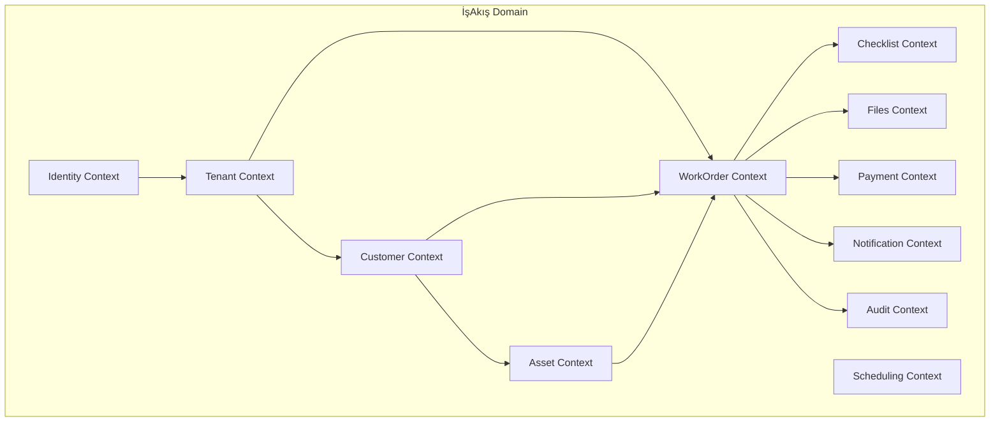
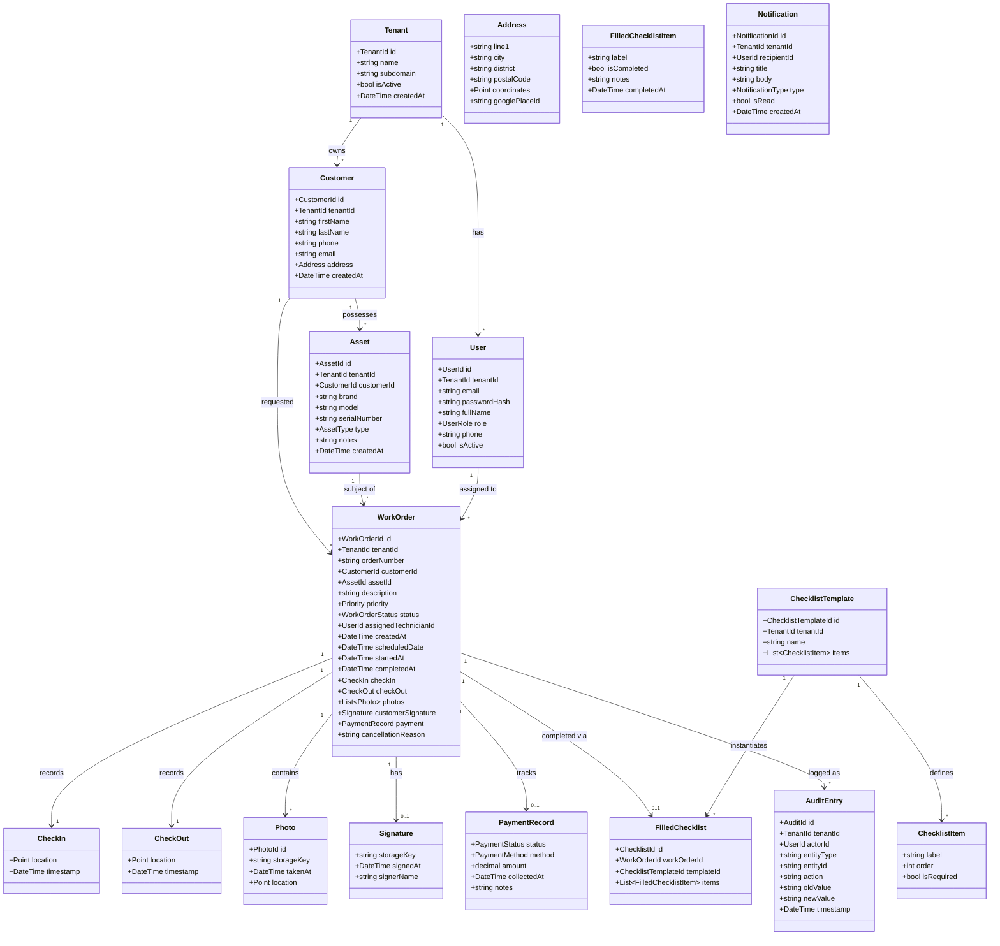
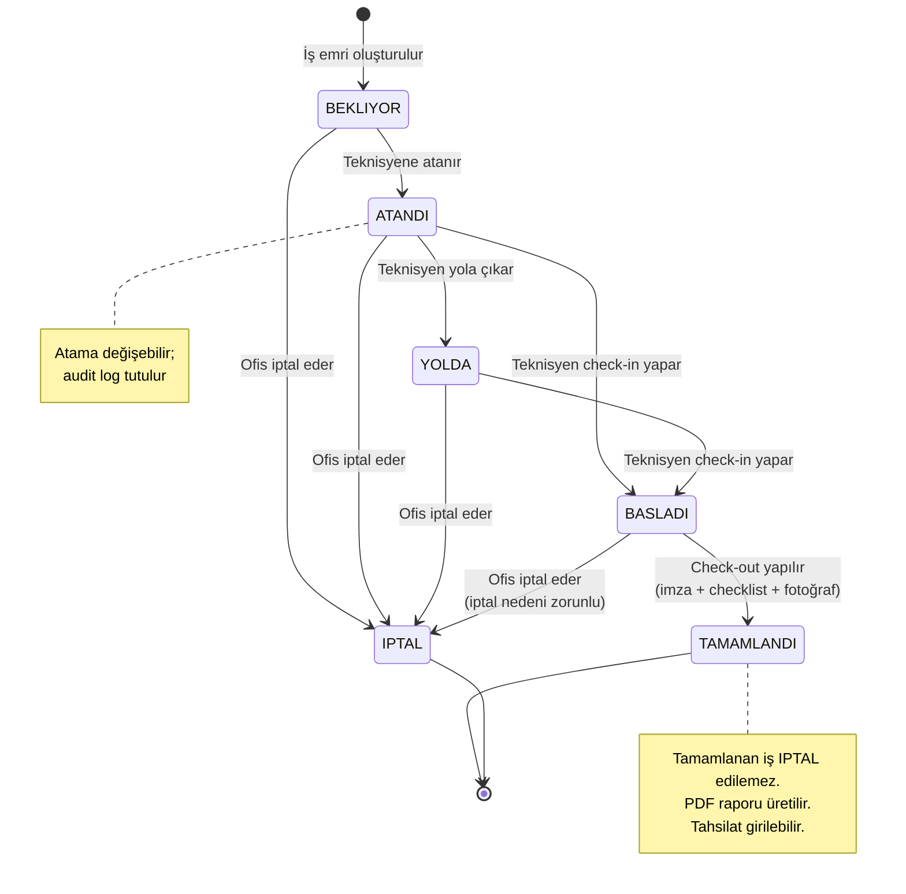
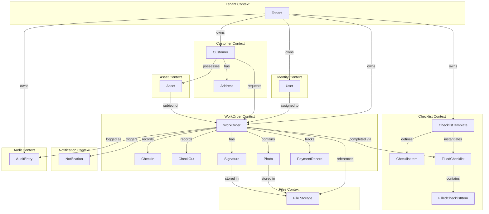

> Proje: İşAkış
> Doküman: 03 Domain Modeli
> Durum: Draft
> Üretim tarihi: 2026-07-21
> Kaynak girdi: templates/01_PROJE_GIRDI_FORMU.yaml

# 03 Domain Modeli — İşAkış

---

## 1. Bounded Context Adayları

Aşağıdaki bounded context'ler, domain'in karmaşıklığını yönetmek ve ekipler arası sorumlulukları ayırmak için tanımlanmıştır. MVP'de tüm context'ler aynı monolitik backend içinde modül olarak yer alır; gelecekte mikroservislere ayrıştırılabilir.

| Context | Sorumluluk | MVP'de Durum |
|---|---|---|
| **Identity** | Kullanıcı kaydı, giriş, JWT yönetimi, şifre sıfırlama | Tam |
| **Tenant** | Firma kaydı, tenant yapılandırması, tenant başına kullanıcı sayısı limiti | Tam |
| **Customer** | Müşteri (son tüketici) kaydı, adres, iletişim, konum (PostGIS) | Tam |
| **Asset** | Müşteriye bağlı cihaz/envanter kaydı, servis geçmişi | Tam |
| **WorkOrder** | İş emri yaşam döngüsü, durum makinesi, atama, tahsilat durumu | Tam |
| **Scheduling** | İş emrinin teknisyene atanması; en yakın teknisyen sorgusu | Tam (MVP'de basit) |
| **Checklist** | İş emrine bağlı kontrol listesi şablonları ve doldurma | Tam |
| **Files** | Fotoğraf, imza, PDF rapor; S3 presigned URL yönetimi | Tam |
| **Notification** | E-posta bildirimi (iş atama, tamamlanma) | Kısmi (MVP: e-posta) |
| **Audit** | Tüm durum değişikliklerinin kaydı (event sourcing değil, basit audit log) | Kısmi (MVP: temel) |
| **Payment** | İş bazında tahsilat durumu ve ödeme tipi takibi | Tam (manuel) |

---

## 2. Domain Kavramları

### Aggregate, Entity ve Value Object Adayları

### Enumeration'lar

| Enum | Değerler |
|---|---|
| `UserRole` | `ADMIN`, `OFFICE_STAFF`, `TECHNICIAN` |
| `WorkOrderStatus` | `BEKLIYOR`, `ATANDI`, `YOLDA`, `BASLADI`, `TAMAMLANDI`, `IPTAL` |
| `Priority` | `DUSUK`, `ORTA`, `YUKSEK`, `ACIL` |
| `AssetType` | `KLIMA`, `KOMBI`, `GUVENLIK_KAMERASI`, `GUVENLIK_ALARM`, `DIGER` |
| `PaymentStatus` | `TAHSIL_EDILDI`, `EDILMEDI`, `KISMI` |
| `PaymentMethod` | `NAKIT`, `KREDI_KARTI`, `HAVALE` |
| `NotificationType` | `IS_ATANDI`, `IS_TAMAMLANDI`, `IS_IPTAL` |

---

## 3. İş Kuralları ve Invariant'lar

| # | Kural | Tip | Açıklama |
|---|---|---|---|
| BR-001 | Tenant izolasyonu | Invariant | Her aggregate sorgusunda tenant_id filtresi zorunludur. Bir tenant, başka bir tenant'ın verisine hiçbir koşulda erişemez. |
| BR-002 | İş emri - müşteri tutarlılığı | Invariant | İş emri oluşturulurken seçilen müşteri, iş emrinin ait olduğu tenant'a ait olmalıdır. |
| BR-003 | Cihaz - müşteri tutarlılığı | Invariant | İş emrine bağlanan cihaz, iş emrindeki müşteriye ait olmalıdır. |
| BR-004 | Tek atama | Invariant | Bir iş emri aynı anda yalnızca bir teknisyene atanabilir. Atama değiştirilebilir ancak atama değişikliği audit log'a kaydedilir. |
| BR-005 | Durum geçiş kuralları | Invariant | İş emri durumu yalnızca tanımlı geçişlere izin verir (bkz. Durum Makinesi). Geçersiz geçiş talebi hata döner. |
| BR-006 | Check-in ön koşulu | Pre-condition | Teknisyen check-in yapabilmesi için iş emri ATANDI veya YOLDA durumunda olmalıdır. |
| BR-007 | Check-out ön koşulu | Pre-condition | Teknisyen check-out yapabilmesi için iş emri BASLADI durumunda olmalı VE müşteri imzası alınmış olmalıdır. |
| BR-008 | İptal kısıtı | Invariant | TAMAMLANDI durumundaki iş emri IPTAL edilemez. IPTAL edilen iş emri tekrar aktif edilemez. |
| BR-009 | Fotoğraf limiti | Invariant | Bir iş emrine en fazla 20 fotoğraf eklenebilir. |
| BR-010 | Tahsilat ön koşulu | Pre-condition | Tahsilat durumu yalnızca TAMAMLANDI durumundaki iş emirleri için güncellenebilir. |
| BR-011 | Customer silme kısıtı | Invariant | Açık (TAMAMLANDI veya IPTAL olmayan) iş emri bulunan müşteri silinemez; önce açık iş emirleri kapatılmalıdır. |
| BR-012 | Asset silme kısıtı | Invariant | Açık iş emri bulunan cihaz silinemez. |
| BR-013 | İş emri numarası teklik | Invariant | İş emri numarası, tenant bazında tekil olmalıdır. Format: `WO-{tenantPrefix}-{sequence}` (varsayım). |
| BR-014 | Teknisyen kendi işini görür | Invariant | Teknisyen rolündeki kullanıcı, API üzerinden yalnızca kendisine atanmış iş emirlerini sorgulayabilir. Ofis personeli tenant içindeki tüm işleri görebilir. |
| BR-015 | Checklist şablonu tenant'a aittir | Invariant | Bir checklist şablonu, yalnızca ait olduğu tenant'ın iş emirlerinde kullanılabilir. |

---

## 4. WorkOrder Durum Makinesi

### Durum Geçiş Matrisi

| Şu Anki Durum | Geçilebilir Durum | İzinli Rol |
|---|---|---|
| BEKLIYOR | ATANDI | Ofis Personeli, Admin |
| BEKLIYOR | IPTAL | Ofis Personeli, Admin |
| ATANDI | YOLDA | Teknisyen |
| ATANDI | BASLADI | Teknisyen |
| ATANDI | IPTAL | Ofis Personeli, Admin |
| YOLDA | BASLADI | Teknisyen |
| YOLDA | IPTAL | Ofis Personeli, Admin |
| BASLADI | TAMAMLANDI | Teknisyen |
| BASLADI | IPTAL | Ofis Personeli, Admin |

---

## 5. Domain Event Adayları

| Event | Tetikleyen | Tüketici | Senkron/Asenkron |
|---|---|---|---|
| `WorkOrderCreated` | Ofis personeli iş emri oluşturur | Audit, Notification | Asenkron |
| `WorkOrderAssigned` | Ofis personeli teknisyen atar | Audit, Notification (teknisyene e-posta) | Asenkron |
| `WorkOrderTechnicianEnRoute` | Teknisyen "Yola Çıktı" işaretler | Audit | Asenkron |
| `WorkOrderStarted` | Teknisyen check-in yapar | Audit | Asenkron |
| `WorkOrderCompleted` | Teknisyen check-out yapar | Audit, Notification (ofise e-posta), PDF üretim kuyruğu | Asenkron |
| `WorkOrderCancelled` | Ofis personeli iptal eder | Audit, Notification | Asenkron |
| `WorkOrderPaymentUpdated` | Ofis personeli tahsilat girer | Audit | Asenkron |
| `PhotoAdded` | Teknisyen fotoğraf yükler | Audit | Asenkron |
| `CustomerCreated` | Ofis personeli müşteri kaydeder | Audit | Asenkron |
| `AssetCreated` | Ofis personeli cihaz kaydeder | Audit | Asenkron |

---

## 6. Domain Diyagramı (Mermaid)

---

## 7. Terimler Sözlüğü

| Terim | İngilizce Karşılığı | Açıklama |
|---|---|---|
| **Tenant** | Tenant | İşAkış'ı kullanan her bir servis firması. Kendi kullanıcıları, müşterileri ve verileri vardır. |
| **Müşteri** | Customer | Servis firmasının hizmet verdiği son tüketici (birey veya kurum). İş emrinin yönlendirildiği taraftır. |
| **Cihaz** | Asset | Müşteriye ait, üzerinde servis işlemi yapılan fiziksel ekipman (klima, kombi, alarm paneli vb.). |
| **İş Emri** | WorkOrder | Müşteri ve cihaz bazında açılan, bir teknisyen tarafından yerine getirilmesi beklenen servis talebi. |
| **Check-in** | Check-In | Teknisyenin iş başında olduğunu GPS konumu ve zaman damgası ile kaydetmesi. |
| **Check-out** | Check-Out | Teknisyenin işi bitirdiğini GPS konumu ve zaman damgası ile kaydetmesi. |
| **Kontrol Listesi** | Checklist | İş emri sırasında teknisyenin adım adım doldurduğu, önceden tanımlanmış doğrulama maddeleri. |
| **Servis Raporu** | Service Report | İş tamamlandıktan sonra otomatik oluşturulan, iş detayı, fotoğraf, checklist ve müşteri imzasını içeren PDF belge. |
| **Tahsilat Durumu** | Payment Status | İş emrinin ödemesinin alınıp alınmadığını belirten durum bilgisi. |
| **Presigned URL** | Presigned URL | S3 uyumlu depolamaya geçici yetkili erişim sağlayan, belirli TTL'li imzalı URL. |
| **Offline-first** | Offline-First | Mobil uygulamanın internet bağlantısı olmadan da çalışabilmesi; veriyi yerel olarak saklayıp bağlantı gelince senkronize etmesi. |
| **RBAC** | Role-Based Access Control | Kullanıcı rollerine (Admin, Ofis, Teknisyen) göre yetkilendirme yapılması. |
| **Multi-tenant** | Multi-Tenant | Tek bir uygulama örneğinin birden fazla firmaya (tenant) hizmet vermesi; her firmanın verisi diğerlerinden izole edilir. |
| **JWT** | JSON Web Token | Kimlik doğrulama için kullanılan, imzalı token tabanlı oturum yönetimi. |
| **Aggregate** | Aggregate | Domain-Driven Design'da bir bütün olarak işlem gören, bir kök entity etrafında kümelenmiş nesne grubu. |

---

## Karar Bekleyen Konular

- İş emri numarası formatının kesinleştirilmesi (tenant prefix uzunluğu, sequence başlangıcı)
- Checklist şablonlarının tenant bazında mı yoksa global mi olacağı (varsayım: tenant bazında, her firma kendi şablonlarını oluşturur)
- "YOLDA" durumunun MVP'de yer alıp almayacağı (varsayım: opsiyonel; teknisyen check-in öncesi isteğe bağlı kullanabilir)
- Audit log saklama süresi ve detay seviyesi (varsayım: 90 gün, yalnızca durum değişiklikleri)
- Payment aggregate'inin ayrı bir bounded context olarak mı yoksa WorkOrder içinde value object olarak mı modelleneceği (varsayım: value object, çünkü MVP'de basit)

## İlgili Dokümanlar

| Doküman | Açıklama |
|---|---|
| `00_EXECUTIVE_SUMMARY.md` | Proje özeti ve riskler |
| `01_ASSUMPTIONS_AND_QUESTIONS.md` | Varsayımlar ve açık sorular |
| `02_PRD.md` | Ürün gereksinimleri dokümanı |
| `04_SOLUTION_ARCHITECTURE.md` | Çözüm mimarisi dokümanı |
