> Proje: İşAkış
> Doküman: 04 Çözüm Mimarisi
> Durum: Draft
> Üretim tarihi: 2026-07-21
> Kaynak girdi: templates/01_PROJE_GIRDI_FORMU.yaml

# 04 Çözüm Mimarisi — İşAkış

---

## 1. Sistem Bağlamı (C4 Context)

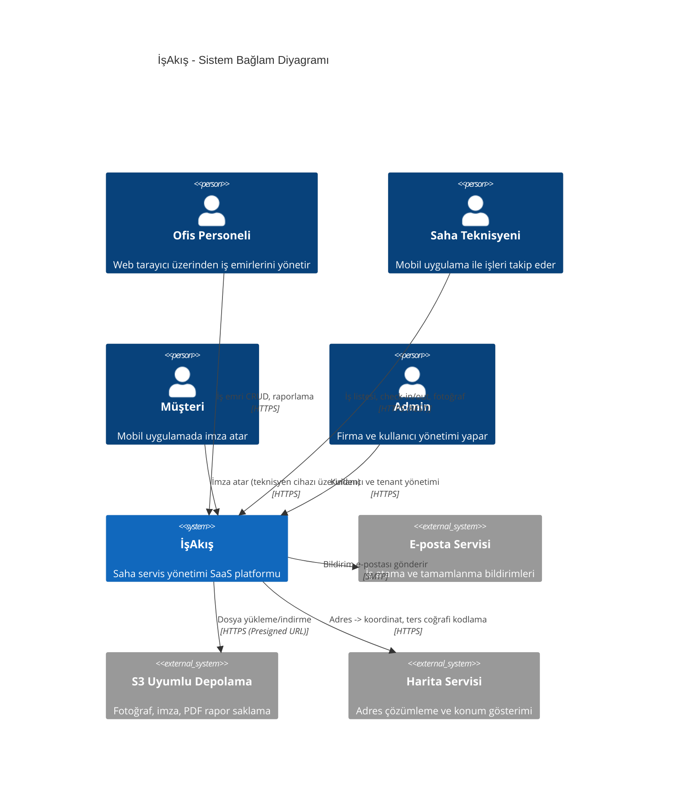

---

## 2. Container Mimarisi (C4 Container)

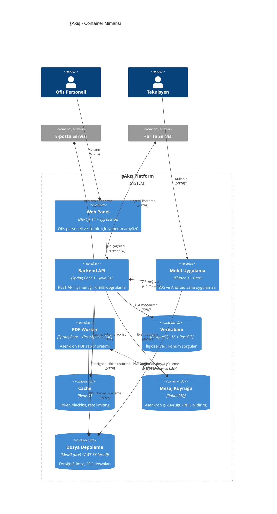

---

## 3. Backend Modül Diyagramı

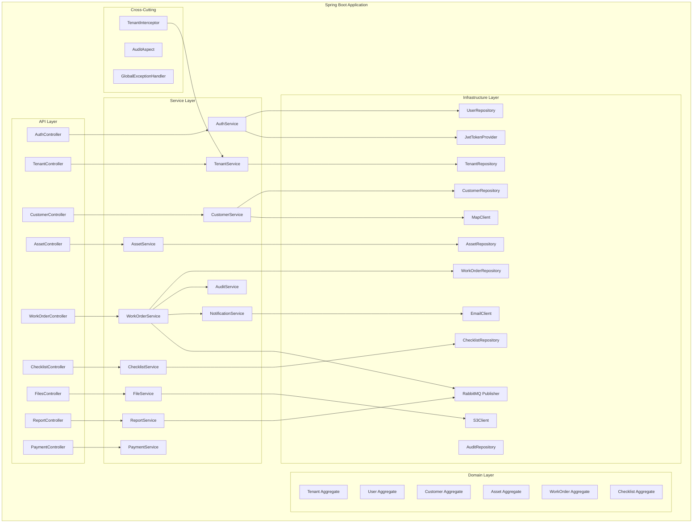

### Modül Sorumlulukları (Paket Yapısı)

```
com.sahaflow
├── auth              # Kimlik doğrulama, JWT, şifre sıfırlama
├── tenant            # Tenant CRUD, tenant yapılandırması
├── customer          # Müşteri ve adres yönetimi
├── asset             # Cihaz/envanter yönetimi
├── workorder         # İş emri, durum makinesi, atama
├── checklist         # Checklist şablonu ve doldurma
├── files             # Presigned URL, dosya metadata
├── report            # PDF rapor üretimi (tetikleyici)
├── payment           # Tahsilat durumu
├── notification      # E-posta bildirimi
├── audit             # Denetim kaydı
├── common            # Paylaşılan DTO, util, exception
└── config            # Security, CORS, Redis, RabbitMQ config
```

---

## 4. Ana İş Akışı Sequence Diyagramı

### İş Emri Oluşturma → Atama → Mobil Başlatma → Tamamlama → Rapor

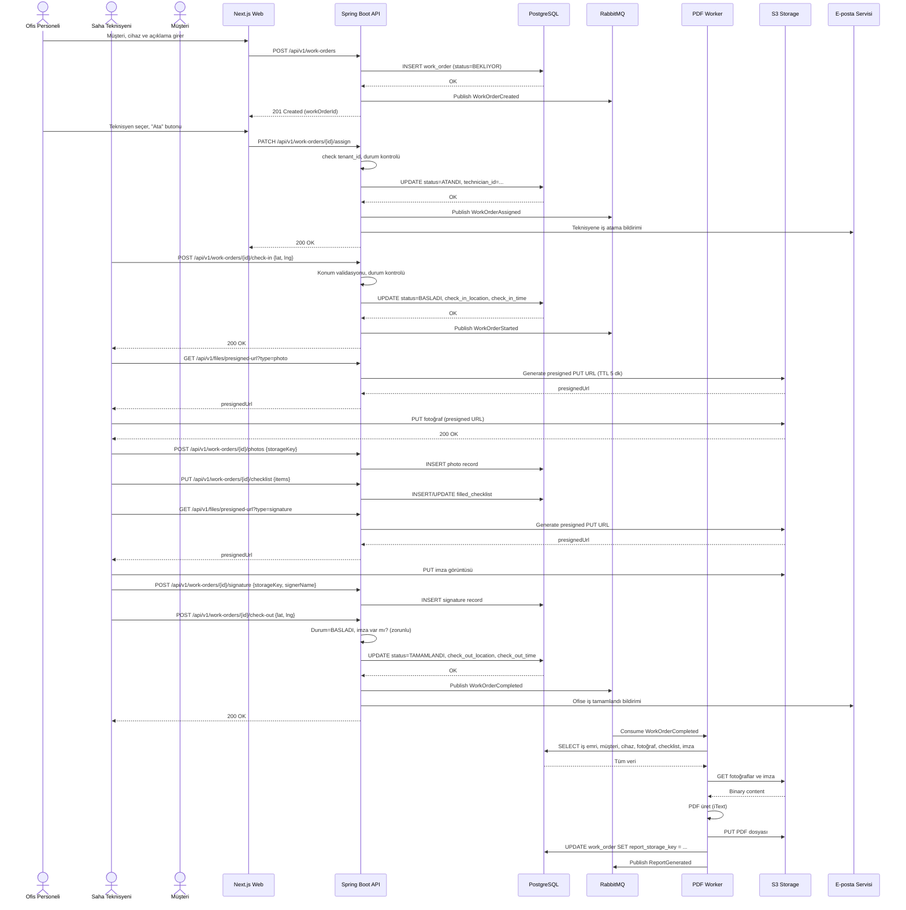

---

## 5. Kimlik Doğrulama Akışı

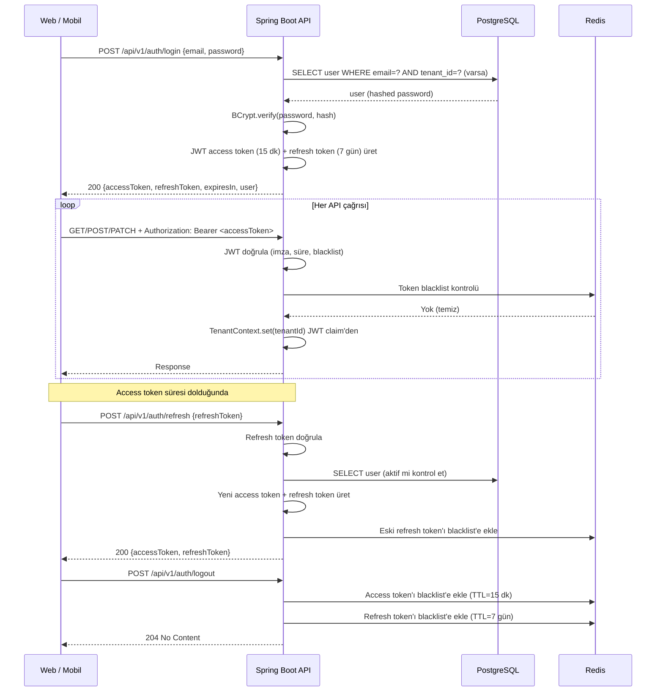

---

## 6. Tenant Bağlamı Akışı

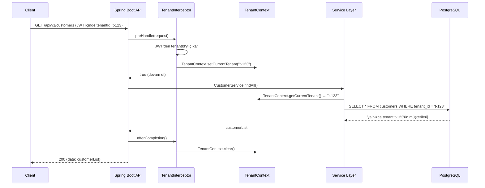

### Tenant İzolasyonu Prensipleri

| Katman | Yöntem |
|---|---|
| Controller | `@PreAuthorize` ile role ve tenant kontrolü |
| Interceptor | Her request'te JWT'den tenantId çıkarılır, `ThreadLocal`'a yazılır |
| Service | Tüm repository sorguları `tenant_id = :tenantId` filtresi içerir |
| Repository | Spring Data JPA `@Query` ile tenant filtresi; native query'lerde zorunlu parametre |
| Veritabanı | `tenant_id` sütunu her tabloda indexed; row-level security (RLS) opsiyonel olarak v2'de |

---

## 7. Dosya Yükleme Akışı (Presigned URL)

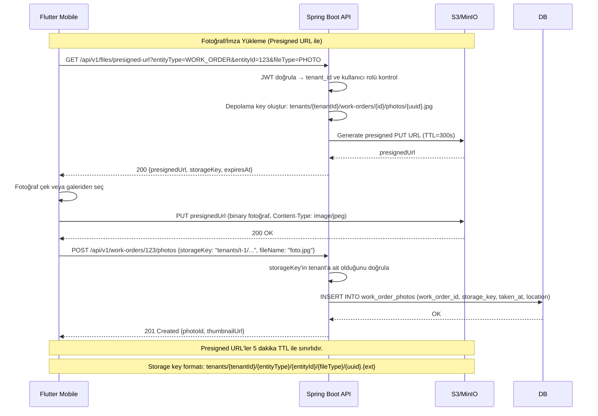

### Dosya İndirme (Presigned GET)

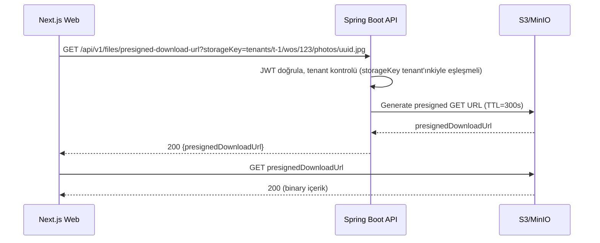

---

## 8. Senkron ve Asenkron Akışlar

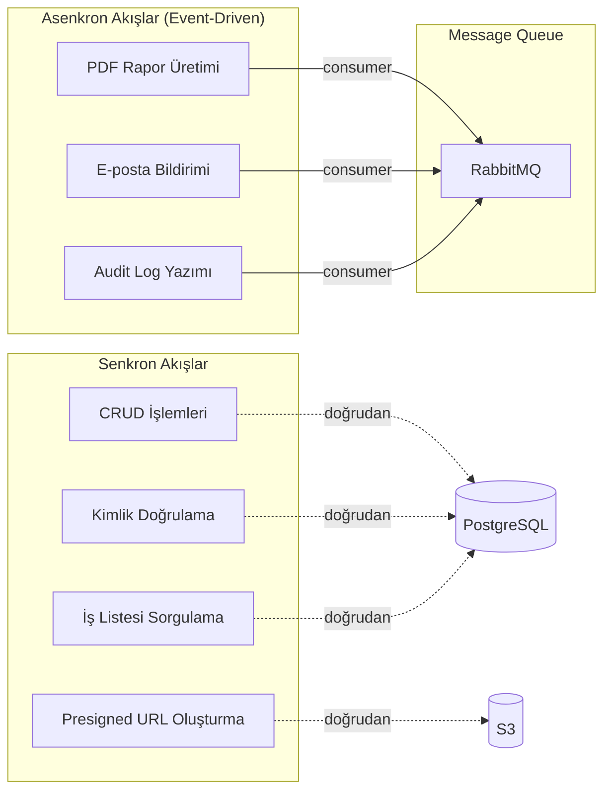

| Akış | Tip | Gerekçe |
|---|---|---|
| CRUD işlemleri | Senkron | Kullanıcı anında yanıt bekler |
| Kimlik doğrulama | Senkron | Oturum açma anında yanıt gerekir |
| Presigned URL | Senkron | Mobil anında URL'ye ihtiyaç duyar |
| PDF üretimi | Asenkron | Ağır I/O; kullanıcıyı bekletmemek için |
| E-posta bildirimi | Asenkron | SMTP gecikmesi; kullanıcı işlemini bloke etmemek için |
| Audit log | Asenkron | Fire-and-forget; ana iş akışını yavaşlatmamak için |

### Retry ve Dead-Letter Stratejisi

| Senaryo | Yaklaşım |
|---|---|
| Geçici hata (DB bağlantı, S3 timeout) | Exponential backoff, 3 retry |
| Kalıcı hata (validation, 404) | Retry yok; doğrudan dead-letter queue (DLQ) |
| DLQ'daki mesaj | Admin panelinden izlenir; manuel replay veya discard |

---

## 9. Ölçekleme Yaklaşımı

### MVP Aşaması (Yatay Ölçekleme Yok)

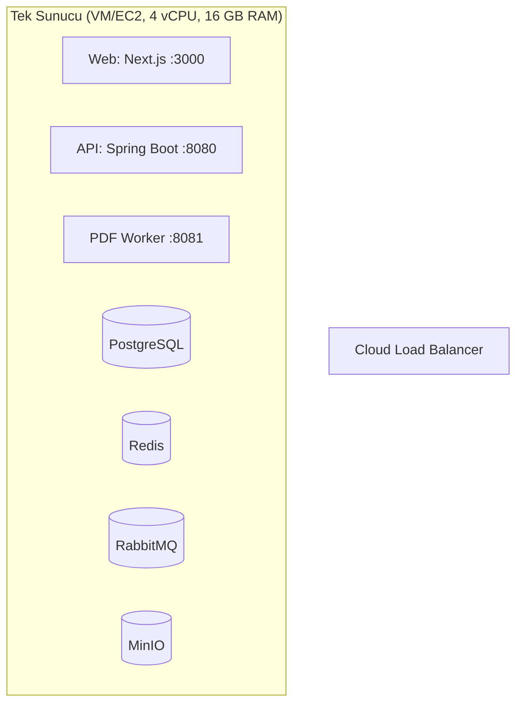

### Üretim Aşaması (v1.1+)

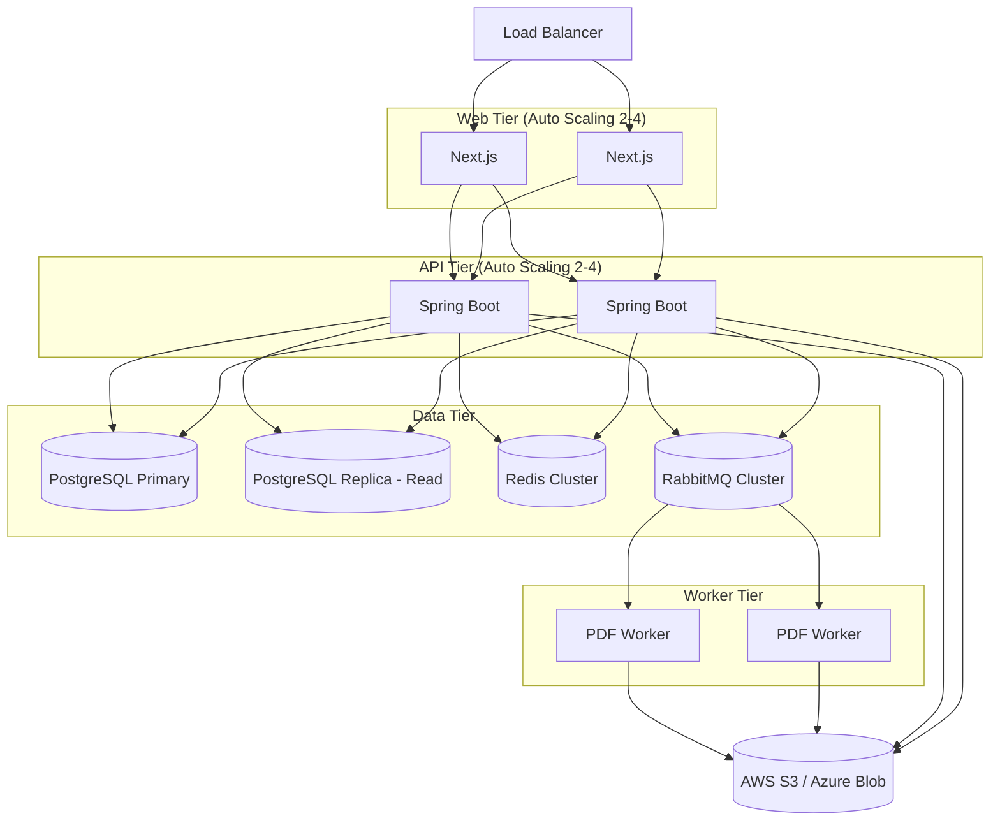

### Ölçekleme Kararları

| Bileşen | MVP Yaklaşımı | Üretim Yaklaşımı |
|---|---|---|
| Web (Next.js) | Tek container, SSR açık | 2-4 container, CDN önünde |
| API (Spring Boot) | Tek container, 2 thread pool | Auto-scaling (CPU > %70), read replica |
| PostgreSQL | Tek instance, pg_dump yedekleme | Primary + Read Replica, WAL arşivleme |
| Redis | Tek instance | Sentinel / Cluster |
| RabbitMQ | Tek instance | Cluster (3 node) |
| S3 | MinIO (Docker) | AWS S3 / Azure Blob (managed) |

---

## 10. Hata ve Dayanıklılık Senaryoları

### Hata Matrisi

| Hata Senaryosu | Etki | Tespit | Kurtarma |
|---|---|---|---|
| Veritabanı bağlantı kopması | API 503 döner; kullanıcı işlem yapamaz | Spring Actuator health check + alert | Connection pool otomatik reconnect; 30 sn içinde düzelmezse alarm |
| S3 erişilemez | Fotoğraf yükleme/indirme başarısız | Health check endpoint | S3 SLA'sına bağlı; presigned URL oluşturma başarısız olur, kullanıcıya "Dosya servisi geçici olarak kullanılamıyor" mesajı |
| RabbitMQ erişilemez | PDF üretimi ve bildirim birikir | Queue health + dead-letter monitoring | Spring RabbitMQ retry + reconnect; MQ gelince biriken mesajlar işlenir |
| JWT secret sızması | Token'lar sahtelenebilir | Güvenlik olayı | Secret rotasyonu; tüm token'lar geçersiz kılınır, tüm kullanıcılar yeniden giriş yapar |
| Offline sync çakışması | Aynı iş emrinde iki farklı değişiklik | Mobil sync log | Last-write-wins (timestamp bazlı); çakışma durumunda eski değişiklik audit log'a kaydedilir |
| Bellek sızıntısı (PDF worker) | Worker container OOM | Container memory monitoring | Health check başarısız → container restart; Kubernetes/Docker restart policy |
| Redis erişilemez | Token blacklist çalışmaz; rate limiting devre dışı | Health check | Sistem Redis olmadan da çalışır; token blacklist kontrolü atlanır (güvenlik riski kabulü), rate limiting by-pass edilir |

### Circuit Breaker Stratejisi (Resilience4j)

| Servis Çağrısı | Circuit Breaker Ayarı |
|---|---|
| E-posta (SMTP) | 5 hata / 30 sn pencere; 60 sn yarı-açık bekleme |
| Harita (Geocoding) | 3 hata / 20 sn pencere; 30 sn yarı-açık bekleme |
| S3 (Presigned URL) | 3 hata / 10 sn pencere; 15 sn yarı-açık bekleme |

---

## Karar Bekleyen Konular

- Üretim bulut sağlayıcı seçimi (AWS, Azure, Hetzner, Türk Telekom Bulut)
- PostgreSQL row-level security (RLS) MVP'de kullanılacak mı? (Varsayım: Hayır; uygulama katmanında tenant filtresi yeterli)
- RabbitMQ yerine MVP'de Spring Async + database polling yeterli olur mu? (Varsayım: RabbitMQ, asenkron akışlar kritik olduğu için MVP'de de var)
- CDN kullanımı (web statik asset'ler ve PDF'ler için) MVP'de gerekli mi? (Varsayım: Next.js built-in asset optimization yeterli)
- Kubernetes'e geçiş zamanı (varsayım: v1.1+); MVP Docker Compose ile single-VM deployment
- SSL sertifika yönetimi (varsayım: Let's Encrypt + Traefik/Certbot otomatik yenileme)

## İlgili Dokümanlar

| Doküman | Açıklama |
|---|---|
| `00_EXECUTIVE_SUMMARY.md` | Proje özeti ve riskler |
| `01_ASSUMPTIONS_AND_QUESTIONS.md` | Varsayımlar ve açık sorular |
| `02_PRD.md` | Ürün gereksinimleri dokümanı |
| `03_DOMAIN_MODEL.md` | Domain modeli ve iş kuralları |
