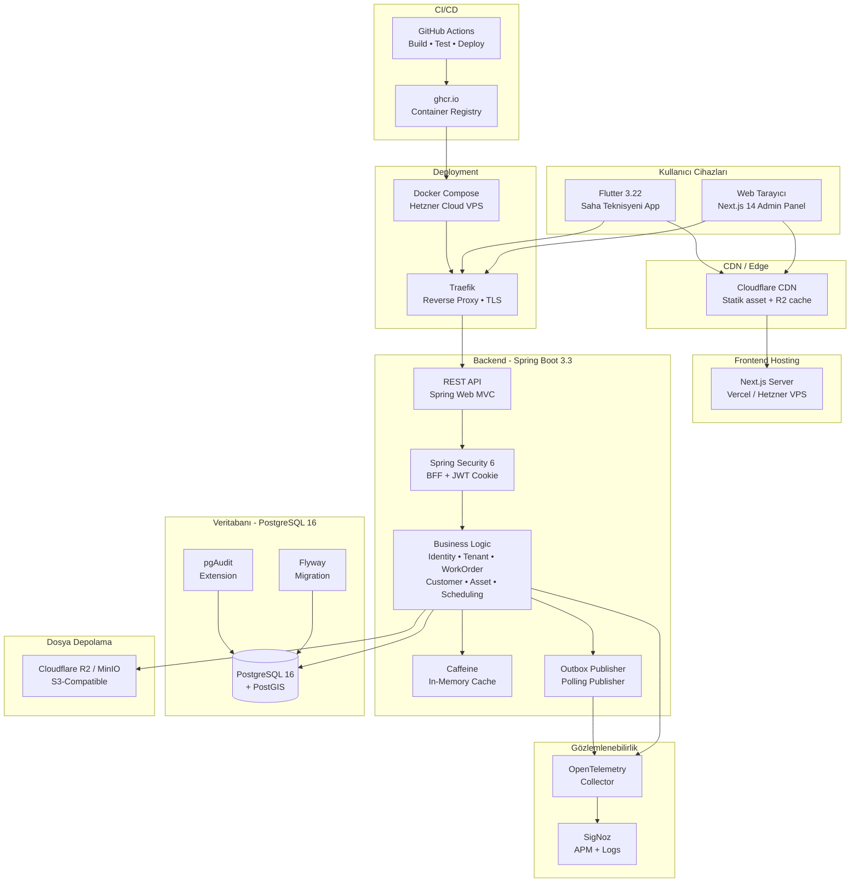

# İşAkış — 05: Teknoloji Yığını Kararları

> Proje: İşAkış
> Doküman: Teknoloji Yığını Kararları
> Durum: Draft
> Üretim tarihi: 2026-07-21
> Kaynak girdi: templates/01_PROJE_GIRDI_FORMU.yaml

---

## İçindekiler

1. [Karar Matrisi](#1-karar-matrisi)
2. [Kullanılmayan Teknolojiler](#2-kullanılmayan-teknolojiler)
3. [Teknoloji Yığını Mimarisi Diyagramı](#3-teknoloji-yığını-mimarisi-diyagramı)
4. [Takım Uyum Matrisi](#4-takım-uyum-matrisi)
5. [Görev Atama Matrisi](#5-görev-atama-matrisi)

---

## 1. Karar Matrisi

Aşağıdaki tabloda, İşAkış projesinin her teknoloji alanı için verilen karar, gerekçesi, alternatifleri ve doğrulama kriterleri yer almaktadır.

### 1.1 Web Frontend

| Kriter | Değer |
|--------|-------|
| **İhtiyaç** | Yönetim paneli (admin), teknisyen paneli, müşteri paneli için sunucu taraflı render destekli, SEO uyumlu, hızlı yüklenen web uygulaması |
| **Seçim** | **Next.js 14 + TypeScript** (App Router) |
| **Gerekçe** | Takımın "preferred_frontend" tercihiyle %100 uyumlu. App Router ile server components, streaming, partial prerendering desteği. KVKK için sunucu tarafında veri işleme kolaylığı. 2 kişilik ekipte full-stack TypeScript ile backend tip paylaşımı maliyeti düşürür. Büyük ekosistem, bol kaynak. |
| **Alternatifler** | **Remix** (edge-native, daha az ekosistem olgunluğu, takımda deneyim yok) ; **Vite + React SPA** (SEO zayıf, server-side yetenekler kısıtlı, BFF ayrı servis gerektirir) ; **Angular** (ağır framework, öğrenme eğrisi yüksek, 2 kişilik ekip için fazla) |
| **Güvenlik etkisi** | Server Components ile hassas API çağrıları istemciye hiç gitmez. CSP, Security Headers Next.js config ile kolayca yönetilir. `next/image` ile resim optimizasyonu client-side saldırı yüzeyini azaltır. HttpOnly cookie ile oturum yönetimi doğal BFF modeline uyar. |
| **Maliyet etkisi** | Vercel ücretsiz katmanı (hobby) 2 kişilik ekip için yeterli. Pro plan aylık $20/üye. Kendi sunucusunda deploy edilirse sıfır ek maliyet. Düşük bütçe hedefiyle uyumlu. |
| **Ölçek sınırı** | Vercel serverless fonksiyon süresi 10s/30s (pro). ISR ile 10K+ sayfa/sn. Yılda 100 tenant x 3000 MAU rahatça karşılar. Peak 30 RPS çok altında. Edge middleware ile global dağıtım. |
| **Değiştirme tetikleyicisi** | 10.000+ tenant, SSR yükü artarsa kısmi CSR'ye kayma; edge rendering ihtiyacı artarsa Remix değerlendirilebilir; kompleks state yönetimi gerekirse micro-frontend değerlendirilebilir. |
| **Doğrulama** | Lighthouse Score > 90, Core Web Vitals LCP < 2.5s, FID < 100ms. E2E testleri (Playwright) geçerli olacak. |

### 1.2 Mobil

| Kriter | Değer |
|--------|-------|
| **İhtiyaç** | iOS ve Android'de çalışan, çevrimdışı (offline) form ve veri girişi yapabilen, GPS ve kamera entegrasyonlu saha teknisyeni uygulaması |
| **Seçim** | **Flutter 3.22 + Dart** |
| **Gerekçe** | Tek kod tabanı ile iOS + Android. "preferred_mobile" tercihine uygun. Çevrimdışı-first mimari için Hive/Isar ile yerel depolama. Kamera, GPS, barkod tarama gibi saha operasyonları için zengin eklenti ekosistemi. Material Design 3 ile tutarlı UI. Hot reload ile hızlı geliştirme. |
| **Alternatifler** | **React Native** (JavaScript köprüsü performans sınırı, native modül bağımlılığı fazla, takımda deneyim yok) ; **Kotlin Multiplatform** (daha düşük olgunluk, UI tarafı platforma özel, 2 kişilik ekip için yönetimi zor) ; **PWA** (çevrimdışı yetenekler kısıtlı, GPS ve Bluetooth erişimi sınırlı, iOS push notification desteği zayıf) |
| **Güvenlik etkisi** | Flutter Secure Storage ile token/key saklama. Sertifika pinning (Dio + http_certificate_pinning). Root/jailbreak tespiti (flutter_jailbreak_detection). Offline veri şifreleme (Hive + AES). Obfuscation (`--obfuscate --split-debug-info`). |
| **Maliyet etkisi** | Flutter ve tüm eklentiler ücretsiz. App Store $99/yıl, Play Store $25 tek seferlik. CI/CD için Codemagic ücretsiz katman (500 dk/ay). |
| **Ölçek sınırı** | Tek uygulama, 3000 MAU'da sorun yok. 50000+ MAU'da offline veri senkronizasyonu için ek iyileştirme gerekebilir. |
| **Değiştirme tetikleyicisi** | Apple/Google Flutter desteğini keserse; native performans kritik olursa (AR/VR) Kotlin/Swift ayrı geliştirme; platform spesifik UI ihtiyacı çok artarsa. |
| **Doğrulama** | CI pipeline'da `flutter analyze`, `flutter test`, `flutter build` başarılı olacak. App Store / Play Store incelemesinden geçecek. |

### 1.3 Backend Framework

| Kriter | Değer |
|--------|-------|
| **İhtiyaç** | REST API, tenant izolasyonu, RBAC, audit log, dosya depolama entegrasyonu, iş emri ve iş takvimi yönetimi sunan yüksek güvenlikli backend |
| **Seçim** | **Spring Boot 3.3 + Java 21** |
| **Gerekçe** | Takımın "preferred_backend" tercihiyle uyumlu. Sanal thread (Project Loom) ile yüksek eşzamanlılık. Spring Security 6 ile BFF oturum yönetimi. Bean Validation, AOP ile audit. Spring Data JPA + Hibernate + PostGIS. Flyway entegrasyonu. Spring Actuator + Micrometer ile gözlemlenebilirlik. 2 kişilik ekipte Spring Initializr ile hızlı başlangıç. |
| **Alternatifler** | **Quarkus** (native image ile hızlı başlangıç, ancak ekosistem olgunluğu Spring'ten düşük, takımda deneyim yok) ; **NestJS** (Node.js ile full-stack TS, ancak JPA/Hibernate gibi mature ORM yok, multitenancy desteği daha manuel) ; **Go + Gin/Echo** (performans yüksek ama ORM ve multitenancy için daha fazla manuel kod, takımda deneyim yok) |
| **Güvenlik etkisi** | Spring Security + OWASP eklentileri (CSRF, Secure Headers). Java'nın tip güvenliği, injection riskini azaltır. Hibernate parametreli sorgular SQL injection'ı önler. CVE taraması (Trivy/Grype) kolay entegre. SBOM oluşturma (CycloneDX Maven plugin). |
| **Maliyet etkisi** | Spring Boot + tüm bağımlılıklar ücretsiz. 2 vCPU + 4GB VM (Hetzner €15/ay) veya Railway/Hostman $20/ay başlangıç. Düşük bütçeyle uyumlu. |
| **Ölçek sınırı** | Sanal thread ile tek instance'ta 10K+ eşzamanlı bağlantı. 30 RPS için 1 instance yeterli. 1000+ tenant'ta connection pool yönetimi gerekir. Yatay ölçekleme ile limitsiz. |
| **Değiştirme tetikleyicisi** | Gerçek zamanlı özellikler (canlı konum, chat) ağırlaşırsa ek WebSocket sunucusu düşünülebilir; event-driven iş yükü artarsa Kafka eklenebilir; cold start süresi kritik olursa Quarkus/GraalVM değerlendirilebilir. |
| **Doğrulama** | Tüm birim ve entegrasyon testleri geçerli. API sözleşme testleri (Pact) başarılı. Güvenlik taraması temiz. Load test'te 30 RPS altında %95 gecikme < 200ms. |

### 1.4 Programlama Dili

| Kriter | Değer |
|--------|-------|
| **İhtiyaç** | Tip güvenliği yüksek, geniş ekosistemli, performanslı, KVKK ve güvenlik gereksinimlerini karşılayan backend dili |
| **Seçim** | **Java 21 (LTS)** |
| **Gerekçe** | Sanal thread, record class, pattern matching, sealed class gibi modern özellikler. Spring Boot ile doğal uyum. Geniş kütüphane ekosistemi. Kurumsal güvenlik standartlarına uygun. JVM'in olgun GC ve profiling araçları. KVKK uyumlu veri işleme için kapsamlı kripto kütüphaneleri. |
| **Alternatifler** | **Kotlin** (daha az boilerplate, null safety, Spring ile uyumlu ama takımda deneyim yok, 2 kişilik ekip için yeni dil öğrenme riski) ; **C# + .NET 8** (benzer olgunluk, ancak proje tercihlerinde Spring Boot belirtilmiş) ; **Python + FastAPI** (hızlı prototipleme, ancak tip güvenliği zayıf, multithreading GIL sınırı var) |
| **Güvenlik etkisi** | Tip güvenliği ve checked exceptions hata yakalamayı zorunlu kılar. JVM sandbox. SecurityManager (deprecated olsa da container ile izolasyon). HTTPS/TLS için kapsamlı Java Security API. OWASP Dependency Check Maven plugin. |
| **Maliyet etkisi** | Açık kaynak, lisans ücreti yok. Oracle JDK lisans değişikliğine karşı Eclipse Temurin (Adoptium) kullanılacak. |
| **Ölçek sınırı** | JVM heap 64GB'a kadar pratik, GC tuning ile yönetilebilir. Sanal thread ile milyonlarca bağlantı. |
| **Değiştirme tetikleyicisi** | Hızlı soğuk başlatma kritik olursa GraalVM native image veya Quarkus; veri bilimi/ML entegrasyonu ağırlaşırsa Python yan servis eklenebilir. |
| **Doğrulama** | `./gradlew build` başarılı. SonarQube kalite kapısı geçerli. Dependency Check temiz. |

### 1.5 Veritabanı

| Kriter | Değer |
|--------|-------|
| **İhtiyaç** | Çok kiracılı (multitenant), coğrafi sorgulamaları destekleyen, ACID uyumlu, KVKK veri saklama ve silme politikalarına uygun relational veritabanı |
| **Seçim** | **PostgreSQL 16 + PostGIS** |
| **Gerekçe** | Takımın "preferred_database" tercihine uygun. PostGIS ile `ST_DWithin`, `ST_Contains` gibi coğrafi sorgular — saha teknisyeni konum takibi, müşteri adres mesafesi hesaplaması için kritik. Row-level security desteği (şimdilik değerlendirme aşamasında, TenantContext filter tercih ediliyor). JSONB ile esnek veri. pgAudit eklentisi. |
| **Alternatifler** | **MySQL 8.0** (yaygın, ancak PostGIS karşılığı zayıf, RLS karmaşık, JSON desteği PostgreSQL'den geride) ; **CockroachDB** (yatay ölçekleme, ancak PostGIS desteği kısıtlı, takım deneyimi yok, yönetim karmaşık) ; **MongoDB** (esnek şema, ancak ACID transaction zayıf, ilişkisel veri modeli için uygun değil, coğrafi sorgu yetenekleri PostGIS'ten geride) |
| **Güvenlik etkisi** | pgcrypto ile kolon seviyesinde şifreleme (AES-256). pgAudit ile detaylı audit. SCRAM-SHA-256 kimlik doğrulama. TLS bağlantı zorunlu. Prepared statements ile SQL injection önleme (Hibernate). Backup şifreleme. |
| **Maliyet etkisi** | PostgreSQL ücretsiz. Hetzner managed PostgreSQL €15/ay (2 vCPU, 4GB). Kendi sunucumuzda Docker ile çalıştırılırsa sadece sunucu maliyeti. |
| **Ölçek sınırı** | Tek instance'ta 500GB veri, 100 tenant'ta yeterli. I/O yoğunlaşırsa read replica eklenebilir. Vertical scaling ile 64 vCPU, 400GB RAM. PostGIS indeksleri (GiST) ile milyonlarca coğrafi nokta sorgusu < 100ms. |
| **Değiştirme tetikleyicisi** | Yatay ölçekleme (sharding) gerekirse Citus extension; 10.000+ tenant olursa database-per-tenant stratejisi değerlendirilebilir; zaman serisi verisi ağırlaşırsa TimescaleDB eklentisi. |
| **Doğrulama** | `pg_isready` bağlantı testi. Flyway migration başarılı. PostGIS sorguları doğru sonuç dönüyor. pgbench testinde hedef RPS karşılanıyor. |

### 1.6 Migration (Veritabanı Sürüm Yönetimi)

| Kriter | Değer |
|--------|-------|
| **İhtiyaç** | Veritabanı şemasını sürümlendirme, tüm ortamlarda tutarlı migration, rollback stratejisi, CI/CD entegrasyonu |
| **Seçim** | **Flyway (Community Edition)** |
| **Gerekçe** | Spring Boot ile doğal entegrasyon (`flyway-core` bağımlılığı). SQL tabanlı migration dosyaları, VCS'de izlenebilir. CheckSum ile migration bütünlüğü. Repeatable migration desteği. Java migration desteği (karmaşık veri dönüşümleri için). |
| **Alternatifler** | **Liquibase** (XML/YAML/JSON migration, daha fazla özellik, ancak Spring Boot'ta Flyway daha yaygın, takımda Flyway deneyimi var) ; **Prisma Migrate** (Node.js ekosistemi, Spring Boot ile uyumsuz) ; **Manuel SQL script** (insan hatası riski, ortamlar arası tutarsızlık) |
| **Güvenlik etkisi** | Migration'lar ayrı veritabanı kullanıcısı (`app_migration`) ile çalışır. `app_runtime` kullanıcısı DDL yetkisine sahip değildir. Migration dosyaları code review'den geçer. Audit log'da migration kaydı tutulur. |
| **Maliyet etkisi** | Flyway Community ücretsiz. Teams edition (geri alma) lisans maliyeti var; MVP aşamasında gerekli değil. |
| **Ölçek sınırı** | Flyway lock mekanizması aynı anda tek migration çalıştırır. 1000+ migration dosyası yönetilebilir. Birden fazla instance, lock sayesinde çakışma olmaz. |
| **Değiştirme tetikleyicisi** | Otomatik rollback ihtiyacı doğarsa Flyway Teams veya Liquibase Pro; sıfır kesintili migration (blue-green) gerekirse genişletilebilir. |
| **Doğrulama** | `./gradlew flywayInfo`, `./gradlew flywayMigrate` başarılı. CI'da test container ile migration testi. |

### 1.7 Dosya Depolama

| Kriter | Değer |
|--------|-------|
| **İhtiyaç** | İş emrine eklenen fotoğraf, video, PDF raporları, imza görsellerini güvenli ve KVKK uyumlu şekilde saklama |
| **Seçim** | **AWS S3 uyumlu nesne depolama (Cloudflare R2 / Backblaze B2 / MinIO)** |
| **Gerekçe** | Presigned URL ile güvenli dosya yükleme/indirme. Tenant'a özel bucket veya prefix ile izolasyon. Object lock ile WORM (Write Once Read Many) uyumluluğu. KVKK için veri silme (expiration lifecycle policy). CDN entegrasyonu. Düşük bütçe için Cloudflare R2 (egress ücretsiz) veya Backblaze B2 (fiyat/performans). Kendi sunucumuzda MinIO (ücretsiz S3 uyumlu). |
| **Alternatifler** | **Yerel dosya sistemi** (ölçeklenmez, yedekleme zor, güvenlik riski, KVKK uyumlu silme zor) ; **Azure Blob Storage** (Türkiye bölgesi yok, fiyat yüksek) ; **Google Cloud Storage** (benzer, ama R2'den pahalı) |
| **Güvenlik etkisi** | Presigned URL süresi 5-15 dakika. Tenant prefix izolasyonu. Server-side encryption (SSE-S3/AES-256). Public access block. Object lock ile silinemez/override edilemez yedek. Access log (S3 access logs). Virus taraması (ClamAV ile bucket trigger, MVP sonrası). |
| **Maliyet etkisi** | Cloudflare R2: 10GB ücretsiz, sonrası $0.015/GB/ay, egress ücretsiz. Backblaze B2: $0.006/GB/ay, egress $0.01/GB. MinIO: kendi sunucusunda çalışırsa sadece disk maliyeti. |
| **Ölçek sınırı** | Petabyte seviyesinde depolama. CDN ile global dağıtım. 500GB/yıl hedefi rahat karşılanır. |
| **Değiştirme tetikleyicisi** | Çok yüksek yazma/okuma IOPS gerekirse dağıtık dosya sistemi (Ceph); çok yüksek egress maliyeti olursa CDN katmanı güçlendirilir. |
| **Doğrulama** | Dosya yükleme/indirme E2E testleri. Presigned URL süre sonu testi. Tenant izolasyon testi (tenant-A, tenant-B dosyasını görememeli). |

### 1.8 Cache

| Kriter | Değer |
|--------|-------|
| **İhtiyaç** | Sık okunan veriler (rol listesi, tenant yapılandırması, katalog verileri) için düşük gecikmeli erişim |
| **Seçim** | **Caffeine (in-memory) + PostgreSQL (temel cache olarak)** |
| **Gerekçe** | 2 kişilik ekip ve düşük bütçede Redis operasyonel yük getirir. Caffeine, JVM içinde yüksek performanslı cache. Spring Cache abstraction ile kolay entegrasyon. Rol ve tenant konfigürasyonu gibi az değişen veriler için yeterli. Peak 30 RPS için in-memory cache fazlasıyla yeterli. Birden fazla instance'ta cache tutarsızlığı minimal etki (tenant sayısı az, TTL 5 dakika). |
| **Alternatifler** | **Redis** (dağıtık cache, çok instance için ideal, ancak ek sunucu/konfigürasyon/bakım maliyeti, düşük yükte gereksiz) ; **Hazelcast** (dağıtık in-memory, ek konfigürasyon karmaşası) ; **Memcached** (basit ama veri yapıları kısıtlı) |
| **Güvenlik etkisi** | In-memory cache'te hassas veri tutulmayacak (token, şifre hash'i vb.). Cache invalidation log ile izlenebilir. |
| **Maliyet etkisi** | Sıfır ek maliyet. JVM heap'i içinde çalışır. |
| **Ölçek sınırı** | Tek instance'ta 2GB heap cache yeterli. 10+ instance'ta cache tutarsızlığı sorun olursa Redis'e geçiş yapılır. |
| **Değiştirme tetikleyicisi** | 5+ backend instance; cache invalidation event'i tüm instance'lara yayılmalı → Redis; distributed lock ihtiyacı → Redis; rate limiting için dağıtık sayaç → Redis. |
| **Doğrulama** | Cache hit rate metrikleri (Micrometer). TTL sonrası veri yenileme testi. |

### 1.9 Mesajlaşma / Event

| Kriter | Değer |
|--------|-------|
| **İhtiyaç** | Asenkron işlemler (e-posta/SMS gönderimi, dış entegrasyon webhook'ları, outbox pattern), event-driven iletişim |
| **Seçim** | **PostgreSQL Outbox Pattern + Spring ApplicationEvent (in-process)** |
| **Gerekçe** | 2 kişilik ekipte ayrı mesajlaşma sunucusu (RabbitMQ/Kafka) yönetimi operasyonel yük. Outbox pattern, transaction ile mesajı aynı veritabanında atomik olarak kaydeder. Polling publisher ile mesajlar asenkron işlenir. İş emri durum değişikliği, bildirim gönderimi gibi işlemler için yeterli. Düşük RPS'te (30) Kafka overkill. |
| **Alternatifler** | **RabbitMQ** (olgun, yönetimi nispeten kolay, ama ek sunucu ve monitoring yükü) ; **Apache Kafka** (yüksek hacimli event streaming, 30 RPS için kesinlikle overkill, operasyonel karmaşa) ; **Redis Pub/Sub** (basit ama mesaj kalıcılığı yok, at-least-once garanti değil) |
| **Güvenlik etkisi** | Outbox tablosu application seviyesinde izole. Mesaj içeriği hassas veri içermez, referans ID taşır. Polling publisher rate limit korumalı. |
| **Maliyet etkisi** | Sıfır ek maliyet. PostgreSQL içinde ek tablo ve polling işlemi. |
| **Ölçek sınırı** | Polling yaklaşımı 100 msg/sn'ye kadar yeterli. Bunun üzerinde LISTEN/NOTIFY veya SKIP LOCKED ile iyileştirilebilir. 500.000+ outbox kaydı ile test edilmeli. |
| **Değiştirme tetikleyicisi** | Anlık bildirim/sohbet eklenirse WebSocket + Redis; event-driven mikroservis mimarisine geçilirse Kafka; dış sistemlerle yüksek hacimli entegrasyon artarsa RabbitMQ. |
| **Doğrulama** | End-to-end test: iş emri oluştur → outbox'a yazıldı mı → polling publisher işledi mi → bildirim gitti mi. |

### 1.10 Kimlik Doğrulama

| Kriter | Değer |
|--------|-------|
| **İhtiyaç** | E-posta/şifre ile giriş, rol tabanlı yetkilendirme, tenant bazlı kullanıcı, güvenli oturum yönetimi, KVKK uyumlu |
| **Seçim** | **Spring Security 6 + JWT (HttpOnly Secure SameSite Cookie) + BFF Pattern** |
| **Gerekçe** | BFF (Backend For Frontend), tarayıcı tarafında JavaScript'in token'a erişmesini engeller. HttpOnly cookie ile XSS saldırılarında token çalınamaz. SameSite=Strict ile CSRF koruması. Spring Security'nin olgun filtre zinciri. RBAC roller veritabanında tenant-aware olarak saklanır. KVKK için açık rıza kaydı ve profil silme desteği. |
| **Alternatifler** | **Ory Kratos/Hydra** (açık kaynak IAM, kendi kendine barındırma, ancak ek operasyonel yük, 2 kişilik ekip için fazla) ; **Keycloak** (tam özellikli IAM, SSO, sosyal giriş, ancak ek sunucu ve JDK yükü, konfigürasyon karmaşası) ; **Auth0 / Clerk** (managed servis, hızlı başlangıç, ancak tenant başına maliyet artar, veri yurt dışına çıkabilir — KVKK riski) |
| **Güvenlik etkisi** | HttpOnly cookie XSS token hırsızlığını engeller. SameSite=Strict CSRF koruması. Spring Security CSRF token (cookie tabanlı). Brute force koruması (Bucket4j). Hesap kilitleme (5 başarısız deneme, 15dk). Şifre politikası (min 12 karakter, zxcvbn ile güçlülük kontrolü). MFA (admin rolleri için TOTP). JWT refresh token rotation. |
| **Maliyet etkisi** | Spring Security + jjwt kütüphanesi ücretsiz. Harici IAM servisi kullanılmadığı için ek maliyet yok. |
| **Ölçek sınırı** | JWT stateless olduğu için yatay ölçeklemede sorun yok. Refresh token veritabanında (outbox gibi polling'le temizlenir). 3000 MAU'da sorunsuz. |
| **Değiştirme tetikleyicisi** | SSO/SAML/OIDC entegrasyonu talebi gelirse Keycloak; çok yüksek güvenlik seviyesi gerekirse WebAuthn/Passkey; managed servis istenirse Zitadel (açık kaynak, self-hosted). |
| **Doğrulama** | Authn E2E testleri (giriş/çıkış/token yenileme). Güvenlik testi (OWASP ZAP). Session fixation, session hijacking testleri. |

### 1.11 API Yaklaşımı

| Kriter | Değer |
|--------|-------|
| **İhtiyaç** | Web frontend ve mobil uygulama için güvenli, sürümlendirilmiş, RESTful API |
| **Seçim** | **REST (HATEOAS seviyesi 2) + OpenAPI 3.0** |
| **Gerekçe** | REST, frontend ve mobil için en yaygın ve olgun API stili. OpenAPI (SpringDoc) ile otomatik dokümantasyon. Tip paylaşımı için OpenAPI → TypeScript/Dart client code generation (`openapi-generator`). Kaynak odaklı URL yapısı (`/api/v1/tenants/{tenantId}/work-orders/{id}`). JSON request/response. 2 kişilik ekipte ek bir GraphQL katmanı gereksiz. |
| **Alternatifler** | **GraphQL** (istemci tam ihtiyacı kadar veri alır, over-fetching yok, ancak sorgu karmaşıklığı, N+1 problemi, caching zorluğu, ek güvenlik riskleri (DoS, derin sorgu), 2 kişilik ekip için overkill) ; **gRPC** (yüksek performans, binary protokol, ancak browser desteği zayıf, debugging zor, mobil taraf için ek katman) ; **tRPC** (TypeScript-native, ancak Spring Boot backend ile uyumsuz) |
| **Güvenlik etkisi** | REST API'ler için OWASP API Security Top 10 kontrolleri. Rate limiting (Bucket4j). Input validation (Bean Validation). Output encoding (Jackson). CORS kısıtlaması. API key (internal servisler arası). |
| **Maliyet etkisi** | SpringDoc + openapi-generator ücretsiz. Ek API gateway katmanı yok. |
| **Ölçek sınırı** | REST, 30 RPS için idealdir. 1000+ RPS'te connection pool ve load balancer yeterli. |
| **Değiştirme tetikleyicisi** | Mobil uygulamanın çok farklı veri şekillerine ihtiyacı olursa GraphQL (backend-for-frontend); real-time bildirim/konum takibi için WebSocket veya SSE eklenebilir; public API yayınlanırsa GraphQL federasyon. |
| **Doğrulama** | OpenAPI dokümanı SpringDoc ile oluşturuluyor. API sözleşme testleri (Pact) başarılı. |

### 1.12 CI/CD

| Kriter | Değer |
|--------|-------|
| **İhtiyaç** | Otomatik build, test, güvenlik taraması, staging ve production ortamlarına deployment |
| **Seçim** | **GitHub Actions + Gradle/Maven build native** |
| **Gerekçe** | GitHub'da barındırılıyorsa doğal entegrasyon. Ücretsiz katman ayda 2000 dakika. Docker build ve push, Flyway migration, test çalıştırma. Ortam başına workflow. Secret management (GitHub Secrets). OIDC ile cloud provider'a doğrudan deployment. |
| **Alternatifler** | **GitLab CI** (GitLab kullanılıyorsa, benzer özellikler) ; **Jenkins** (kendi sunucusunda barındırma, çok esnek ama operasyonel yükü yüksek, 2 kişilik ekip için fazla) ; **CircleCI / Travis CI** (ücretli katmanlar, ekosistemden düşüyor) |
| **Güvenlik etkisi** | Pipeline'da OWASP Dependency Check, Trivy container scan, SAST (SonarQube Cloud). Secret scanning (GitHub Advanced Security). Deployment approval gate. Environment protection kuralları. SBOM oluşturma ve imzalama. |
| **Maliyet etkisi** | GitHub Actions ücretsiz katman yeterli (2000 dk/ay). |
| **Ölçek sınırı** | Aynı anda 20 concurrent job (ücretsiz). Build süresi ~5 dk, yeterli. |
| **Değiştirme tetikleyicisi** | Monorepo büyürse incremental build ve caching iyileştirilir; çok ortamlı deployment (10+ tenant'a özel staging) gerekirse özel deployment pipeline. |
| **Doğrulama** | Her PR'da CI çalışıyor. `main` branch'e merge → staging deploy → E2E test → production deploy (manuel onay). |

### 1.13 Gözlemlenebilirlik

| Kriter | Değer |
|--------|-------|
| **İhtiyaç** | Backend, frontend ve mobil uygulamanın sağlığını izleme, hata ayıklama, performans optimizasyonu, audit |
| **Seçim** | **OpenTelemetry + Spring Actuator + SigNoz (self-hosted)** |
| **Gerekçe** | OpenTelemetry, vendor-neutral veri toplama standardı. Spring Boot 3.3 Micrometer Tracing ile otomatik enstrümantasyon. SigNoz, Datadog/New Relic alternatifi açık kaynak APM (tek bir Docker Compose ile kendi sunucusunda). Metrics (Prometheus formatı), traces, logs tek panelde. Düşük bütçe için managed servis gerektirmez. 2 kişilik ekip için yeterli görünürlük. |
| **Alternatifler** | **Datadog / New Relic** (managed, kapsamlı, ancak maliyet yüksek — ayda yüzlerce dolar, KVKK veri yurt dışına çıkabilir) ; **Grafana + Prometheus + Loki + Tempo** (olgun, esnek, ancak her bileşenin ayrı yönetimi, 2 kişilik ekip için fazla) ; **ELK Stack** (log ağırlıklı, trace/metrics için ek araçlar gerekir) |
| **Güvenlik etkisi** | Log'larda hassas veri maskelenir (PII redaction). Trace context tenant ID taşır. SigNoz erişimi yalnızca iç ağda. Audit log'lar ayrı bir tabloda saklanır (tam deletion yok). |
| **Maliyet etkisi** | SigNoz self-hosted: kendi sunucusunda (4GB RAM, 2 vCPU) çalışır, sadece sunucu maliyeti. OpenTelemetry collector: aynı sunucu. |
| **Ölçek sınırı** | SigNoz, 10K spans/sn'ye kadar tek instance. 100 tenant'ta yeterli. Yüksek hacimde ClickHouse cluster'a geçilebilir. |
| **Değiştirme tetikleyicisi** | Çok yüksek hacim (1M+ spans/sn) → Grafana Tempo + Mimir; sıfır operasyon istenirse → SigNoz Cloud veya Grafana Cloud; SIEM/SOC entegrasyonu gerekirse → Wazuh. |
| **Doğrulama** | Dashboard'da RED metrikleri (Rate, Error, Duration) görünür. Trace ID ile uçtan uca izlenebilir. Alert kuralları (Discord/Slack webhook) tetikleniyor. |

### 1.14 Deployment

| Kriter | Değer |
|--------|-------|
| **İhtiyaç** | Backend, frontend, veritabanı ve yardımcı servislerin güvenli, kesintisiz deployment'ı |
| **Seçim** | **Docker Compose (staging) + Hetzner Cloud VPS (production)** |
| **Gerekçe** | 2 kişilik ekipte Kubernetes operasyonel karmaşa yaratır. Docker Compose ile tek sunucuda tüm servisleri çalıştırmak basit ve yönetilebilir. Hetzner Cloud, fiyat/performans lideri (Türkiye'ye yakın Nürnberg/Falkenstein veri merkezi). Traefik/Caddy ile reverse proxy ve otomatik TLS (Let's Encrypt). Watchtower ile otomatik container güncelleme. |
| **Alternatifler** | **Kubernetes (k3s/microk8s)** (ölçeklenebilir, ancak yönetimi karmaşık, 2 kişilik ekip için overkill, debugging zor) ; **Railway / Hostman** (PaaS, basit deployment, ancak Türkiye bölgesi yok ve veri KVKK kapsamında yurt dışına çıkabilir) ; **AWS ECS Fargate** (managed container, ancak maliyetli ve Türkiye bölgesi yok) |
| **Güvenlik etkisi** | Container'lar root olmayan kullanıcıyla çalışır. Read-only root filesystem. SecurityContext kısıtlamaları. Network segmentation (Docker network). Secret'lar environment variable ile değil, Docker secrets veya `.env` dosyasıyla (Git'e commit edilmez). |
| **Maliyet etkisi** | Hetzner CX32 (4 vCPU, 8GB RAM): ~€14/ay. CX42 (8 vCPU, 16GB): ~€28/ay. Volume (block storage) 100GB: ~€6/ay. Toplam ~€20-35/ay. |
| **Ölçek sınırı** | Tek sunucu, 3000 MAU'da yeterli. Dikey ölçekleme ile sunucu büyütülebilir. Yatay ölçekleme için Docker Swarm veya k3s eklenebilir. |
| **Değiştirme tetikleyicisi** | Yüksek erişilebilirlik (HA) gerekirse Docker Swarm veya k3s cluster; managed Kubernetes (GKE/AKS) gerekirse; 10.000+ tenant'a ulaşılırsa multi-region deployment. |
| **Doğrulama** | `docker compose up -d` başarılı. Health check endpoint'leri 200 dönüyor. Zero-downtime deploy (rolling update) çalışıyor. |

### 1.15 Test Araçları

| Kriter | Değer |
|--------|-------|
| **İhtiyaç** | Birim testi, entegrasyon testi, API sözleşme testi, E2E testi, güvenlik testi, yük testi |
| **Seçim** | **JUnit 5 + Mockito + Testcontainers + Playwright + Pact + OWASP ZAP + k6** |
| **Gerekçe** | Backend: JUnit 5 + Mockito (birim), Testcontainers (PostgreSQL entegrasyon testi), RestAssured (API testi). Frontend: Playwright (E2E, cross-browser). Sözleşme: Pact (consumer-driven contract test). Güvenlik: OWASP ZAP (DAST). Yük: k6 (açık kaynak, JavaScript ile test yazma). Tümü ücretsiz, CI'da çalışabilir. |
| **Alternatifler** | **Cypress** (E2E, sadece Chromium/Firefox, Safari yok, Playwright daha kapsamlı) ; **Selenium** (eski, yavaş, Playwright modern alternatif) ; **Gatling** (yük testi, Scala tabanlı, k6'dan daha karmaşık) ; **Postman/Newman** (API testi, ancak Pact ile sözleşme testi daha güçlü) |
| **Güvenlik etkisi** | Testcontainers, gerçek PostgreSQL ile test eder (H2 gibi emülatör değil). OWASP ZAP CI'da baseline scan. k6 yük testi ile DoS dayanıklılığı ölçülür. |
| **Maliyet etkisi** | Tüm araçlar ücretsiz ve açık kaynak. |
| **Ölçek sınırı** | Parallel test execution ile CI süresi kontrol altında. Testcontainers reuse ile hızlandırma. |
| **Değiştirme tetikleyicisi** | Mobil E2E testi için Appium/Patrol eklenebilir; görsel regresyon testi için Percy/Chromatic; fuzzing için Jazzer. |
| **Doğrulama** | `./gradlew test`, `./gradlew integrationTest` başarılı. `npx playwright test` geçerli. `k6 run load-test.js` hedefleri karşılıyor. |

### 1.16 Container Registry

| Kriter | Değer |
|--------|-------|
| **İhtiyaç** | Docker imajlarının güvenli saklanması ve CI/CD pipeline'dan erişimi |
| **Seçim** | **GitHub Container Registry (ghcr.io)** |
| **Gerekçe** | GitHub ile entegre, OIDC kimlik doğrulama. Ücretsiz (public repos için limitsiz, private için 500MB). CI'da doğrudan `docker push ghcr.io/...`. Image signing (Cosign). Vulnerability scanning. |
| **Alternatifler** | **Docker Hub** (ücretsiz katman kısıtlı, rate limit, popüler ama daha az kurumsal) ; **AWS ECR** (çok iyi ama ek AWS hesabı yönetimi gerekir) ; **Harbor** (self-hosted, güvenli ama operasyonel yük, 2 kişilik ekip için fazla) |
| **Güvenlik etkisi** | İmaj tarama (Trivy). İmzalı imajlar (Cosign). Private repository. |
| **Maliyet etkisi** | Ücretsiz. |
| **Ölçek sınırı** | 500MB private storage yeterli. Daha fazlası için GitHub Packages $0.25/GB. |
| **Değiştirme tetikleyicisi** | Self-hosted registry ihtiyacı (air-gapped ortam) → Harbor; çok büyük imaj boyutları → ECR. |
| **Doğrulama** | `docker pull ghcr.io/saha-flow/backend:latest` başarılı. CI'da imaj tarama geçerli. |

### 1.17 Secret Management

| Kriter | Değer |
|--------|-------|
| **İhtiyaç** | Veritabanı şifresi, JWT signing key, API anahtarları, S3 access key gibi hassas bilgilerin güvenli yönetimi |
| **Seçim** | **Spring Boot External Config (`.env` + Docker secrets) + GitHub Secrets** |
| **Gerekçe** | `.env` dosyası Git'e commit edilmez, `.env.example` template commit edilir. Production'da Docker secrets veya environment variable ile enjekte edilir. Spring Boot `application.yml` property placeholder ile okur. GitHub Actions Secrets ile CI'da kullanılır. Düşük maliyet, basit yönetim. |
| **Alternatifler** | **HashiCorp Vault** (tam secret management, dinamik secret, audit, ancak operasyonel yük çok fazla, 2 kişilik ekip için overkill) ; **AWS Secrets Manager** (managed, ama maliyetli — secret başına $0.40/ay + API çağrı başına ücret) ; **SOPS** (git ile şifrelenmiş secret, basit, ama Vault kadar dinamik değil) |
| **Güvenlik etkisi** | Secret'lar asla koda gömülmez. Production secret'ları geliştirme ortamında kullanılmaz. Rotasyon manuel (MVP aşaması). Audit log'da secret değişikliği izlenir. |
| **Maliyet etkisi** | Sıfır ek maliyet. |
| **Ölçek sınırı** | 50'den az secret için manuel yönetim yeterli. 100+ secret'ta Vault düşünülmeli. |
| **Değiştirme tetikleyicisi** | Otomatik secret rotasyonu gerekirse Vault; çoklu ortamda secret dağıtımı karmaşıklaşırsa Infisical veya Doppler; müşteri-managed key gerekirse KMS. |
| **Doğrulama** | Secret rotasyon testi. `.env` dosyası `.gitignore`'da. GitHub Secret Scanning ile kazara commit tespiti. |

### 1.18 Log Aggregation

| Kriter | Değer |
|--------|-------|
| **İhtiyaç** | Tüm servislerin log'larının merkezi olarak toplanması, aranabilmesi, KVKK uyumlu olması |
| **Seçim** | **Docker JSON File Logging + SigNoz (Logs pipeline)** |
| **Gerekçe** | Docker varsayılan JSON file logging driver, log'ları diskte toplar. SigNoz'un OpenTelemetry log pipeline'ı ile structured log toplama. PII/PHI maskeleme OpenTelemetry processor ile yapılır. Düşük bütçeye uygun, ek servis gerektirmez. |
| **Alternatifler** | **ELK Stack (Elasticsearch + Logstash + Kibana)** (güçlü arama ve görselleştirme, ancak Elasticsearch bellek ve disk tüketimi yüksek, operasyonel yük fazla) ; **Loki + Grafana** (hafif, Grafana ile entegre, ancak yine de ek yönetim) ; **Datadog Logs** (managed, çok iyi ama pahalı, KVKK veri yurt dışı riski) |
| **Güvenlik etkisi** | Log'larda şifre, token, kredi kartı gibi hassas veri maskelenir. Log retention 90 gün (KVKK uyumlu). Log'lar tenant ID ile indekslenir. |
| **Maliyet etkisi** | Sıfır ek maliyet (SigNoz'un log pipeline'ı zaten mevcut). |
| **Ölçek sınırı** | Günlük 1GB log'a kadar yeterli. Disk rotasyonu (logrotate benzeri) ile yönetilir. |
| **Değiştirme tetikleyicisi** | Log hacmi 10GB/gün'ü geçerse Loki; tam metin arama ihtiyacı artarsa ELK; managed servis istenirse Grafana Cloud Loki. |
| **Doğrulama** | SigNoz UI'da log'lar görünür ve aranabilir. Hassas veri maskeleme çalışıyor. |

---

## 2. Kullanılmayan Teknolojiler

Aşağıda, İşAkış projesinde **bilinçli olarak kullanılmayan** teknolojiler ve gerekçeleri yer almaktadır.

### 2.1 Redis

| Kriter | Açıklama |
|--------|----------|
| **Neden kullanılmıyor?** | 2 kişilik ekip ve düşük bütçede ek bir sunucu/konfigürasyon/backup yönetimi gerektirir. Peak 30 RPS'te Caffeine in-memory cache fazlasıyla yeterli. Rate limiting için Bucket4j (in-memory token bucket) kullanılıyor. Distributed lock ve distributed session için şimdilik gerek yok. |
| **Ne zaman eklenir?** | 5+ backend instance çalışmaya başladığında (cache invalidation ve rate limiting dağıtık olmalı); dağıtık session yönetimi gerektiğinde; job queue (Bull/BullMQ) ihtiyacı doğduğunda. |
| **Maliyet karşılaştırması** | Redis için ayrı bir sunucu (~€10-15/ay Hetzner) veya managed Redis (~€20-50/ay). Şu an bu maliyet gereksiz. |

### 2.2 Kubernetes (k3s, microk8s)

| Kriter | Açıklama |
|--------|----------|
| **Neden kullanılmıyor?** | Kubernetes'in operasyonel karmaşıklığı 2 kişilik ekip için çok yüksek. Pod networking, ingress controller, storage class, Helm chart yönetimi, RBAC, resource quota, monitoring... her biri ayrı uzmanlık gerektirir. Tek sunucuda Docker Compose aynı işlevselliği çok daha basit sunar. |
| **Ne zaman eklenir?** | 100+ tenant ve HA (high availability) zorunlu olduğunda; multi-cloud veya hybrid deployment gerektiğinde; otomatik yatay ölçekleme (HPA) gerektiğinde. |
| **Maliyet karşılaştırması** | k3s cluster için minimum 3 node (master + 2 worker) ~€50-60/ay. Docker Compose tek sunucu ~€14-28/ay. |

### 2.3 GraphQL

| Kriter | Açıklama |
|--------|----------|
| **Neden kullanılmıyor?** | GraphQL, istemci tarafında sorgu esnekliği sağlar ancak sunucu tarafında N+1 problemi, query complexity analysis, rate limiting derinliği, authorization (field-level) gibi ek karmaşıklıklar getirir. 2 kişilik ekipte REST API yönetimi çok daha basit. Web ve mobil istemciler benzer veri ihtiyacına sahip, over-fetching minimal. |
| **Ne zaman eklenir?** | Public API yayınlandığında (üçüncü parti geliştiriciler için); mobil ve web istemcilerin veri ihtiyaçları çok farklılaştığında; çok sayıda farklı istemci tipi eklendiğinde. |
| **Maliyet karşılaştırması** | GraphQL (Netflix DGS veya Apollo Server) ek öğrenme ve geliştirme süresi. REST + OpenAPI codegen, 2 kat daha hızlı geliştirme. |

### 2.4 Mikroservisler

| Kriter | Açıklama |
|--------|----------|
| **Neden kullanılmıyor?** | Mikroservis mimarisi dağıtık sistem karmaşıklığı getirir: service discovery, distributed tracing, circuit breaker, saga pattern, eventual consistency, inter-service auth (mTLS)... 2 kişilik ekipte modüler monolit çok daha verimli. Paket sınırları (identity, tenant, workorder vb.) net belirlenmiş bir monolit, ileride servis olarak ayrılabilir. |
| **Ne zaman eklenir?** | Takım büyüklüğü 8+ kişi olduğunda (her takım bir servisten sorumlu); bağımsız deploy ihtiyacı doğduğunda; farklı ölçekleme profilleri oluştuğunda (örneğin raporlama servisi ağır CPU, bildirim servisi hafif). |
| **Maliyet karşılaştırması** | Monolit: tek deploy, tek CI/CD pipeline. Mikroservis: her servis için ayrı repo/pipeline, service mesh, API gateway — geliştirme maliyeti 3-5 kat artar. |

### 2.5 Elasticsearch

| Kriter | Açıklama |
|--------|----------|
| **Neden kullanılmıyor?** | Elasticsearch tam metin arama için çok güçlü, ancak bellek tüketimi yüksek (minimum 2-4GB), operasyonel yönetimi karmaşık. İş emri ve müşteri araması için PostgreSQL `tsvector` / `pg_trgm` yeterli. MV aşamasında Elasticsearch overkill. |
| **Ne zaman eklenir?** | Tam metin arama performansı PostgreSQL'de yetersiz kalırsa; fuzzy search, autocomplete, faceted search gibi gelişmiş arama özellikleri gerektiğinde. |
| **Maliyet karşılaştırması** | Elasticsearch için ek sunucu (min 4GB RAM) ~€15-25/ay. PostgreSQL full-text search ücretsiz. |

### 2.6 WebSocket / Socket.io

| Kriter | Açıklama |
|--------|----------|
| **Neden kullanılmıyor?** | İşAkış MVP'sinde gerçek zamanlı özellik (canlı konum takibi, anlık bildirim, chat) yok. İş emri durumu polling ile yenilenebilir (mobil uygulama zaten offline-first). Gerçek zamanlı bildirim için SSE (Server-Sent Events) daha basit bir alternatif. |
| **Ne zaman eklenir?** | Canlı teknisyen konum takibi; anlık push notification; saha içi chat/iletişim eklendiğinde. |
| **Maliyet karşılaştırması** | WebSocket, uzun ömürlü bağlantılar için ek bellek ve connection pool yönetimi gerektirir. |

---

## 3. Teknoloji Yığını Mimarisi Diyagramı

---

## 4. Takım Uyum Matrisi

2 kişilik ekibin her teknoloji kararıyla uyumu:

| Teknoloji | Kişi-1 (Full-stack) | Kişi-2 (Backend ağırlıklı) | Öğrenme İhtiyacı |
|-----------|---------------------|---------------------------|------------------|
| Next.js 14 + TypeScript | Deneyimli | Orta | Kişi-2: App Router, RSC |
| Flutter 3.22 | Orta | Yok | Kişi-2: Dart, Widget sistemi |
| Spring Boot 3.3 + Java 21 | Deneyimli | Deneyimli | Yok, sadece sanal thread yeniliği |
| PostgreSQL 16 + PostGIS | Orta | Deneyimli | Kişi-1: PostGIS fonksiyonları |
| Docker | Orta | Deneyimli | Minimal |
| OpenTelemetry + SigNoz | Yok | Yok | Her ikisi: OTEL SDK, SigNoz kurulum |
| GitHub Actions | Orta | Orta | Minimal |
| Playwright | Orta | Yok | Kişi-2: Temel E2E test yazımı |

---

## 5. Görev Atama Matrisi

| Katman | Birincil Sorumlu | Yedek |
|--------|-----------------|-------|
| Next.js Frontend | Kişi-1 | Kişi-2 |
| Flutter Mobil | Kişi-1 | Kişi-2 |
| Spring Boot Backend | Kişi-2 | Kişi-1 |
| Veritabanı + Migration | Kişi-2 | Kişi-1 |
| DevOps / CI/CD | Kişi-2 | Kişi-1 |
| Güvenlik | Kişi-2 | Kişi-1 |
| Test (her katman) | Geliştiren kişi | Diğeri |

---

## Karar Bekleyen Konular

1. **MinIO vs Cloudflare R2**: MinIO self-hosted sıfır egress maliyeti, ancak disk yedekleme sorumluluğu. R2 managed ama dosya sayısı arttıkça maliyet artabilir. İlk 6 ay MinIO ile başlayıp, operasyonel yük fazla gelirse R2'ye geçiş.
2. **SigNoz vs Grafana Cloud**: SigNoz self-hosted operasyonel yükü değerlendirilmeli. İlk ay denendikten sonra Grafana Cloud free tier (10K metrics, 50GB logs, 50GB traces) ile karşılaştırma yapılacak.
3. **Hetzner vs Hostman (PaaS)**: Tamamen self-managed (Hetzner) vs kısmen managed (Hostman). Hostman, Türkiye'ye yakın bölge sunmuyor, KVKK riski var. Hetzner ile başlanacak, operasyonel yük değerlendirilecek.
4. **E-posta servisi**: SendGrid, Resend, Mailgun veya self-hosted Postal değerlendirmesi yapılacak. KVKK için Türkiye'de barındırma tercih edilmeli.
5. **SMS servisi**: Netgsm, TFon veya Twilio değerlendirmesi. Türkiye operatörleriyle entegrasyon ve fiyat karşılaştırması yapılacak.
6. **Ödeme entegrasyonu**: İyzico, PayTR veya Stripe (Türkiye desteği) karşılaştırması. Abonelik yönetimi (tekrarlayan ödeme) yetenekleri değerlendirilecek.

---

## İlgili Dokümanlar

- [06: Frontend Mimari ve Güvenlik](06_FRONTEND_ARCHITECTURE_SECURITY.md)
- [07: Backend Mimari ve Güvenlik](07_BACKEND_ARCHITECTURE_SECURITY.md)
- [08: Veritabanı ve Veri Güvenliği](08_DATABASE_AND_DATA_SECURITY.md)
- [09: API ve Entegrasyonlar](09_API_AND_INTEGRATIONS.md)
