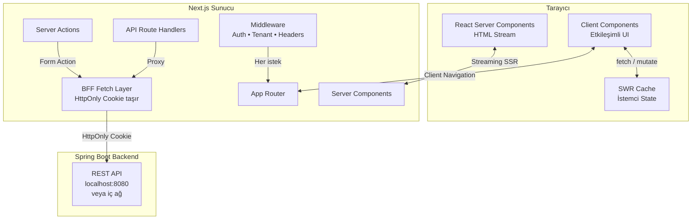

# İşAkış — 06: Frontend Mimari ve Güvenlik

> Proje: İşAkış
> Doküman: Frontend Mimari ve Güvenlik
> Durum: Draft
> Üretim tarihi: 2026-07-21
> Kaynak girdi: templates/01_PROJE_GIRDI_FORMU.yaml

---

## İçindekiler

1. [Mimari Genel Bakış](#1-mimari-genel-bakış)
2. [Uygulama ve Modül Yapısı](#2-uygulama-ve-modül-yapısı)
3. [Routing Mimarisi](#3-routing-mimarisi)
4. [Server/Client Sınırı](#4-serverclient-sınırı)
5. [State Yönetimi](#5-state-yönetimi)
6. [API Erişim Katmanı](#6-api-erişim-katmanı)
7. [Form ve Veri Doğrulama](#7-form-ve-veri-doğrulama)
8. [Authentication ve Oturum Yönetimi](#8-authentication-ve-oturum-yönetimi)
9. [Authorization UX](#9-authorization-ux)
10. [Güvenlik Kontrolleri](#10-güvenlik-kontrolleri)
11. [CSP ve Güvenlik Başlıkları](#11-csp-ve-güvenlik-başlıkları)
12. [Dosya Yükleme Akışı](#12-dosya-yükleme-akışı)
13. [Hata Yönetimi](#13-hata-yönetimi)
14. [Erişilebilirlik](#14-erişilebilirlik)
15. [Performans Bütçesi](#15-performans-bütçesi)
16. [Frontend Test Stratejisi](#16-frontend-test-stratejisi)
17. [Güvenlik Kontrol Listesi](#17-güvenlik-kontrol-listesi)

---

## 1. Mimari Genel Bakış

İşAkış frontend mimarisi, Next.js 14 App Router üzerine inşa edilmiş çok panelli bir web uygulamasıdır. BFF (Backend For Frontend) modeliyle çalışır; tüm API çağrıları Next.js sunucu tarafından yapılır ve hassas token'lar istemci JavaScript'ine hiç erişmez.



---

## 2. Uygulama ve Modül Yapısı

Proje, feature-based (özellik tabanlı) dizin yapısı kullanır. Her iş alanı kendi dizininde barındırılır ve ortak kodlar `shared` altında toplanır.

```
src/
├── app/                          # Next.js App Router sayfaları
│   ├── (auth)/                   # Auth route grubu (layout'suz)
│   │   ├── login/
│   │   ├── forgot-password/
│   │   └── reset-password/
│   ├── (dashboard)/              # Dashboard route grubu (ortak layout)
│   │   ├── layout.tsx            # Sidebar + TenantContext + AuthGuard
│   │   ├── page.tsx              # Ana dashboard
│   │   ├── work-orders/
│   │   │   ├── page.tsx          # İş emri listesi
│   │   │   ├── [id]/
│   │   │   │   ├── page.tsx      # İş emri detayı
│   │   │   │   └── edit/
│   │   │   └── new/
│   │   ├── customers/
│   │   ├── assets/
│   │   ├── scheduling/
│   │   ├── checklists/
│   │   ├── inventory/
│   │   ├── reports/
│   │   ├── settings/
│   │   │   ├── profile/
│   │   │   ├── users/
│   │   │   └── tenant/
│   │   └── admin/                # Sadece admin rolü
│   │       ├── audit/
│   │       └── billing/
│   └── api/                      # API Route Handlers (BFF proxy)
│       ├── auth/
│       └── proxy/[...path]/
├── features/                     # Feature-based modüller
│   ├── auth/
│   │   ├── components/
│   │   ├── hooks/
│   │   ├── services/
│   │   └── types/
│   ├── work-orders/
│   │   ├── components/
│   │   │   ├── WorkOrderList.tsx
│   │   │   ├── WorkOrderDetail.tsx
│   │   │   ├── WorkOrderForm.tsx
│   │   │   ├── WorkOrderStatusBadge.tsx
│   │   │   └── WorkOrderTimeline.tsx
│   │   ├── hooks/
│   │   │   ├── useWorkOrders.ts
│   │   │   └── useWorkOrderDetail.ts
│   │   ├── services/
│   │   │   └── workOrderService.ts
│   │   ├── schemas/
│   │   │   └── workOrderSchema.ts  # Zod validation
│   │   └── types/
│   ├── customers/
│   ├── assets/
│   ├── scheduling/
│   ├── checklists/
│   ├── inventory/
│   ├── files/
│   └── reports/
├── shared/                       # Paylaşılan kod
│   ├── components/
│   │   ├── ui/                   # Temel UI bileşenleri (Button, Input...)
│   │   ├── layout/               # Layout bileşenleri (Sidebar, Header)
│   │   └── data-display/         # DataTable, Card, Badge
│   ├── hooks/
│   │   ├── useAuth.ts
│   │   ├── useTenant.ts
│   │   ├── usePermission.ts
│   │   └── usePagination.ts
│   ├── lib/
│   │   ├── api-client.ts         # BFF API istemcisi
│   │   ├── auth.ts               # Auth yardımcıları
│   │   ├── permissions.ts        # Permission kontrolü
│   │   └── utils.ts
│   ├── schemas/                  # Paylaşılan Zod şemaları
│   └── types/                    # Paylaşılan TypeScript tipleri
├── middleware.ts                  # Next.js Middleware (auth, tenant, CSP)
└── instrumentation.ts            # OpenTelemetry
```

---

## 3. Routing Mimarisi

Next.js App Router kullanılır. Route grupları `(auth)` ve `(dashboard)` ile layout paylaşımı sağlanır.

### Route Tanımları

| Route | Sayfa | Erişim | Render Stratejisi |
|-------|-------|--------|-------------------|
| `/login` | Giriş sayfası | Herkese açık | SSR (dinamik) |
| `/forgot-password` | Şifre sıfırlama | Herkese açık | SSR |
| `/` | Ana dashboard | Kullanıcı (giriş yapmış) | SSR + CSR hydration |
| `/work-orders` | İş emirleri listesi | Tüm roller | SSR + CSR hydration |
| `/work-orders/[id]` | İş emri detayı | Tüm roller | SSR (generateMetadata) + CSR |
| `/work-orders/new` | Yeni iş emri | Admin, Dispatcher | CSR (form ağırlıklı) |
| `/customers` | Müşteri listesi | Tüm roller | SSR + CSR hydration |
| `/assets` | Varlık listesi | Tüm roller | ISR (60s revalidate) |
| `/scheduling` | İş takvimi | Admin, Dispatcher | CSR (takvim interaktif) |
| `/checklists` | Kontrol listeleri | Tüm roller | SSR |
| `/reports` | Raporlar | Admin, Yönetici | CSR (dashboard) |
| `/settings/*` | Ayarlar | Admin, Yönetici | SSR + CSR |
| `/admin/*` | Yönetim paneli | Sadece Admin | SSR |
| `/api/proxy/[...path]` | BFF API proxy | Giriş yapmış | API Route (server-only) |

### Route Guard (Middleware)

`middleware.ts` her istekte çalışır:

```
İstek gelir
  → /login, /forgot-password, /reset-password? → Geçir (public)
  → Cookie'de `saha-flow-session` var mı?
    → Yok → /login sayfasına yönlendir (redirect)
    → Var → Backend'e `/api/v1/auth/session` isteği ile doğrula
      → Geçersiz/expired → Cookie'yi temizle, /login'e yönlendir
      → Geçerli → Tenant ID header ekle, isteği geçir
```

Middleware'de ağır session doğrulama yapılmaz; sadece cookie varlığı ve temel JWT expiry kontrolü. Detaylı RBAC kontrolü sayfa/layout seviyesinde yapılır.

---

## 4. Server/Client Sınırı

İşAkış'ın en kritik mimari kararlarından biri, hangi kodun sunucuda (server component), hangi kodun istemcide (client component) çalışacağıdır.

### Server Components (Varsayılan)

Şu durumlarda Server Component kullanılır:

- Veri çekme (doğrudan backend API çağrısı, HttpOnly cookie ile)
- Hassas iş mantığı (izin kontrolü, tenant doğrulama)
- SEO için metadata (sayfa başlığı, açıklama)
- Statik / az değişen içerik (yardım metinleri, katalog verileri)

```typescript
// app/work-orders/page.tsx — Server Component
import { getServerSession } from '@/shared/lib/auth';
import { workOrderService } from '@/features/work-orders/services';
import { WorkOrderList } from '@/features/work-orders/components';

export default async function WorkOrdersPage() {
  const session = await getServerSession();
  const workOrders = await workOrderService.list(session.tenantId, {
    page: 1,
    size: 20,
  });

  return <WorkOrderList initialData={workOrders} />;
}
```

### Client Components (Açıkça 'use client' ile)

Şu durumlarda Client Component kullanılır:

- `useState`, `useEffect`, `useReducer` hooks
- Event handler'lar (`onClick`, `onChange`, `onSubmit`)
- Tarayıcı API'leri (`localStorage`, `geolocation`, `IntersectionObserver`)
- SWR ile istemci tarafı veri çekme (realtime update, mutate)
- Form validasyonu (Zod + react-hook-form)

```typescript
// features/work-orders/components/WorkOrderList.tsx — Client Component
'use client';

import { useWorkOrders } from '../hooks/useWorkOrders';
import { DataTable } from '@/shared/components/data-display';
import { usePermission } from '@/shared/hooks';

export function WorkOrderList({ initialData }: { initialData: WorkOrderPage }) {
  const { data, error, isLoading, mutate } = useWorkOrders({ fallbackData: initialData });
  const { can } = usePermission();

  return (
    <DataTable
      data={data?.items ?? []}
      columns={columns}
      onRowClick={(row) => router.push(`/work-orders/${row.id}`)}
      actions={can('work-order:create') ? ['create'] : []}
    />
  );
}
```

### Sınır Kuralları

```
Server Component
  ├── async/await ile veri çek
  ├── HttpOnly cookie'yi oku (cookies())
  ├── Backend'e doğrudan istek yap
  ├── Secret/API key içerebilir
  └── İstemci etkileşimi YOK → Client Component'i child olarak kullan

Client Component ('use client')
  ├── useState, useEffect, useReducer
  ├── SWR ile client-side fetch
  ├── Event handler'lar
  ├── Asla secret/API key içeremez
  ├── Hassas veriyi props ile alır (server → client serialization)
  └── Kullanıcıdan veri girişi → Zod doğrulama → Server Action veya API route'a gönder
```

---

## 5. State Yönetimi

İşAkış'ta karmaşık global state yönetimi (Redux, Zustand, MobX) kullanılmaz. 2 kişilik ekip ve orta karmaşıklıkta bir uygulama için React Context + SWR yeterlidir.

### State Katmanları

| Katman | Araç | Kullanım |
|--------|------|----------|
| **Server State** | SWR | Backend'den gelen tüm veriler (iş emri listesi, müşteri, varlık, vb.) |
| **Client State** | React Context | Auth (user, tenant, permissions), UI (sidebar açık/kapalı, tema) |
| **Form State** | react-hook-form | Tüm formlar (iş emri oluşturma, müşteri düzenleme, vb.) |
| **URL State** | useSearchParams, useRouter | Sayfalama, filtreleme, sıralama, sekme seçimi |

### SWR Yapılandırması

```typescript
// shared/lib/swr-config.ts
import { SWRConfig } from 'swr';

const swrConfig = {
  revalidateOnFocus: false,       // Sekme değişiminde yeniden fetch YAPMA
  revalidateOnReconnect: true,    // İnternet geri gelince fetch
  shouldRetryOnError: true,
  errorRetryCount: 3,
  errorRetryInterval: 2000,       // 2 saniye aralıkla
  dedupingInterval: 5000,         // 5 saniye içinde aynı key duplicate olmaz
  fallback: {},                   // SSR'dan gelen veriler buraya yazılır
};

// SWR key standardı:
// `/api/proxy/tenants/{tenantId}/work-orders?page=1&size=20&status=OPEN`
// — API endpoint'i olduğu gibi key olarak kullanılır.
```

### Context Yapısı

```typescript
// AuthContext
interface AuthContextValue {
  user: User | null;
  tenant: Tenant | null;
  permissions: string[];
  isLoading: boolean;
  login: (email: string, password: string) => Promise<void>;
  logout: () => Promise<void>;
  refreshSession: () => Promise<void>;
}

// TenantContext
interface TenantContextValue {
  currentTenant: Tenant;
  switchTenant: (tenantId: string) => void;  // Gelecek özelliği
}

// UIContext (sidebar, tema)
interface UIContextValue {
  sidebarOpen: boolean;
  toggleSidebar: () => void;
  theme: 'light' | 'dark' | 'system';
  setTheme: (theme: string) => void;
}
```

---

## 6. API Erişim Katmanı

BFF (Backend For Frontend) modeliyle, istemci JavaScript'i asla doğrudan Spring Boot API'ye istek yapmaz. Tüm API çağrıları Next.js sunucusu üzerinden geçer.

### Akış

```
[Client Component] → SWR fetch() → /api/proxy/[...path] → [Next.js API Route]
  → HttpOnly cookie'yi ekle → Spring Boot API
```

### API Route Handler (BFF Proxy)

```typescript
// app/api/proxy/[...path]/route.ts
import { NextRequest, NextResponse } from 'next/server';
import { cookies } from 'next/headers';

const BACKEND_URL = process.env.BACKEND_INTERNAL_URL ?? 'http://localhost:8080';

export async function GET(req: NextRequest) {
  return proxyRequest(req, 'GET');
}

export async function POST(req: NextRequest) {
  return proxyRequest(req, 'POST');
}

export async function PUT(req: NextRequest) {
  return proxyRequest(req, 'PUT');
}

export async function PATCH(req: NextRequest) {
  return proxyRequest(req, 'PATCH');
}

export async function DELETE(req: NextRequest) {
  return proxyRequest(req, 'DELETE');
}

async function proxyRequest(req: NextRequest, method: string): Promise<NextResponse> {
  const path = req.nextUrl.pathname.replace('/api/proxy', '/api/v1');
  const url = `${BACKEND_URL}${path}${req.nextUrl.search}`;

  const cookieStore = await cookies();
  const sessionCookie = cookieStore.get('saha-flow-session');

  if (!sessionCookie) {
    return NextResponse.json({ error: 'Unauthorized' }, { status: 401 });
  }

  const headers = new Headers();
  headers.set('Cookie', `saha-flow-session=${sessionCookie.value}`);
  headers.set('Content-Type', 'application/json');

  // Client'ın gönderdiği ek header'ları aktar (Idempotency-Key vb.)
  const idempotencyKey = req.headers.get('Idempotency-Key');
  if (idempotencyKey) headers.set('Idempotency-Key', idempotencyKey);

  const body = method === 'GET' || method === 'HEAD'
    ? undefined
    : await req.text();

  const response = await fetch(url, {
    method,
    headers,
    body,
    redirect: 'manual',  // Open redirect'e karşı
  });

  const data = await response.json();

  return NextResponse.json(data, {
    status: response.status,
    headers: {
      'Cache-Control': 'no-store',  // BFF yanıtları cache'lenmez
    },
  });
}
```

### Hata Yönetimi (API Katmanı)

```typescript
// shared/lib/api-client.ts
class ApiError extends Error {
  status: number;
  detail: string;
  errors?: ValidationError[];

  constructor(status: number, detail: string, errors?: ValidationError[]) {
    super(detail);
    this.status = status;
    this.detail = detail;
    this.errors = errors;
  }
}

async function apiFetch<T>(path: string, options?: RequestInit): Promise<T> {
  const res = await fetch(`/api/proxy${path}`, {
    ...options,
    headers: {
      'Content-Type': 'application/json',
      ...options?.headers,
    },
  });

  if (!res.ok) {
    const body = await res.json().catch(() => ({}));
    throw new ApiError(res.status, body.detail ?? 'Beklenmeyen bir hata oluştu', body.errors);
  }

  return res.json();
}
```

---

## 7. Form ve Veri Doğrulama

Tüm kullanıcı girdileri hem istemci tarafında (UX için) hem de sunucu tarafında (güvenlik için) doğrulanır.

### İstemci Tarafı: Zod + react-hook-form

```typescript
// features/work-orders/schemas/workOrderSchema.ts
import { z } from 'zod';

export const workOrderCreateSchema = z.object({
  title: z
    .string()
    .min(5, 'Başlık en az 5 karakter olmalıdır')
    .max(200, 'Başlık en fazla 200 karakter olabilir'),
  description: z
    .string()
    .min(10, 'Açıklama en az 10 karakter olmalıdır')
    .max(5000, 'Açıklama en fazla 5000 karakter olabilir'),
  customerId: z.string().uuid('Geçersiz müşteri ID'),
  assetId: z.string().uuid('Geçersiz varlık ID').optional(),
  priority: z.enum(['LOW', 'MEDIUM', 'HIGH', 'CRITICAL']),
  scheduledStartAt: z.string().datetime('Geçersiz başlangıç tarihi'),
  scheduledEndAt: z.string().datetime('Geçersiz bitiş tarihi'),
  checklistTemplateId: z.string().uuid('Geçersiz şablon ID').optional(),
  notes: z.string().max(2000, 'Notlar en fazla 2000 karakter olabilir').optional(),
}).refine(
  (data) => new Date(data.scheduledEndAt) > new Date(data.scheduledStartAt),
  { message: 'Bitiş tarihi başlangıç tarihinden sonra olmalıdır', path: ['scheduledEndAt'] }
);

export type WorkOrderCreate = z.infer<typeof workOrderCreateSchema>;
```

### Form Bileşeni

```typescript
'use client';

import { useForm } from 'react-hook-form';
import { zodResolver } from '@hookform/resolvers/zod';
import { workOrderCreateSchema, type WorkOrderCreate } from '../schemas';
import { useCreateWorkOrder } from '../hooks/useWorkOrders';

export function WorkOrderForm({ customers, assets, checklistTemplates }: WorkOrderFormProps) {
  const { register, handleSubmit, formState: { errors } } = useForm<WorkOrderCreate>({
    resolver: zodResolver(workOrderCreateSchema),
  });

  const { create, isMutating } = useCreateWorkOrder();

  const onSubmit = async (data: WorkOrderCreate) => {
    try {
      await create(data);
      toast.success('İş emri oluşturuldu');
    } catch (err) {
      toast.error('İş emri oluşturulamadı');
    }
  };

  // ... JSX
}
```

### Sunucu Tarafı Doğrulama

Backend'de aynı şema Java tarafında `@Valid` + Bean Validation ile tekrar doğrulanır. Frontend doğrulaması asla backend doğrulamasının yerine geçmez; savunma derinliği prensibi gereği her ikisi de uygulanır.

---

## 8. Authentication ve Oturum Yönetimi

### Mimari: BFF + HttpOnly Secure SameSite Cookie

```
[Kullanıcı giriş yapar]
  → POST /api/proxy/auth/login (email, password)
  → Next.js API Route → Spring Boot /api/v1/auth/login
  → Spring Boot: Kullanıcıyı doğrula, iki token üret:
      - Access Token (JWT, 15dk expiry, user_id, tenant_id, permissions)
      - Refresh Token (opaque, 7 gün expiry, veritabanında saklı)
  → Response: Set-Cookie header ile:
      saha-flow-session=<access_token>; HttpOnly; Secure; SameSite=Strict; Path=/; Max-Age=900
  → Response body: { user: { id, name, email }, tenant: { id, name } }

[Access Token expire olunca]
  → Next.js API proxy: 401 yanıtı alır
  → Refresh token ile POST /api/v1/auth/refresh
  → Spring Boot: Refresh token'ı doğrula, rotate et
  → Yeni access token Set-Cookie

[Kullanıcı çıkış yapar]
  → POST /api/v1/auth/logout
  → Spring Boot: Refresh token'ı invalidate et
  → Set-Cookie: saha-flow-session=; Max-Age=0 (cookie'yi sil)
```

### Oturum Güvenliği

| Kontrol | Uygulama |
|---------|----------|
| **Cookie flags** | HttpOnly, Secure, SameSite=Strict, Path=/ |
| **Token tipi** | JWT (RS256, asymmetric), 15 dakika expiry |
| **Refresh token** | Opaque random string, veritabanında hash'lenmiş |
| **Token rotation** | Refresh kullanıldığında eski token invalidate edilir |
| **Reuse detection** | Refresh token tekrar kullanılırsa, tüm kullanıcı oturumları sonlandırılır |
| **Session binding** | Token'da IP hash ve User-Agent hash (opsiyonel, mobil kullanımda sorun yaratabilir) |
| **Brute force** | 5 başarısız giriş → 15 dakika hesap kilitleme |
| **Concurrent session** | Aynı kullanıcı en fazla 5 aktif oturum |

---

## 9. Authorization UX

Rol tabanlı kullanıcı arayüzü kontrolleri.

### Permission Kontrol Hook'u

```typescript
// shared/hooks/usePermission.ts
export function usePermission() {
  const { permissions } = useAuth();

  return {
    can: (permission: string): boolean => {
      return permissions.includes(permission);
    },
    canAny: (requiredPermissions: string[]): boolean => {
      return requiredPermissions.some((p) => permissions.includes(p));
    },
    canAll: (requiredPermissions: string[]): boolean => {
      return requiredPermissions.every((p) => permissions.includes(p));
    },
  };
}
```

### Rol-Permission Matrisi (Frontend)

| Rol | İş Emri Görüntüle | İş Emri Oluştur/Düzenle | Müşteri Yönet | Raporlar | Sistem Ayarı | Audit |
|-----|-------------------|------------------------|---------------|----------|--------------|-------|
| **Admin** | ✅ | ✅ | ✅ | ✅ | ✅ | ✅ |
| **Yönetici** | ✅ | ✅ | ✅ | ✅ | ❌ | ❌ |
| **Dispatcher** | ✅ | ✅ | ✅ | ❌ | ❌ | ❌ |
| **Teknisyen** | ✅ (kendine atanan) | ❌ (sadece durum güncelleme) | ❌ | ❌ | ❌ | ❌ |

### UI'da Permission Tabanlı Render

```tsx
// Sayfa seviyesinde yetkilendirme
// app/admin/audit/layout.tsx
export default function AdminLayout({ children }: { children: React.ReactNode }) {
  return (
    <PermissionGuard required="audit:read" fallback={<Unauthorized />}>
      {children}
    </PermissionGuard>
  );
}

// Bileşen seviyesinde yetkilendirme
<PermissionGate permission="work-order:create">
  <Button onClick={() => router.push('/work-orders/new')}>
    Yeni İş Emri
  </Button>
</PermissionGate>
```

### Önemli: Frontend yetkilendirme kontrolleri yalnızca UX içindir. Gerçek yetkilendirme backend'de zorunlu olarak yapılır. Hiçbir frontend kontrolü güvenlik mekanizması olarak kabul edilmez.

---

## 10. Güvenlik Kontrolleri

### XSS (Cross-Site Scripting) Koruması

| Katman | Önlem |
|--------|-------|
| **React varsayılan** | JSX otomatik olarak tüm değişkenleri escape eder. `dangerouslySetInnerHTML` kullanımı yasaktır. ESLint kuralı: `react/no-danger` → error. |
| **Output encoding** | Kullanıcı girdisi doğrudan DOM'a yazılmaz. `textContent` tercih edilir. |
| **URL güvenliği** | `javascript:` protokolü engellenir. URL'ler `new URL()` ile doğrulanır. |
| **CSP** | Content Security Policy ile inline script engellenir (aşağıda detaylı). |
| **HttpOnly cookie** | JWT token JavaScript'ten erişilemez, XSS ile çalınamaz. |

### CSRF (Cross-Site Request Forgery) Koruması

| Katman | Önlem |
|--------|-------|
| **SameSite=Strict** | Cookie sadece aynı site isteklerinde gönderilir. Modern tarayıcılarda CSRF'yi engeller. |
| **CSRF Token (Spring Security)** | Spring Security 6, cookie tabanlı CSRF token üretir. Next.js API proxy, bu token'ı `X-XSRF-TOKEN` header olarak iletir. |
| **Origin/Referer kontrolü** | Backend'de Origin ve Referer header doğrulaması. |
| **State-changing operations** | GET istekleri hiçbir zaman state değiştirmez (POST/PUT/PATCH/DELETE zorunlu). |

### Clickjacking Koruması

| Katman | Önlem |
|--------|-------|
| **X-Frame-Options** | `DENY` — sayfa hiçbir frame içinde gösterilemez. |
| **Content-Security-Policy** | `frame-ancestors 'none'` — CSP seviyesinde koruma. |
| **SameSite=Strict** | Frame'den gelen isteklerde cookie gönderilmez. |

### Open Redirect Koruması

| Katman | Önlem |
|--------|-------|
| **Login redirect** | `redirect_uri` parametresi yalnızca whitelist'teki URL'leri kabul eder. `/login?redirect=/work-orders` — sadece relative path. Mutlak URL reddedilir. |
| **Next.js redirect** | `next.config.js`'de `redirects` sadece internal path'lere yönlendirir. |
| **Backend API proxy** | `fetch(url, { redirect: 'manual' })` — otomatik yönlendirme engellenir. |

---

## 11. CSP ve Güvenlik Başlıkları

### Content Security Policy

`middleware.ts`'te her yanıta CSP header'ı eklenir:

```typescript
// middleware.ts - CSP
const cspHeader = [
  "default-src 'self'",
  "script-src 'self' 'unsafe-inline'",      // Next.js için 'unsafe-inline' gerekli (development)
  "style-src 'self' 'unsafe-inline'",        // CSS-in-JS için
  "img-src 'self' data: https://*.cloudflare-r2.com",
  "font-src 'self'",
  "connect-src 'self'",
  "frame-ancestors 'none'",                  // Clickjacking koruma
  "form-action 'self'",                      // Form sadece kendi domain'e submit
  "base-uri 'self'",                         // Base tag hijacking engelleme
  "object-src 'none'",                       // Flash, Java applet engelleme
  "upgrade-insecure-requests",               // HTTP → HTTPS yükseltme
].join('; ');

// Production'da script-src 'unsafe-inline' kaldırılmalı, nonce veya hash kullanılmalı.
// MVP aşamasında Next.js'in gereksinimi için 'unsafe-inline' kabul edilebilir.
```

### Diğer Güvenlik Başlıkları

| Header | Değer | Amaç |
|--------|-------|------|
| `Strict-Transport-Security` | `max-age=63072000; includeSubDomains; preload` | HTTPS zorlaması (HSTS) |
| `X-Content-Type-Options` | `nosniff` | MIME sniffing engelleme |
| `X-Frame-Options` | `DENY` | Clickjacking engelleme |
| `Referrer-Policy` | `strict-origin-when-cross-origin` | Referrer bilgisi sızıntısını azaltma |
| `Permissions-Policy` | `camera=(), geolocation=(self), microphone=()` | Tarayıcı API erişimi kısıtlama |
| `Cross-Origin-Opener-Policy` | `same-origin` | COOP, side-channel saldırılarına karşı |
| `Cross-Origin-Resource-Policy` | `same-origin` | CORP, cross-origin kaynak yükleme engelleme |

### `next.config.js` ile Header'lar

```typescript
// next.config.js (headless CMS veya statik export için ek)
const securityHeaders = [
  { key: 'X-DNS-Prefetch-Control', value: 'on' },
  { key: 'Strict-Transport-Security', value: 'max-age=63072000; includeSubDomains; preload' },
  { key: 'X-Content-Type-Options', value: 'nosniff' },
  { key: 'Referrer-Policy', value: 'strict-origin-when-cross-origin' },
  { key: 'Permissions-Policy', value: 'camera=(), geolocation=(self), microphone=()' },
];

module.exports = {
  async headers() {
    return [
      { source: '/(.*)', headers: securityHeaders },
    ];
  },
};
```

---

## 12. Dosya Yükleme Akışı

Dosya yüklemesinde presigned URL yaklaşımı kullanılır. Dosya hiçbir zaman backend sunucusundan geçmez.

```
[Kullanıcı dosya yüklemek ister]
  1. Client: POST /api/proxy/files/upload-request
     → { fileName: "foto.jpg", contentType: "image/jpeg", fileSize: 2048000 }
  2. Backend: Presigned URL oluştur (5 dakika geçerli)
     → Tenant prefix: /tenant-uuid/work-orders/wo-uuid/foto.jpg
     → Dosya boyutu limiti: 10MB (foto), 50MB (video), 25MB (PDF)
     → İzin verilen MIME tipleri: image/jpeg, image/png, image/webp, application/pdf, video/mp4
  3. Backend: media_object tablosuna kayıt oluştur (status=PENDING)
     → Response: { uploadUrl, objectKey, mediaObjectId }
  4. Client: Dosyayı doğrudan presigned URL ile S3'e yükle (PUT)
  5. Client: POST /api/proxy/files/upload-complete
     → { mediaObjectId, objectKey }
  6. Backend: Dosyanın yüklendiğini S3'ten doğrula (HEAD request)
     → media_object status = READY
     → Virüs taraması tetikle (ClamAV, MVP sonrası)
     → EXIF metadata temizleme (varsa konum verisi)
```

### Güvenlik Kontrolleri (Dosya Yükleme)

| Kontrol | Uygulama |
|---------|----------|
| **Dosya boyutu sınırı** | Frontend: 10MB (maksimum ön kontrol), Backend: presigned URL'de Content-Length limiti |
| **MIME tipi doğrulama** | Frontend: `file.type` kontrolü, Backend: presigned URL'de Content-Type kısıtlaması, S3'te magic byte kontrolü (MVP sonrası) |
| **Dosya adı sanitizasyonu** | Orijinal dosya adı kaydedilmez. UUID tabanlı benzersiz ad: `{uuid}.{ext}` |
| **Tenant izolasyonu** | Tüm dosyalar `/tenant-{id}/` prefix altında saklanır. Presigned URL sadece kendi tenant prefix'ine erişim verir. |
| **Virüs taraması** | MVP'de: yalnızca MIME tipi kontrolü. MVP sonrası: ClamAV ile S3 bucket trigger üzerinden virüs taraması. |
| **EXIF/metadata temizleme** | MVP sonrası: Yükleme sırasında EXIF verileri sıyrılır (özellikle GPS koordinatları). |
| **Presigned URL süresi** | 5 dakika. Bu süre içinde yüklenmezse URL geçersiz olur. |

---

## 13. Hata Yönetimi

### Hata Katmanları

```
[Backend] → RFC 7807 Problem Detail JSON
  → [Next.js API Route] → Problem Detail'i frontend ApiError'a dönüştür
    → [Client Component] → Kullanıcıya gösterilecek mesaj
```

### Backend Hata Formatı (RFC 7807)

```json
{
  "type": "https://api.sahaflow.com/errors/validation-failed",
  "title": "Validation Failed",
  "status": 422,
  "detail": "İş emri oluşturulurken doğrulama hatası oluştu",
  "instance": "/api/v1/tenants/abc/work-orders",
  "errors": [
    { "field": "title", "message": "Başlık en az 5 karakter olmalıdır" },
    { "field": "customerId", "message": "Geçersiz müşteri ID" }
  ]
}
```

### Frontend Hata Yönetimi

```typescript
// features/work-orders/hooks/useCreateWorkOrder.ts
export function useCreateWorkOrder() {
  const { data: _, error, trigger, isMutating } = useSWRMutation(
    '/api/proxy/tenants/current/work-orders',
    (url, { arg }: { arg: WorkOrderCreate }) => apiFetch(url, {
      method: 'POST',
      body: JSON.stringify(arg),
    })
  );

  return {
    create: trigger,
    isMutating,
    error, // SWR error state'i
  };
}

// Error boundary (React Error Boundary)
// app/error.tsx — Next.js App Router error boundary
'use client';

export default function ErrorPage({
  error,
  reset,
}: {
  error: Error & { digest?: string };
  reset: () => void;
}) {
  return (
    <div role="alert">
      <h2>Bir hata oluştu</h2>
      <p>{error.message}</p>
      <button onClick={reset}>Tekrar Dene</button>
    </div>
  );
}
```

### Global Error Toast

Tüm beklenmeyen hatalar için global toast bildirimi:

```typescript
// SWR global onError
<SWRConfig value={{
  onError: (error, key) => {
    if (error.status >= 500) {
      toast.error('Sunucu hatası oluştu, lütfen daha sonra tekrar deneyin');
    }
    // 401: AuthContext handle eder (logout)
    // 403: PermissionGate handle eder
    // 404: Sayfa veya bileşen seviyesinde handle edilir
    // 422: Form bileşeni handle eder (alan hataları)
  }
}}>
```

---

## 14. Erişilebilirlik

İşAkış, WCAG 2.1 AA seviyesini hedefler.

| Kriter | Uygulama |
|--------|----------|
| **Semantik HTML** | `<header>`, `<nav>`, `<main>`, `<section>`, `<article>`, `<aside>` doğru kullanımı |
| **ARIA** | `role`, `aria-label`, `aria-describedby`, `aria-hidden` gerekli yerlerde |
| **Klavye navigasyonu** | Tüm interaktif elementler klavyeyle erişilebilir (Tab, Enter, Space, Escape) |
| **Focus yönetimi** | Modal açıldığında focus modal'a taşınır, kapandığında tetikleyiciye döner |
| **Renk kontrastı** | Minimum 4.5:1 (normal metin), 3:1 (büyük metin). Tailwind renk paleti doğrulanır. |
| **Form erişilebilirliği** | Tüm input'larda `<label>`, hata mesajları `aria-describedby` ile bağlı |
| **Toast / bildirim** | `role="alert"` veya `aria-live="polite"` ile ekran okuyucuya bildirilir |
| **Skip link** | İlk tab'da "Ana içeriğe atla" linki görünür |

### ESLint Erişilebilirlik Kuralları

```json
{
  "extends": ["next/core-web-vitals", "plugin:jsx-a11y/recommended"],
  "rules": {
    "jsx-a11y/anchor-is-valid": "error",
    "jsx-a11y/alt-text": "error",
    "jsx-a11y/label-has-associated-control": "error",
    "jsx-a11y/no-autofocus": "warn"
  }
}
```

---

## 15. Performans Bütçesi

| Metrik | Hedef | Ölçüm Aracı |
|--------|-------|-------------|
| **LCP (Largest Contentful Paint)** | < 2.5 saniye | Lighthouse, Web Vitals |
| **FID (First Input Delay)** | < 100 ms | Lighthouse, Web Vitals |
| **CLS (Cumulative Layout Shift)** | < 0.1 | Lighthouse, Web Vitals |
| **TTFB (Time to First Byte)** | < 600 ms | Lighthouse |
| **First Load JS** | < 150 KB (gzipped) | `next build` output |
| **Total Bundle Size** | < 300 KB (gzipped, per route) | `@next/bundle-analyzer` |
| **Image Size** | < 200 KB (per image, before optimization) | `next/image` optimizasyonu |
| **Lighthouse Score** | > 90 (Performance, Accessibility, Best Practices, SEO) | Lighthouse CI |
| **Sayfa Yüklenme (3G)** | < 3 saniye (interaktif) | Playwright test |

### Optimizasyon Teknikleri

- **`next/image`**: Otomatik WebP/AVIF dönüşümü, lazy loading, responsive sizing
- **`next/dynamic`**: Büyük bileşenler için lazy loading (`import()`)
- **Font optimizasyonu**: `next/font` ile font subsetting ve `display: swap`
- **Bundle splitting**: Route-based code splitting (App Router varsayılan)
- **ISR**: Az değişen veriler için Incremental Static Regeneration
- **Prefetching**: `<Link>` bileşenleri otomatik prefetch (viewport'ta)

---

## 16. Frontend Test Stratejisi

### Test Piramidi (Frontend)

```
        ┌─────┐
        │ E2E  │  Playwright (5-10 test)
       ┌┴─────┴┐
       │  Bileşen │  Vitest + React Testing Library (20-30 test)
      ┌┴─────────┴┐
      │  Birim     │  Vitest (50+ test)
     ┌┴───────────┴┐
     │  Statik      │  TypeScript + ESLint
    └──────────────┘
```

### Birim Testleri (Vitest)

```typescript
// features/work-orders/schemas/__tests__/workOrderSchema.test.ts
import { describe, it, expect } from 'vitest';
import { workOrderCreateSchema } from '../workOrderSchema';

describe('workOrderCreateSchema', () => {
  it('geçerli veri ile başarılı parse', () => {
    const result = workOrderCreateSchema.safeParse({
      title: 'Klima bakımı',
      description: 'Ofis kliması yıllık bakım',
      customerId: '550e8400-e29b-41d4-a716-446655440000',
      priority: 'MEDIUM',
      scheduledStartAt: '2026-08-01T09:00:00Z',
      scheduledEndAt: '2026-08-01T11:00:00Z',
    });
    expect(result.success).toBe(true);
  });

  it('kısa başlık ile hata döner', () => {
    const result = workOrderCreateSchema.safeParse({
      title: 'AB',
      // ...eksik alanlar
    });
    expect(result.success).toBe(false);
  });

  it('bitiş tarihi başlangıçtan önceyse hata döner', () => {
    const result = workOrderCreateSchema.safeParse({
      title: 'Klima Bakımı',
      description: 'Detaylı açıklama burada',
      customerId: '550e8400-e29b-41d4-a716-446655440000',
      priority: 'MEDIUM',
      scheduledStartAt: '2026-08-01T11:00:00Z',
      scheduledEndAt: '2026-08-01T09:00:00Z',
    });
    expect(result.success).toBe(false);
  });
});
```

### Bileşen Testleri (Vitest + RTL)

```typescript
// features/work-orders/components/__tests__/WorkOrderStatusBadge.test.tsx
import { render, screen } from '@testing-library/react';
import { WorkOrderStatusBadge } from '../WorkOrderStatusBadge';

describe('WorkOrderStatusBadge', () => {
  it.each([
    ['OPEN', 'Açık'],
    ['IN_PROGRESS', 'Devam Ediyor'],
    ['COMPLETED', 'Tamamlandı'],
    ['CANCELLED', 'İptal'],
  ])('%s durumunda doğru etiketi gösterir', (status, label) => {
    render(<WorkOrderStatusBadge status={status as any} />);
    expect(screen.getByText(label)).toBeInTheDocument();
  });
});
```

### E2E Testleri (Playwright)

```typescript
// e2e/work-orders.spec.ts
import { test, expect } from '@playwright/test';

test.describe('İş Emri Yönetimi', () => {
  test.beforeEach(async ({ page }) => {
    await page.goto('/login');
    await page.fill('[name="email"]', 'admin@test.com');
    await page.fill('[name="password"]', 'Test1234!');
    await page.click('button[type="submit"]');
    await expect(page).toHaveURL('/');
  });

  test('yeni iş emri oluşturma akışı', async ({ page }) => {
    await page.click('text=Yeni İş Emri');
    await expect(page).toHaveURL('/work-orders/new');

    await page.fill('[name="title"]', 'Playwright Test İş Emri');
    await page.fill('[name="description"]', 'E2E test ile oluşturuldu');
    await page.selectOption('[name="customerId"]', { index: 1 });
    await page.selectOption('[name="priority"]', 'MEDIUM');
    await page.click('button[type="submit"]');

    await expect(page.locator('.toast-success')).toBeVisible();
    await expect(page).toHaveURL(/\/work-orders\//);
  });

  test('yetkisiz kullanıcı admin sayfasına erişemez', async ({ page }) => {
    // Teknisyen ile giriş yap
    await page.goto('/admin/audit');
    await expect(page.locator('text=Yetkisiz Erişim')).toBeVisible();
  });
});
```

### Test Çalıştırma (CI)

```bash
# Birim ve bileşen testleri
npx vitest run --coverage

# E2E testleri
npx playwright test

# CI'da paralel
npx playwright test --workers=4
```

---

## 17. Güvenlik Kontrol Listesi

| No | Kontrol | Durum | Doğrulama Yöntemi |
|----|---------|-------|-------------------|
| F-SEC-01 | Tüm API çağrıları BFF proxy üzerinden yapılıyor | ✅ Zorunlu | Kod incelemesi |
| F-SEC-02 | JWT HttpOnly cookie'de saklanıyor, JavaScript erişemez | ✅ Zorunlu | Tarayıcı DevTools → Cookies |
| F-SEC-03 | CSP header'ı tüm sayfalarda mevcut | ✅ Zorunlu | `curl -I` header kontrolü |
| F-SEC-04 | X-Frame-Options: DENY header'ı mevcut | ✅ Zorunlu | `curl -I` header kontrolü |
| F-SEC-05 | XSS: `dangerouslySetInnerHTML` kullanımı yok | ✅ Zorunlu | ESLint `react/no-danger` |
| F-SEC-06 | Tüm kullanıcı girdileri Zod ile doğrulanıyor | ✅ Zorunlu | Birim testleri |
| F-SEC-07 | Login redirect sadece relative path kabul ediyor | ✅ Zorunlu | Kod incelemesi + test |
| F-SEC-08 | Dosya yükleme: MIME tipi ve boyut kontrolü | ✅ Zorunlu | E2E test |
| F-SEC-09 | Yetkilendirme kontrolleri backend'de zorunlu, frontend sadece UX | ✅ Zorunlu | Mimari karar |
| F-SEC-10 | Secret/key/API anahtarı client bundle'da yer almıyor | ✅ Zorunlu | `next build` output kontrolü |
| F-SEC-11 | `.env` dosyası `.gitignore`'da | ✅ Zorunlu | Git kontrolü |
| F-SEC-12 | Input'larda maxLength attribute'u mevcut | ✅ Zorunlu | Kod incelemesi |
| F-SEC-13 | Regex DoS (ReDoS) koruması: Zod şemalarında timeout | ⚠️ MVP sonrası | RegEx analiz aracı |
| F-SEC-14 | Subresource Integrity (SRI) — CDN kaynakları için | ⚠️ MVP sonrası | `next/script` integrity attribute |
| F-SEC-15 | Package audit: `npm audit` CI'da çalışıyor | ✅ Zorunlu | CI pipeline |
| F-SEC-16 | Lighthouse Best Practices score > 90 | ✅ Hedef | Lighthouse CI |
| F-SEC-17 | WCAG 2.1 AA erişilebilirlik | ✅ Hedef | axe-core (Playwright) |
| F-SEC-18 | Rate limiting (frontend): ardışık form gönderimi engelleniyor | ✅ Zorunlu | Button disabled + debounce |
| F-SEC-19 | `next.config.js`'de `poweredByHeader: false` | ✅ Zorunlu | Header kontrolü |
| F-SEC-20 | Error boundary: hiçbir hata ham stack trace göstermez | ✅ Zorunlu | E2E hata testi |

---

## Karar Bekleyen Konular

1. **`unsafe-inline` CSP direktifi**: Next.js geliştirme ortamında `unsafe-inline` gerekli. Production'da strict CSP (nonce-based) uygulanması değerlendirilecek. Next.js 14'te `strict-dynamic` desteği araştırılacak.
2. **Component kütüphanesi**: UI bileşenleri için Tailwind CSS + Headless UI / Radix UI / shadcn/ui değerlendirilecek. MVP hızı için shadcn/ui önerilir.
3. **Form state kütüphanesi**: `react-hook-form` mu yoksa `@tanstack/react-form` mu? react-hook-form daha olgun ve yaygın.
4. **i18n**: İlk aşamada sadece Türkçe, ancak yapı `next-intl` ile çok dilli olacak şekilde tasarlanmalı mı?
5. **Mobil responsive**: Dashboard sayfaları tablette yönetilebilir olmalı, ancak birincil kullanım masaüstü. Tasarım kararı: mobile-first mi desktop-first mi?
6. **Dark mode**: MVP'de gerekli değil, ancak Tailwind `dark:` sınıfları ile CSS değişkenleri şimdiden yapılandırılmalı mı?

---

## İlgili Dokümanlar

- [05: Teknoloji Yığını Kararları](05_TECH_STACK_DECISIONS.md)
- [07: Backend Mimari ve Güvenlik](07_BACKEND_ARCHITECTURE_SECURITY.md)
- [08: Veritabanı ve Veri Güvenliği](08_DATABASE_AND_DATA_SECURITY.md)
- [09: API ve Entegrasyonlar](09_API_AND_INTEGRATIONS.md)
