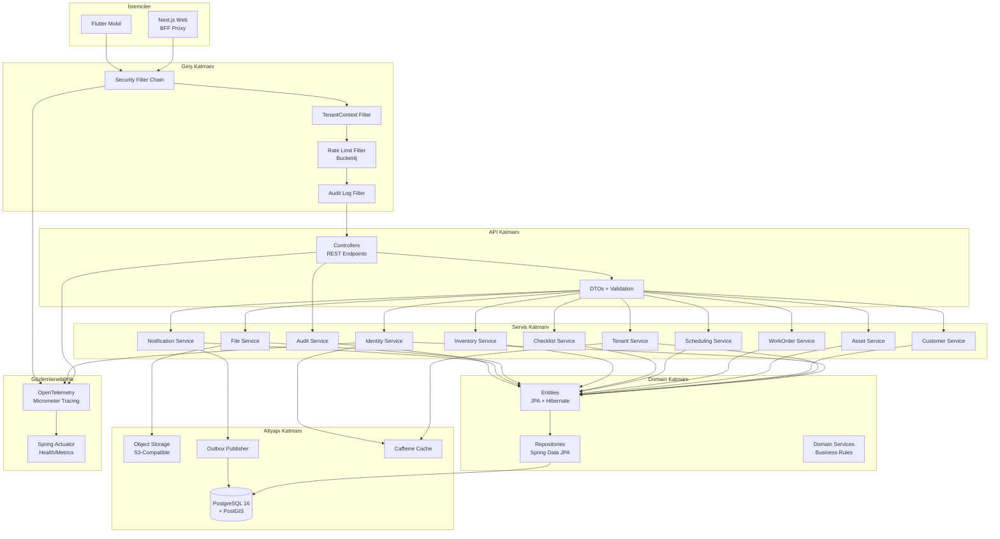
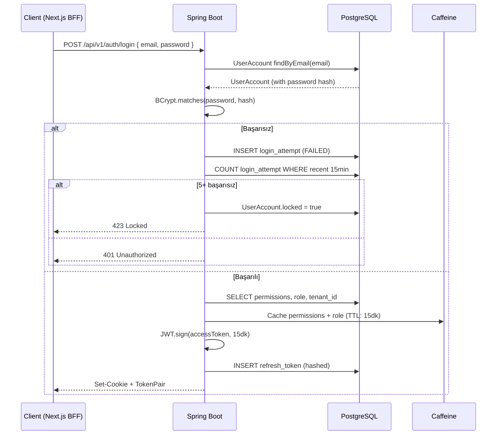

# İşAkış — 07: Backend Mimari ve Güvenlik

> Proje: İşAkış
> Doküman: Backend Mimari ve Güvenlik
> Durum: Draft
> Üretim tarihi: 2026-07-21
> Kaynak girdi: templates/01_PROJE_GIRDI_FORMU.yaml

---

## İçindekiler

1. [Mimari Genel Bakış](#1-mimari-genel-bakış)
2. [Modüller ve Katmanlar](#2-modüller-ve-katmanlar)
3. [Paket Sınırları](#3-paket-sınırları)
4. [Authentication (Kimlik Doğrulama)](#4-authentication-kimlik-doğrulama)
5. [Authorization (Yetkilendirme)](#5-authorization-yetkilendirme)
6. [Tenant Çözümleme ve Izolasyon](#6-tenant-çözümleme-ve-izolasyon)
7. [Object-Level Authorization](#7-object-level-authorization)
8. [Validation (Doğrulama)](#8-validation-doğrulama)
9. [Transaction Yönetimi](#9-transaction-yönetimi)
10. [Idempotency](#10-idempotency)
11. [Rate Limiting](#11-rate-limiting)
12. [Audit Log](#12-audit-log)
13. [Hassas Veri Maskeleme](#13-hassas-veri-maskeleme)
14. [Dosya ve Webhook Güvenliği](#14-dosya-ve-webhook-güvenliği)
15. [Hata Sözleşmesi (RFC 7807)](#15-hata-sözleşmesi-rfc-7807)
16. [Dependency ve SBOM Yönetimi](#16-dependency-ve-sbom-yönetimi)
17. [Backend Testleri](#17-backend-testleri)
18. [Güvenlik Kontrol Listesi](#18-güvenlik-kontrol-listesi)

---

## 1. Mimari Genel Bakış

İşAkış backend'i, modüler monolit olarak tasarlanmış Spring Boot 3.3 uygulamasıdır. Her iş alanı kendi paketinde (module) izole edilmiş olup, ileride mikroservis olarak ayrılabilecek şekilde paket sınırları korunur.



---

## 2. Modüller ve Katmanlar

### Katman Mimarisi

```
┌──────────────────────────────────────────────────┐
│                 Giriş Katmanı                      │
│  FilterChain, TenantContext, RateLimit, Audit      │
└──────────────────────────────────────────────────┘
                        ↓
┌──────────────────────────────────────────────────┐
│                 API Katmanı                        │
│  RestController, DTO, ExceptionHandler             │
└──────────────────────────────────────────────────┘
                        ↓
┌──────────────────────────────────────────────────┐
│                Servis Katmanı                      │
│  Servis sınıfları, iş mantığı, domain servisleri   │
└──────────────────────────────────────────────────┘
                        ↓
┌──────────────────────────────────────────────────┐
│                Domain Katmanı                      │
│  Entity, Repository, Value Object, Domain Event    │
└──────────────────────────────────────────────────┘
                        ↓
┌──────────────────────────────────────────────────┐
│               Altyapı Katmanı                      │
│  Database, S3, Cache, Outbox, Email, SMS           │
└──────────────────────────────────────────────────┘
```

### Modüller

Her modül kendi içinde aynı katmanlı yapıyı tekrar eder:

```
com.sahaflow.{module}/
├── api/                    # Controller + DTO
│   ├── {Module}Controller.java
│   ├── dto/
│   │   ├── Create{Entity}Request.java
│   │   ├── Update{Entity}Request.java
│   │   └── {Entity}Response.java
│   └── mapper/
│       └── {Entity}Mapper.java    # DTO ↔ Entity dönüşümü (MapStruct)
├── service/                # İş mantığı
│   ├── {Module}Service.java
│   └── impl/
│       └── {Module}ServiceImpl.java
├── domain/                 # Domain modeli
│   ├── {Entity}.java
│   ├── {Entity}Repository.java
│   └── event/
│       └── {Entity}CreatedEvent.java
├── infrastructure/         # Modüle özel altyapı
│   └── config/
│       └── {Module}Config.java
└── exception/              # Modüle özel exception'lar
    ├── {Entity}NotFoundException.java
    └── Duplicate{Entity}Exception.java
```

### 12 Modül

| # | Modül | Paket | Sorumluluk |
|---|-------|-------|------------|
| 1 | **Identity** | `com.sahaflow.identity` | Kullanıcı kaydı, giriş/çıkış, şifre sıfırlama, MFA, refresh token yönetimi |
| 2 | **Tenant** | `com.sahaflow.tenant` | Tenant CRUD, konfigürasyon, tenant bazlı ayarlar, abonelik durumu |
| 3 | **Customer** | `com.sahaflow.customer` | Müşteri CRUD, adres yönetimi (PostGIS), iletişim bilgileri |
| 4 | **Asset** | `com.sahaflow.asset` | Müşteriye ait varlıklar (klima, kombi, asansör vb.), servis geçmişi |
| 5 | **WorkOrder** | `com.sahaflow.workorder` | İş emri CRUD, durum makinesi, atama, durum geçmişi, lokasyon olayları |
| 6 | **Scheduling** | `com.sahaflow.scheduling` | İş takvimi, teknisyen müsaitlik kontrolü, rota optimizasyonu (MVP sonrası) |
| 7 | **Checklist** | `com.sahaflow.checklist` | Kontrol listesi şablonları, saha sonuçları, fotoğraf/video ekleri |
| 8 | **Inventory** | `com.sahaflow.inventory` | Malzeme/malzeme kataloğu, iş emrinde kullanılan malzemeler, stok takibi (MVP sonrası) |
| 9 | **Files** | `com.sahaflow.files` | Presigned URL üretimi, dosya metadata yönetimi, media_object |
| 10 | **Notification** | `com.sahaflow.notification` | E-posta, SMS, push notification tetikleme, outbox event işleme |
| 11 | **Audit** | `com.sahaflow.audit` | Audit log yazma, sorgulama, retention yönetimi |
| 12 | **Shared** | `com.sahaflow.shared` | Ortak tipler, utility sınıfları, exception handler, pagination modeli, TenantContext |

---

## 3. Paket Sınırları

Modüller arası bağımlılık kuralları:

```
✅ İzin verilen bağımlılıklar:
  {Module}Service → Shared (utility, exception, model)
  {Module}Controller → {Module}Service
  {Module}Service → Kendi Repository'si
  Notification → WorkOrder (olay bildirimi için)
  Audit → Tüm modüller (audit event yakalama)

❌ Yasak bağımlılıklar:
  {ModuleA}Service → {ModuleB}Repository  (kendi repository'si dışında)
  {ModuleA}Service → {ModuleB}Controller  (diğer modülün controller'ı)
  Domain katmanı → API katmanı (yukarı bağımlılık)
  Herhangi bir modül → Identity (şifre hash'i gibi hassas veri)

🔄 Modüller arası iletişim:
  - Servis çağrısı (senkron): Doğrudan Service interface'i üzerinden
  - Event (asenkron): Spring ApplicationEvent + @EventListener
  - Outbox (asenkron, dayanıklı): OutboxEvent tablosu üzerinden
```

### ArchUnit Testi ile Paket Sınırı Doğrulaması

```java
@Test
void domainLayerDoesNotDependOnApiLayer() {
    noClasses()
        .that().resideInAPackage("com.sahaflow..domain..")
        .should().dependOnClassesThat()
        .resideInAPackage("com.sahaflow..api..")
        .check(importedClasses);
}

@Test
void servicesDontAccessOtherModuleRepositories() {
    noClasses()
        .that().resideInAPackage("com.sahaflow.customer.service..")
        .should().accessClassesThat()
        .resideInAPackage("com.sahaflow.workorder.domain..")
        .check(importedClasses);
}
```

---

## 4. Authentication (Kimlik Doğrulama)

### Spring Security Filter Chain

```java
@Configuration
@EnableWebSecurity
@EnableMethodSecurity
public class SecurityConfig {

    @Bean
    public SecurityFilterChain filterChain(HttpSecurity http) throws Exception {
        http
            // CSRF koruması (cookie tabanlı, BFF ile uyumlu)
            .csrf(csrf -> csrf
                .csrfTokenRepository(CookieCsrfTokenRepository.withHttpOnlyFalse())
                .csrfTokenRequestHandler(new CsrfTokenRequestAttributeHandler())
            )

            // Session yönetimi (stateless — JWT kullanılıyor)
            .sessionManagement(session -> session
                .sessionCreationPolicy(SessionCreationPolicy.STATELESS)
            )

            // CORS
            .cors(cors -> cors.configurationSource(corsConfigurationSource()))

            // Güvenlik başlıkları
            .headers(headers -> headers
                .xssProtection(xss -> xss.headerValue(XXssProtectionHeaderWriter.HeaderValue.ENABLED_MODE_BLOCK))
                .contentSecurityPolicy(csp -> csp.policyDirectives("default-src 'self'"))
                .frameOptions(frame -> frame.deny())
                .httpStrictTransportSecurity(hsts -> hsts
                    .includeSubDomains(true)
                    .maxAgeInSeconds(31536000)
                )
            )

            // Endpoint yetkilendirme
            .authorizeHttpRequests(auth -> auth
                .requestMatchers("/api/v1/auth/login", "/api/v1/auth/register", "/api/v1/auth/refresh").permitAll()
                .requestMatchers("/api/v1/auth/logout").authenticated()
                .requestMatchers("/actuator/health", "/actuator/info").permitAll()
                .requestMatchers("/actuator/**").hasRole("ADMIN")
                .anyRequest().authenticated()
            )

            // JWT filter
            .addFilterBefore(jwtAuthenticationFilter(), UsernamePasswordAuthenticationFilter.class)

            // Exception handling
            .exceptionHandling(ex -> ex
                .authenticationEntryPoint(new ProblemDetailAuthenticationEntryPoint())
                .accessDeniedHandler(new ProblemDetailAccessDeniedHandler())
            );

        return http.build();
    }
}
```

### JWT Token Yönetimi

```java
// Token yapısı
public record TokenPair(
    String accessToken,   // JWT, 15 dakika, user_id + tenant_id + permissions
    String refreshToken,  // Opaque random, 7 gün, veritabanında hash'li
    Instant expiresAt
) {}

// JWT Claims
{
  "sub": "user-uuid",
  "tenant_id": "tenant-uuid",
  "permissions": ["work-order:read", "work-order:create", "customer:read"],
  "role": "TECHNICIAN",
  "iat": 1721116800,
  "exp": 1721117700,  // 15 dakika
  "jti": "unique-token-id"
}
```

### Authentication Akışı



### Refresh Token Rotation

```java
public TokenPair refreshAccessToken(String refreshTokenValue) {
    // 1. Refresh token hash'ini hesapla
    String hash = hashRefreshToken(refreshTokenValue);

    // 2. Veritabanında ara
    RefreshToken storedToken = refreshTokenRepository.findByTokenHash(hash)
        .orElseThrow(() -> new InvalidRefreshTokenException());

    // 3. Süre kontrolü
    if (storedToken.isExpired()) {
        throw new InvalidRefreshTokenException();
    }

    // 4. Reuse detection: Bu token daha önce kullanılmış mı?
    if (storedToken.isUsed()) {
        // Token reuse tespit edildi → Tüm kullanıcı oturumlarını sonlandır
        refreshTokenRepository.invalidateAllForUser(storedToken.getUserId());
        auditService.log("REFRESH_TOKEN_REUSE_DETECTED", storedToken.getUserId());
        throw new SecurityException("Token reuse detected");
    }

    // 5. Eski token'ı kullanılmış olarak işaretle
    storedToken.markAsUsed();
    refreshTokenRepository.save(storedToken);

    // 6. Yeni token çifti oluştur
    return generateTokenPair(storedToken.getUser());
}
```

---

## 5. Authorization (Yetkilendirme)

### RBAC + Deny-by-Default

İşAkış, rol tabanlı erişim kontrolü (RBAC) kullanır. Temel prensip **önce reddet, sonra izin ver** (deny-by-default):

```java
// Method-level authorization
@RestController
@RequestMapping("/api/v1/tenants/{tenantId}/work-orders")
public class WorkOrderController {

    @GetMapping
    @PreAuthorize("hasAuthority('work-order:read') and @tenantValidator.isSameTenant(#tenantId)")
    public Page<WorkOrderResponse> list(@PathVariable UUID tenantId, Pageable pageable) {
        // ...
    }

    @PostMapping
    @PreAuthorize("hasAuthority('work-order:create')")
    public WorkOrderResponse create(
        @PathVariable UUID tenantId,
        @Valid @RequestBody CreateWorkOrderRequest request) {
        // TenantContext'ten tenant_id al, request.tenantId ile karşılaştır
        if (!TenantContext.getCurrentTenantId().equals(tenantId)) {
            throw new AccessDeniedException("Tenant mismatch");
        }
        // ...
    }

    @GetMapping("/{id}")
    @PreAuthorize("hasAuthority('work-order:read')")
    public WorkOrderResponse getById(@PathVariable UUID tenantId, @PathVariable UUID id) {
        // ...
    }

    @PatchMapping("/{id}/status")
    @PreAuthorize("hasAnyAuthority('work-order:update', 'work-order:change-status')")
    public WorkOrderResponse updateStatus(
        @PathVariable UUID tenantId,
        @PathVariable UUID id,
        @Valid @RequestBody UpdateStatusRequest request) {
        // ...
    }
}
```

### Permission Tanımları

```java
// Her permission enum olarak tanımlanır
public enum Permission {
    // Work Order
    WORK_ORDER_READ("work-order:read"),
    WORK_ORDER_CREATE("work-order:create"),
    WORK_ORDER_UPDATE("work-order:update"),
    WORK_ORDER_DELETE("work-order:delete"),
    WORK_ORDER_CHANGE_STATUS("work-order:change-status"),
    WORK_ORDER_ASSIGN("work-order:assign"),

    // Customer
    CUSTOMER_READ("customer:read"),
    CUSTOMER_CREATE("customer:create"),
    CUSTOMER_UPDATE("customer:update"),
    CUSTOMER_DELETE("customer:delete"),

    // Asset
    ASSET_READ("asset:read"),
    ASSET_CREATE("asset:create"),
    ASSET_UPDATE("asset:update"),

    // Checklist
    CHECKLIST_READ("checklist:read"),
    CHECKLIST_CREATE("checklist:create"),
    CHECKLIST_EXECUTE("checklist:execute"),  // Teknisyen

    // Report
    REPORT_READ("report:read"),
    REPORT_EXPORT("report:export"),

    // Admin
    TENANT_MANAGE("tenant:manage"),
    USER_MANAGE("user:manage"),
    AUDIT_READ("audit:read"),
    SYSTEM_CONFIG("system:config"),
}
```

### Role → Permission Eşleme (Veritabanında)

| Rol | Permission'lar |
|-----|---------------|
| **ADMIN** | Tüm permission'lar |
| **MANAGER** | work-order:*, customer:*, asset:*, checklist:*, report:*, inventory:* |
| **DISPATCHER** | work-order:read, work-order:create, work-order:update, work-order:assign, customer:read, asset:read, scheduling:* |
| **TECHNICIAN** | work-order:read, work-order:change-status, customer:read, asset:read, checklist:execute |

### TenantContext + Permission Evaluator

```java
@Component("tenantValidator")
public class TenantValidator {

    public boolean isSameTenant(UUID requestTenantId) {
        UUID currentTenantId = TenantContext.getCurrentTenantId();
        if (currentTenantId == null) return false;
        return currentTenantId.equals(requestTenantId);
    }
}

@Component
public class CustomPermissionEvaluator implements PermissionEvaluator {

    @Override
    public boolean hasPermission(Authentication auth, Object targetDomainObject, Object permission) {
        if (auth == null || !(auth instanceof JwtAuthenticationToken jwtAuth)) {
            return false;
        }
        Collection<? extends GrantedAuthority> authorities = jwtAuth.getAuthorities();
        return authorities.stream()
            .anyMatch(a -> a.getAuthority().equals(permission));
    }
}
```

---

## 6. Tenant Çözümleme ve Izolasyon

### Shared Database / Shared Schema Modeli

Tüm tenant'lar aynı veritabanı ve aynı tabloları paylaşır. Her satır `tenant_id` kolonu ile ayrıştırılır.

### TenantContext Filter

```java
@Component
public class TenantContextFilter extends OncePerRequestFilter {

    @Override
    protected void doFilterInternal(
        HttpServletRequest request,
        HttpServletResponse response,
        FilterChain chain) throws ServletException, IOException {

        // 1. JWT'den tenant_id'yi al (Authentication nesnesinden)
        Authentication auth = SecurityContextHolder.getContext().getAuthentication();
        if (auth instanceof JwtAuthenticationToken jwtAuth) {
            String tenantId = jwtAuth.getTokenAttributes().get("tenant_id").toString();
            TenantContext.setCurrentTenantId(UUID.fromString(tenantId));
        }

        // 2. Alternatif: URL path'inden tenant_id'yi al (mobil app için)
        // GET /api/v1/tenants/{tenantId}/...
        // URL'deki tenant_id ile JWT'deki tenant_id aynı mı kontrol et!

        try {
            chain.doFilter(request, response);
        } finally {
            TenantContext.clear();
        }
    }
}

public class TenantContext {
    private static final ThreadLocal<UUID> CURRENT_TENANT = new ThreadLocal<>();

    public static void setCurrentTenantId(UUID tenantId) {
        CURRENT_TENANT.set(tenantId);
    }

    public static UUID getCurrentTenantId() {
        UUID id = CURRENT_TENANT.get();
        if (id == null) {
            throw new TenantResolutionException("Tenant context not set");
        }
        return id;
    }

    public static void clear() {
        CURRENT_TENANT.remove();
    }
}
```

### Hibernate Tenant Interceptor

```java
@Component
public class TenantEntityInterceptor extends EmptyInterceptor {

    @Override
    public boolean onSave(Object entity, Serializable id, Object[] state,
                          String[] propertyNames, Type[] types) {
        if (entity instanceof TenantAware tenantAware) {
            UUID tenantId = TenantContext.getCurrentTenantId();
            tenantAware.setTenantId(tenantId);
        }
        return false; // State'i manuel değiştirmedik, entity üzerinde setter ile
    }

    @Override
    public void onDelete(Object entity, Serializable id, Object[] state,
                         String[] propertyNames, Type[] types) {
        if (entity instanceof TenantAware tenantAware) {
            UUID currentTenant = TenantContext.getCurrentTenantId();
            if (!currentTenant.equals(tenantAware.getTenantId())) {
                throw new CrossTenantAccessException(
                    "Cannot delete entity from different tenant"
                );
            }
        }
    }
}
```

### Tenant-Aware Interface

```java
// Tüm veri tablolarında ortak interface
public interface TenantAware {
    UUID getTenantId();
    void setTenantId(UUID tenantId);
}

@MappedSuperclass
public abstract class BaseTenantEntity implements TenantAware {

    @Column(name = "tenant_id", nullable = false, updatable = false)
    private UUID tenantId;

    @Column(name = "created_at", nullable = false, updatable = false)
    private Instant createdAt;

    @Column(name = "updated_at")
    private Instant updatedAt;

    @Column(name = "created_by")
    private UUID createdBy;

    @PrePersist
    protected void onCreate() {
        createdAt = Instant.now();
    }

    @PreUpdate
    protected void onUpdate() {
        updatedAt = Instant.now();
    }

    // getters/setters...
}
```

### Tenant Izolasyon Testi

```java
@Test
void crossTenantAccessShouldThrowException() {
    // Tenant-A kullanıcısı, Tenant-B'nin verisine erişmeye çalışır
    TenantContext.setCurrentTenantId(tenantAId);

    assertThrows(AccessDeniedException.class, () -> {
        workOrderService.findById(tenantBWorkOrderId);
    });
}
```

---

## 7. Object-Level Authorization

İş emri, müşteri, varlık gibi nesnelere erişimde tenant ve permission kontrolüne ek olarak, aynı tenant içinde rol bazlı kısıtlama uygulanır.

### Örnek: Teknisyen Sadece Kendi İş Emirlerini Görebilir

```java
@Service
public class WorkOrderServiceImpl implements WorkOrderService {

    private final WorkOrderRepository repository;

    @Override
    public Page<WorkOrder> listForCurrentUser(Pageable pageable) {
        UUID tenantId = TenantContext.getCurrentTenantId();
        UUID userId = SecurityUtils.getCurrentUserId();
        String role = SecurityUtils.getCurrentUserRole();

        return switch (role) {
            case "ADMIN", "MANAGER", "DISPATCHER" ->
                repository.findByTenantId(tenantId, pageable);
            case "TECHNICIAN" ->
                repository.findByTenantIdAndAssigneeId(tenantId, userId, pageable);
            default ->
                throw new AccessDeniedException("Unknown role: " + role);
        };
    }

    @Override
    public WorkOrder findById(UUID id) {
        WorkOrder wo = repository.findById(id)
            .orElseThrow(() -> new WorkOrderNotFoundException(id));

        // Tenant kontrolü
        if (!TenantContext.getCurrentTenantId().equals(wo.getTenantId())) {
            throw new AccessDeniedException("Cross-tenant access denied");
        }

        // Object-level: Teknisyen sadece kendi iş emrini görebilir
        // Not: DB sorgusunda filtrelemek daha performanslı, bu savunma katmanı
        String role = SecurityUtils.getCurrentUserRole();
        if ("TECHNICIAN".equals(role)) {
            UUID userId = SecurityUtils.getCurrentUserId();
            if (!userId.equals(wo.getAssigneeId())) {
                throw new AccessDeniedException("Not assigned to this work order");
            }
        }

        return wo;
    }
}
```

### Repository Sorgularında Tenant Filtreleme

```java
@Repository
public interface WorkOrderRepository extends JpaRepository<WorkOrder, UUID> {

    // Tüm sorgular tenant_id ile filtrelenir
    @Query("SELECT w FROM WorkOrder w WHERE w.tenantId = :tenantId")
    Page<WorkOrder> findByTenantId(@Param("tenantId") UUID tenantId, Pageable pageable);

    @Query("SELECT w FROM WorkOrder w WHERE w.tenantId = :tenantId AND w.assigneeId = :assigneeId")
    Page<WorkOrder> findByTenantIdAndAssigneeId(
        @Param("tenantId") UUID tenantId,
        @Param("assigneeId") UUID assigneeId,
        Pageable pageable
    );

    // ID ile bulurken tenant_id'yi de kontrol et
    @Query("SELECT w FROM WorkOrder w WHERE w.id = :id AND w.tenantId = :tenantId")
    Optional<WorkOrder> findByIdAndTenantId(
        @Param("id") UUID id,
        @Param("tenantId") UUID tenantId
    );
}
```

**Önemli**: `findById` gibi basit repository metotları yerine her zaman `findByIdAndTenantId` kullanılır. Bu, ID tahmin edilerek başka tenant'ın verisine erişimi (IDOR - Insecure Direct Object Reference) engeller.

---

## 8. Validation (Doğrulama)

### Bean Validation (Jakarta Validation 3.0)

```java
// Request DTO
public record CreateWorkOrderRequest(

    @NotBlank(message = "Başlık zorunludur")
    @Size(min = 5, max = 200, message = "Başlık 5-200 karakter arasında olmalıdır")
    String title,

    @NotBlank(message = "Açıklama zorunludur")
    @Size(min = 10, max = 5000)
    String description,

    @NotNull(message = "Müşteri zorunludur")
    UUID customerId,

    UUID assetId,

    @NotNull(message = "Öncelik zorunludur")
    WorkOrderPriority priority,

    @NotNull(message = "Planlanan başlangıç zorunludur")
    @Future(message = "Başlangıç tarihi gelecekte olmalıdır")
    Instant scheduledStartAt,

    @NotNull(message = "Planlanan bitiş zorunludur")
    @Future(message = "Bitiş tarihi gelecekte olmalıdır")
    Instant scheduledEndAt,

    UUID checklistTemplateId,

    @Size(max = 2000)
    String notes
) {}

// Controller'da @Valid ile tetiklenir
@PostMapping
@PreAuthorize("hasAuthority('work-order:create')")
public ResponseEntity<WorkOrderResponse> create(
    @PathVariable UUID tenantId,
    @Valid @RequestBody CreateWorkOrderRequest request) {
    // ...
}
```

### Custom Validator Örnekleri

```java
// İş emri bitiş tarihi başlangıçtan sonra olmalı
@Constraint(validatedBy = EndAfterStartValidator.class)
@Target({ElementType.TYPE})
@Retention(RetentionPolicy.RUNTIME)
public @interface EndAfterStart {
    String message() default "Bitiş tarihi başlangıç tarihinden sonra olmalıdır";
    Class<?>[] groups() default {};
    Class<? extends Payload>[] payload() default {};
}

public class EndAfterStartValidator
    implements ConstraintValidator<EndAfterStart, CreateWorkOrderRequest> {

    @Override
    public boolean isValid(CreateWorkOrderRequest request, ConstraintValidatorContext context) {
        if (request.scheduledStartAt() == null || request.scheduledEndAt() == null) {
            return true; // @NotNull ayrıca kontrol eder
        }
        return request.scheduledEndAt().isAfter(request.scheduledStartAt());
    }
}
```

### Validation Exception Handler

```java
@RestControllerAdvice
public class ValidationExceptionHandler {

    @ExceptionHandler(MethodArgumentNotValidException.class)
    public ResponseEntity<ProblemDetail> handleValidation(MethodArgumentNotValidException ex) {
        List<ValidationError> errors = ex.getBindingResult()
            .getFieldErrors()
            .stream()
            .map(fe -> new ValidationError(fe.getField(), fe.getDefaultMessage()))
            .toList();

        ProblemDetail problem = ProblemDetail.forStatusAndDetail(
            HttpStatus.UNPROCESSABLE_ENTITY,
            "Doğrulama hatası"
        );
        problem.setTitle("Validation Failed");
        problem.setProperty("errors", errors);

        return ResponseEntity.status(422).body(problem);
    }
}

public record ValidationError(String field, String message) {}
```

### Input Sanitizasyonu

- **HTML tag temizleme**: OWASP Java HTML Sanitizer ile kullanıcı girdilerinden HTML çıkarılır. (Sadece `notes` ve `description` gibi alanlarda, düz metin olarak)
- **SQL injection**: Hibernate/JPA parametreli sorgular kullanır, ek önlem gerekmez.
- **LDAP/OS command injection**: LDAP veya sistem komutu çalıştırılmadığı için risk yok.
- **XSS**: JSON response'lar Jackson ile serileştirilir, varsayılan olarak tüm string'ler escape edilir.

---

## 9. Transaction Yönetimi

```java
@Service
@Transactional(readOnly = true)
public class WorkOrderServiceImpl implements WorkOrderService {

    // Yazma işlemleri için @Transactional (readOnly = false, varsayılan)
    @Override
    @Transactional
    public WorkOrder create(CreateWorkOrderRequest request) {
        // 1. Validasyon (müşteri bu tenant'ta mı?)
        Customer customer = customerRepository
            .findByIdAndTenantId(request.customerId(), TenantContext.getCurrentTenantId())
            .orElseThrow(() -> new CustomerNotFoundException(request.customerId()));

        // 2. İş emri oluştur
        WorkOrder wo = WorkOrder.builder()
            .tenantId(TenantContext.getCurrentTenantId())
            .title(request.title())
            .description(request.description())
            .customerId(request.customerId())
            .status(WorkOrderStatus.OPEN)
            .priority(request.priority())
            .scheduledStartAt(request.scheduledStartAt())
            .scheduledEndAt(request.scheduledEndAt())
            .build();

        wo = workOrderRepository.save(wo);

        // 3. Outbox event (aynı transaction içinde)
        outboxEventRepository.save(OutboxEvent.builder()
            .aggregateType("WORK_ORDER")
            .aggregateId(wo.getId())
            .eventType("WORK_ORDER_CREATED")
            .payload(toJson(wo))
            .tenantId(TenantContext.getCurrentTenantId())
            .build());

        return wo;
    }

    // Transaction isolation: Çoğu okuma için READ_COMMITTED yeterli.
    // Kritik işlemler (stok düşümü, durum geçişi) için optimistic locking.
}
```

### Transaction Kuralları

| Kural | Açıklama |
|-------|----------|
| **Read-only** | Okuma servis metotları `@Transactional(readOnly = true)` ile işaretlenir |
| **Rollback** | RuntimeException ve türevleri otomatik rollback. Checked exception'lar için `@Transactional(rollbackFor = Exception.class)` |
| **Timeout** | Hiçbir transaction 30 saniyeden uzun sürmemeli. `@Transactional(timeout = 30)` |
| **Propagation** | Varsayılan REQUIRED. İç içe transaction'da yeni transaction gerekirse REQUIRES_NEW |
| **Isolation** | Varsayılan READ_COMMITTED. Kritik operasyonlarda optimistic locking (`@Version`) |
| **No nested** | JPA/Hibernate nested transaction'ları karmaşıklık nedeniyle kullanılmaz |

### Optimistic Locking

```java
@Entity
@Table(name = "work_order")
public class WorkOrder extends BaseTenantEntity {

    @Id
    @GeneratedValue
    private UUID id;

    @Version
    private Long version;  // Optimistic locking için

    // ...
}

// Güncelleme sırasında versiyon çakışması → OptimisticLockException
// Controller'da 409 Conflict dönülür
@ExceptionHandler(OptimisticLockException.class)
public ResponseEntity<ProblemDetail> handleOptimisticLock(OptimisticLockException ex) {
    ProblemDetail problem = ProblemDetail.forStatusAndDetail(
        HttpStatus.CONFLICT,
        "Kayıt başka bir kullanıcı tarafından güncellenmiş. Lütfen yenileyip tekrar deneyin."
    );
    return ResponseEntity.status(409).body(problem);
}
```

---

## 10. Idempotency

Para veya stok hareketi içeren kritik işlemlerde idempotency sağlanır.

```java
// Filter: Idempotency-Key header'ını oku
@Component
public class IdempotencyFilter extends OncePerRequestFilter {

    private final IdempotencyStore idempotencyStore;

    @Override
    protected void doFilterInternal(
        HttpServletRequest request,
        HttpServletResponse response,
        FilterChain chain) throws ServletException, IOException {

        String idempotencyKey = request.getHeader("Idempotency-Key");

        // Sadece POST için (state-changing operations)
        if (idempotencyKey != null && "POST".equalsIgnoreCase(request.getMethod())) {
            // 1. Bu key daha önce kullanılmış mı?
            Optional<IdempotencyRecord> existing = idempotencyStore.find(idempotencyKey);
            if (existing.isPresent()) {
                // Aynı yanıtı dön
                response.setStatus(existing.get().getStatusCode());
                response.setContentType("application/json");
                response.getWriter().write(existing.get().getResponseBody());
                return;
            }

            // 2. İşlemi çalıştır, yanıtı yakala
            ContentCachingResponseWrapper wrapper = new ContentCachingResponseWrapper(response);
            chain.doFilter(request, wrapper);

            // 3. Yanıtı kaydet (24 saat TTL ile)
            byte[] responseBody = wrapper.getContentAsByteArray();
            idempotencyStore.save(idempotencyKey, response.getStatus(),
                new String(responseBody, StandardCharsets.UTF_8));

            wrapper.copyBodyToResponse();
        } else {
            chain.doFilter(request, response);
        }
    }
}
```

**Not**: GET, PUT, DELETE zaten idempotent'tir. PATCH'ın idempotent olması tasarıma bağlıdır — İşAkış'ta PATCH tam kaynak güncellemesi olarak değil, kısmi güncelleme olarak kullanılır ve idempotent kabul edilmez.

---

## 11. Rate Limiting

```java
// Bucket4j ile in-memory rate limiting
@Component
public class RateLimitFilter extends OncePerRequestFilter {

    // Kullanıcı başına bucket'lar (Caffeine ile TTL)
    private final Cache<String, Bucket> buckets = Caffeine.newBuilder()
        .expireAfterAccess(1, TimeUnit.HOURS)
        .build();

    @Override
    protected void doFilterInternal(
        HttpServletRequest request,
        HttpServletResponse response,
        FilterChain chain) throws ServletException, IOException {

        String userId = SecurityUtils.getCurrentUserId().toString();
        String path = request.getRequestURI();

        // Endpoint'e göre farklı limitler
        Bandwidth limit = getLimitForPath(path);
        Bucket bucket = buckets.get(userId + ":" + getRateLimitKey(path),
            k -> Bucket.builder().addLimit(limit).build());

        if (bucket.tryConsume(1)) {
            response.setHeader("X-RateLimit-Remaining",
                String.valueOf(bucket.getAvailableTokens()));
            chain.doFilter(request, response);
        } else {
            response.setStatus(429);
            response.setHeader("Retry-After", "60");
            response.setContentType("application/json");
            response.getWriter().write("""
                {"type":"https://api.sahaflow.com/errors/rate-limited",
                 "title":"Rate Limited",
                 "status":429,
                 "detail":"Çok fazla istek. Lütfen 60 saniye sonra tekrar deneyin."}
                """);
        }
    }

    private Bandwidth getLimitForPath(String path) {
        if (path.contains("/auth/login")) {
            // Giriş: 5 istek/dakika (brute force koruması)
            return Bandwidth.simple(5, Duration.ofMinutes(1));
        } else if (path.contains("/files/upload")) {
            // Dosya yükleme: 10 istek/dakika
            return Bandwidth.simple(10, Duration.ofMinutes(1));
        } else {
            // Genel API: 60 istek/dakika
            return Bandwidth.simple(60, Duration.ofMinutes(1));
        }
    }

    private String getRateLimitKey(String path) {
        // Auth endpoint'leri için IP bazlı, diğerleri için user-id bazlı
        return path.contains("/auth/") ? "ip:" + getClientIp() : "user:" + SecurityUtils.getCurrentUserId();
    }
}
```

### Rate Limit Headers (Standart)

| Header | Açıklama |
|--------|----------|
| `X-RateLimit-Limit` | Dakikada izin verilen maksimum istek sayısı |
| `X-RateLimit-Remaining` | Kalan istek hakkı |
| `X-RateLimit-Reset` | Limitin sıfırlanacağı Unix timestamp |
| `Retry-After` | 429 dönüldüğünde kaç saniye sonra tekrar denenebilir |

---

## 12. Audit Log

### Audit Event Yapısı

```java
@Entity
@Table(name = "audit_event")
public class AuditEvent extends BaseEntity {  // BaseEntity: id, createdAt (tenant_id yok!)

    @Column(name = "tenant_id", nullable = false)
    private UUID tenantId;

    @Column(name = "actor_id")
    private UUID actorId;  // İşlemi yapan kullanıcı

    @Column(name = "actor_role", length = 50)
    private String actorRole;

    @Enumerated(EnumType.STRING)
    @Column(name = "event_type", nullable = false, length = 100)
    private AuditEventType eventType;

    @Column(name = "target_type", length = 100)
    private String targetType;  // Hangi entity: WORK_ORDER, CUSTOMER, vb.

    @Column(name = "target_id")
    private UUID targetId;

    @Column(name = "action", nullable = false, length = 50)
    private String action;  // CREATED, UPDATED, DELETED, LOGIN, LOGOUT, EXPORT, vb.

    @Column(name = "changes", columnDefinition = "JSONB")
    private String changes;  // Değişiklik detayları (JSON diff)

    @Column(name = "ip_address", length = 45)
    private String ipAddress;

    @Column(name = "user_agent", length = 500)
    private String userAgent;

    @Column(name = "request_id", length = 36)
    private String requestId;  // Trace ID, uçtan uca izleme için
}
```

### Audit Event Tipleri

```java
public enum AuditEventType {
    // Authentication
    USER_LOGIN,
    USER_LOGIN_FAILED,
    USER_LOGOUT,
    USER_LOCKED,
    REFRESH_TOKEN_REUSE,
    PASSWORD_CHANGED,

    // CRUD
    ENTITY_CREATED,
    ENTITY_UPDATED,
    ENTITY_DELETED,
    ENTITY_EXPORTED,

    // Work Order
    WORK_ORDER_STATUS_CHANGED,
    WORK_ORDER_ASSIGNED,
    WORK_ORDER_UNASSIGNED,

    // System
    TENANT_CREATED,
    USER_INVITED,
    USER_ROLE_CHANGED,
    PERMISSION_CHANGED,
    SYSTEM_CONFIG_CHANGED,
    BILLING_EVENT,
}
```

### Audit Aspect (AOP)

```java
@Aspect
@Component
public class AuditAspect {

    private final AuditEventRepository auditEventRepository;

    @AfterReturning(pointcut = "@annotation(auditable)", returning = "result")
    public void logAudit(JoinPoint joinPoint, Auditable auditable, Object result) {
        AuditEvent event = AuditEvent.builder()
            .tenantId(TenantContext.getCurrentTenantId())
            .actorId(SecurityUtils.getCurrentUserId())
            .actorRole(SecurityUtils.getCurrentUserRole())
            .eventType(auditable.eventType())
            .targetType(auditable.targetType())
            .action(auditable.action())
            .ipAddress(RequestUtils.getClientIp())
            .userAgent(RequestUtils.getUserAgent())
            .requestId(MDC.get("traceId"))
            .build();

        // Hedef ID'yi çıkar (result'tan veya joinPoint args'dan)
        if (result instanceof Identifiable identifiable) {
            event.setTargetId(identifiable.getId());
        }

        auditEventRepository.save(event);
    }
}

@Target(ElementType.METHOD)
@Retention(RetentionPolicy.RUNTIME)
public @interface Auditable {
    AuditEventType eventType();
    String targetType();
    String action();
}
```

### Audit Log Sorgulama (Sadece Admin)

```java
@RestController
@RequestMapping("/api/v1/admin/audit")
@PreAuthorize("hasAuthority('audit:read')")
public class AuditController {

    @GetMapping
    public Page<AuditEventResponse> search(
        @RequestParam(required = false) UUID tenantId,
        @RequestParam(required = false) AuditEventType eventType,
        @RequestParam(required = false) @DateTimeFormat(iso = ISO.DATE_TIME) Instant from,
        @RequestParam(required = false) @DateTimeFormat(iso = ISO.DATE_TIME) Instant to,
        Pageable pageable) {

        return auditService.search(tenantId, eventType, from, to, pageable);
    }
}
```

---

## 13. Hassas Veri Maskeleme

### Log Maskeleme

```java
// Logback configuration: logback-spring.xml
// OpenTelemetry log processor ile PII maskeleme

// Log'lanacak verilerde:
// - Şifre: ASLA log'lanmaz
// - E-posta: KISMEN maskelenir (f***@domain.com)
// - Telefon: KISMEN maskelenir (*** *** 12 34)
// - TCKN: ASLA log'lanmaz
// - IP adresi: KVKK kapsamında saklama süresi 90 gün
```

### DTO Maskeleme (API Response)

```java
// Jackson serializer ile hassas alan maskeleme
public class MaskedStringSerializer extends StdSerializer<String> {

    @Override
    public void serialize(String value, JsonGenerator gen, SerializerProvider provider)
        throws IOException {
        if (value == null) {
            gen.writeNull();
        } else if (value.contains("@")) {
            // E-posta maskeleme
            String[] parts = value.split("@");
            String masked = parts[0].charAt(0) + "***@" + parts[1];
            gen.writeString(masked);
        } else if (value.matches("\\d{10,}")) {
            // Telefon maskeleme
            gen.writeString(value.substring(0, 3) + "****" + value.substring(value.length() - 2));
        } else {
            gen.writeString(value);
        }
    }
}
```

### Veritabanı Seviyesinde Şifreleme

Bkz. [08: Veritabanı ve Veri Güvenliği](08_DATABASE_AND_DATA_SECURITY.md) - Bölüm 7.

---

## 14. Dosya ve Webhook Güvenliği

### Dosya Yükleme Güvenliği

```java
@Service
public class FileServiceImpl implements FileService {

    private static final Set<String> ALLOWED_MIME_TYPES = Set.of(
        "image/jpeg", "image/png", "image/webp",
        "application/pdf", "video/mp4"
    );

    private static final long MAX_FILE_SIZE = 10 * 1024 * 1024; // 10MB (foto)

    public PresignedUploadUrl generateUploadUrl(UploadRequest request) {
        // 1. MIME tipi kontrolü
        if (!ALLOWED_MIME_TYPES.contains(request.contentType())) {
            throw new InvalidFileTypeException("Desteklenmeyen dosya türü");
        }

        // 2. Dosya boyutu kontrolü
        if (request.fileSize() > MAX_FILE_SIZE) {
            throw new FileSizeExceededException("Dosya boyutu 10MB'dan büyük olamaz");
        }

        // 3. Tenant prefix ile object key oluştur
        UUID tenantId = TenantContext.getCurrentTenantId();
        String extension = getExtension(request.fileName()).toLowerCase();
        String objectKey = String.format("tenant-%s/%s/%s.%s",
            tenantId, request.context(), UUID.randomUUID(), extension);

        // 4. Presigned URL oluştur (5 dakika geçerli)
        URL presignedUrl = s3Client.generatePresignedUrl(objectKey, request.contentType(), 5);

        return new PresignedUploadUrl(presignedUrl, objectKey);
    }
}
```

### Webhook Güvenliği (Dış Entegrasyonlar için Gelecek Özelliği)

Dış sistemlere webhook gönderirken veya dış sistemlerden webhook alırken:

| Kontrol | Uygulama |
|---------|----------|
| **HMAC imzalama** | Webhook payload'ı HMAC-SHA256 ile imzalanır. `X-SahaFlow-Signature` header'ı ile iletilir |
| **Timestamp** | `X-SahaFlow-Timestamp` header'ı ile replay attack engellenir (5 dakika tolerans) |
| **Static IP whitelist** | Giden webhook'lar sabit bir IP aralığından çıkar. Karşı taraf IP whitelist yapabilir. |
| **Retry with backoff** | Başarısız webhook'lar exponential backoff ile tekrarlanır: 1dk, 5dk, 25dk, 125dk. Maksimum 5 deneme. |
| **Max payload size** | Webhook payload'ı maksimum 2MB. |
| **HTTPS only** | Webhook URL'leri sadece HTTPS olabilir. HTTP URL'ler reddedilir. |
| **Secret rotasyonu** | Webhook secret'ı periyodik olarak değiştirilebilir (manuel). |

---

## 15. Hata Sözleşmesi (RFC 7807)

### Standart Hata Formatı

```json
{
  "type": "https://api.sahaflow.com/errors/{error-category}",
  "title": "Human-readable error title",
  "status": 422,
  "detail": "Detaylı Türkçe açıklama",
  "instance": "/api/v1/tenants/abc/work-orders/def",
  "errors": [
    { "field": "title", "message": "Başlık en az 5 karakter olmalıdır" }
  ],
  "traceId": "abc123def456"
}
```

### Hata Tip Kataloğu

| HTTP Status | Type URI | Kullanım |
|-------------|----------|----------|
| 400 | `/errors/bad-request` | Geçersiz istek formatı |
| 401 | `/errors/unauthorized` | Kimlik doğrulama başarısız |
| 403 | `/errors/forbidden` | Yetkilendirme hatası (tenant/object seviyesi) |
| 404 | `/errors/not-found` | Kaynak bulunamadı |
| 409 | `/errors/conflict` | Optimistic lock / duplicate |
| 422 | `/errors/validation-failed` | Bean validation hatası |
| 429 | `/errors/rate-limited` | Rate limit aşıldı |
| 500 | `/errors/internal-error` | Beklenmeyen sunucu hatası |
| 503 | `/errors/service-unavailable` | Bakım modu / aşırı yük |

### Global Exception Handler

```java
@RestControllerAdvice
public class GlobalExceptionHandler {

    @ExceptionHandler(EntityNotFoundException.class)
    public ResponseEntity<ProblemDetail> handleNotFound(EntityNotFoundException ex) {
        ProblemDetail problem = ProblemDetail.forStatusAndDetail(
            HttpStatus.NOT_FOUND, ex.getMessage()
        );
        problem.setTitle("Kayıt Bulunamadı");
        problem.setType(URI.create("https://api.sahaflow.com/errors/not-found"));
        enrichWithTraceId(problem);
        return ResponseEntity.status(404).body(problem);
    }

    @ExceptionHandler(AccessDeniedException.class)
    public ResponseEntity<ProblemDetail> handleForbidden(AccessDeniedException ex) {
        ProblemDetail problem = ProblemDetail.forStatusAndDetail(
            HttpStatus.FORBIDDEN, "Bu işlem için yetkiniz bulunmamaktadır"
        );
        problem.setTitle("Yetkisiz Erişim");
        problem.setType(URI.create("https://api.sahaflow.com/errors/forbidden"));
        enrichWithTraceId(problem);
        return ResponseEntity.status(403).body(problem);
    }

    @ExceptionHandler(Exception.class)
    public ResponseEntity<ProblemDetail> handleGeneral(Exception ex) {
        log.error("Unhandled exception", ex);
        ProblemDetail problem = ProblemDetail.forStatusAndDetail(
            HttpStatus.INTERNAL_SERVER_ERROR, "Beklenmeyen bir hata oluştu. Lütfen daha sonra tekrar deneyin."
        );
        problem.setTitle("Sunucu Hatası");
        problem.setType(URI.create("https://api.sahaflow.com/errors/internal-error"));
        enrichWithTraceId(problem);
        // İstemciye stack trace GÖNDERME
        return ResponseEntity.status(500).body(problem);
    }

    private void enrichWithTraceId(ProblemDetail problem) {
        problem.setProperty("traceId", MDC.get("traceId"));
    }
}
```

---

## 16. Dependency ve SBOM Yönetimi

### Dependency Scanning (CI Pipeline)

```bash
# OWASP Dependency Check (Gradle plugin)
./gradlew dependencyCheckAnalyze

# Trivy container scan
trivy image ghcr.io/saha-flow/backend:latest

# Gradle dependencies (güncel tutma)
./gradlew dependencyUpdates  # Ben-Manes Versions plugin
```

### SBOM (Software Bill of Materials)

```kotlin
// build.gradle.kts
plugins {
    id("org.cyclonedx.bom") version "1.8.2"
}

// CI'da:
// ./gradlew cyclonedxBom
// → build/reports/bom.json (CycloneDX formatı)
// → SBOM, container image ile birlikte saklanır
// → Güvenlik denetimleri için kullanılır
```

### Üçüncü Parti Kütüphane Politikası

| Kural | Açıklama |
|-------|----------|
| **Lisans kontrolü** | AGPL ve GPL lisanslı kütüphaneler kullanılmaz (SaaS AGPL bulaşma riski) |
| **Güncelleme** | Her sprint başında `./gradlew dependencyUpdates` ile güncelleme kontrolü |
| **CVE tarama** | Her PR'da OWASP Dependency Check çalıştırılır. HIGH/CRITICAL CVE → Merge engellenir |
| **SBOM imzalama** | Production build'lerde SBOM Cosign ile imzalanır |

---

## 17. Backend Testleri

### Test Piramidi (Backend)

```
        ┌─────┐
        │  API  │  RestAssured + Testcontainers (10-15 test)
       ┌┴─────┴┐
       │Entegrasyon│  @SpringBootTest + Testcontainers (20-30 test)
      ┌┴──────────┴┐
      │  Birim      │  JUnit 5 + Mockito (100+ test)
     ┌┴────────────┴┐
     │  Statik      │  ArchUnit + Error Prone
    └──────────────┘
```

### Birim Testi Örneği

```java
@ExtendWith(MockitoExtension.class)
class WorkOrderServiceTest {

    @Mock private WorkOrderRepository repository;
    @Mock private CustomerRepository customerRepository;
    @Mock private OutboxEventRepository outboxRepository;
    @InjectMocks private WorkOrderServiceImpl service;

    @Test
    void createWorkOrder_Success() {
        UUID tenantId = UUID.randomUUID();
        UUID customerId = UUID.randomUUID();
        TenantContext.setCurrentTenantId(tenantId);

        CreateWorkOrderRequest request = new CreateWorkOrderRequest(
            "Klima Bakımı", "Detaylı açıklama", customerId, null,
            WorkOrderPriority.MEDIUM,
            Instant.now().plus(1, ChronoUnit.HOURS),
            Instant.now().plus(3, ChronoUnit.HOURS),
            null, null
        );

        Customer customer = new Customer();
        when(customerRepository.findByIdAndTenantId(customerId, tenantId))
            .thenReturn(Optional.of(customer));
        when(repository.save(any())).thenAnswer(inv -> inv.getArgument(0));

        WorkOrder result = service.create(request);

        assertThat(result.getStatus()).isEqualTo(WorkOrderStatus.OPEN);
        assertThat(result.getTenantId()).isEqualTo(tenantId);
        verify(outboxRepository).save(any());
    }

    @Test
    void createWorkOrder_CustomerNotFound_ThrowsException() {
        UUID tenantId = UUID.randomUUID();
        TenantContext.setCurrentTenantId(tenantId);

        CreateWorkOrderRequest request = new CreateWorkOrderRequest(
            "Test", "Açıklama", UUID.randomUUID(), null,
            WorkOrderPriority.MEDIUM,
            Instant.now().plus(1, ChronoUnit.HOURS),
            Instant.now().plus(3, ChronoUnit.HOURS),
            null, null
        );

        when(customerRepository.findByIdAndTenantId(any(), any()))
            .thenReturn(Optional.empty());

        assertThrows(CustomerNotFoundException.class, () -> service.create(request));
    }
}
```

### Entegrasyon Testi (Testcontainers)

```java
@SpringBootTest(webEnvironment = WebEnvironment.RANDOM_PORT)
@Testcontainers
class WorkOrderControllerIntegrationTest {

    @Container
    static PostgreSQLContainer<?> postgres = new PostgreSQLContainer<>("postgres:16")
        .withDatabaseName("testdb")
        .withUsername("test")
        .withPassword("test");

    @DynamicPropertySource
    static void configureProperties(DynamicPropertyRegistry registry) {
        registry.add("spring.datasource.url", postgres::getJdbcUrl);
        registry.add("spring.datasource.username", postgres::getUsername);
        registry.add("spring.datasource.password", postgres::getPassword);
    }

    @Autowired
    private TestRestTemplate restTemplate;

    @Test
    void createWorkOrder_WithValidData_Returns201() {
        // Arrange: JWT token oluştur
        String token = JwtTestUtils.createToken(tenantId, userId, List.of("work-order:create"));

        CreateWorkOrderRequest request = CreateWorkOrderRequest.builder()
            .title("Entegrasyon Testi İş Emri")
            .description("Test ile oluşturuldu")
            .customerId(customerId)
            .priority(WorkOrderPriority.HIGH)
            .scheduledStartAt(Instant.now().plus(1, ChronoUnit.HOURS))
            .scheduledEndAt(Instant.now().plus(3, ChronoUnit.HOURS))
            .build();

        // Act
        ResponseEntity<WorkOrderResponse> response = restTemplate.exchange(
            "/api/v1/tenants/{tenantId}/work-orders",
            HttpMethod.POST,
            new HttpEntity<>(request, createAuthHeaders(token)),
            WorkOrderResponse.class,
            tenantId
        );

        // Assert
        assertThat(response.getStatusCode()).isEqualTo(HttpStatus.CREATED);
        assertThat(response.getBody().title()).isEqualTo("Entegrasyon Testi İş Emri");
    }
}
```

### Contract Testing (Pact)

```java
@ExtendWith(PactConsumerTestExt.class)
@PactTestFor(providerName = "saha-flow-backend", port = "8080")
class WorkOrderApiContractTest {

    @Pact(consumer = "saha-flow-web")
    V4Pact createWorkOrderPact(PactDslWithProvider builder) {
        return builder
            .given("valid customer exists")
            .uponReceiving("create work order request")
                .method("POST")
                .path("/api/v1/tenants/123/work-orders")
                .headers("Content-Type", "application/json")
                .body(new PactDslJsonBody()
                    .stringType("title", "Test İş Emri")
                    .stringType("description", "Test Açıklama"))
            .willRespondWith()
                .status(201)
                .body(new PactDslJsonBody()
                    .uuid("id")
                    .stringType("title", "Test İş Emri"))
            .toPact(V4Pact.class);
    }
}
```

---

## 18. Güvenlik Kontrol Listesi

| No | Kontrol | Durum | Doğrulama Yöntemi | OWASP ASVS Ref |
|----|---------|-------|-------------------|----------------|
| B-SEC-01 | Tüm istekler TenantContext filter'dan geçiyor | ✅ Zorunlu | Birim testi | V4.1.1 |
| B-SEC-02 | Her repository sorgusu tenant_id ile filtreleniyor | ✅ Zorunlu | Kod incelemesi + ArchUnit | V4.1.2 |
| B-SEC-03 | Object-level authorization tüm endpoint'lerde | ✅ Zorunlu | Birim testi | V4.2.1 |
| B-SEC-04 | JWT HttpOnly cookie ile, JavaScript erişemez | ✅ Zorunlu | Entegrasyon testi | V3.1.1 |
| B-SEC-05 | Refresh token rotation ve reuse detection | ✅ Zorunlu | Birim testi | V3.3.2 |
| B-SEC-06 | CSRF koruması aktif (Spring Security) | ✅ Zorunlu | Güvenlik testi | V4.1.3 |
| B-SEC-07 | Rate limiting tüm endpoint'lerde | ✅ Zorunlu | Yük testi | V11.1.1 |
| B-SEC-08 | Input validation (Bean Validation + sanitize) | ✅ Zorunlu | Entegrasyon testi | V5.1.1 |
| B-SEC-09 | SQL injection: Prepared statements | ✅ Zorunlu | Statik analiz | V5.3.1 |
| B-SEC-10 | Hata yanıtlarında stack trace yok | ✅ Zorunlu | Entegrasyon testi | V7.4.3 |
| B-SEC-11 | Audit log tüm kritik işlemlerde | ✅ Zorunlu | Entegrasyon testi | V7.2.1 |
| B-SEC-12 | Hassas veri log'larda maskeleniyor | ✅ Zorunlu | Birim testi | V7.1.1 |
| B-SEC-13 | Şifre BCrypt ile hash'leniyor (cost=12) | ✅ Zorunlu | Birim testi | V2.4.1 |
| B-SEC-14 | Idempotency-Key desteği (POST) | ✅ Zorunlu | Birim testi | V11.2.1 |
| B-SEC-15 | Dependency check (OWASP DC) CI'da çalışıyor | ✅ Zorunlu | CI pipeline | V14.1.1 |
| B-SEC-16 | CORS sadece bilinen origin'lere izin verir | ✅ Zorunlu | Entegrasyon testi | V14.3.1 |
| B-SEC-17 | Security headers (HSTS, XFO, CSP, etc.) | ✅ Zorunlu | `curl -I` | V14.3.2 |
| B-SEC-18 | HTTP Strict Transport Security (HSTS) aktif | ✅ Zorunlu | Header kontrolü | V9.1.2 |
| B-SEC-19 | Dosya yükleme: MIME/boyut/uzantı kontrolü | ✅ Zorunlu | Entegrasyon testi | V12.1.1 |
| B-SEC-20 | Transaction rollback ve optimistic locking | ✅ Zorunlu | Entegrasyon testi | V1.12.1 |
| B-SEC-21 | Docker non-root kullanıcı ile çalışır | ✅ Zorunlu | Dockerfile kontrolü | V1.14.1 |
| B-SEC-22 | Secrets asla koda gömülmez | ✅ Zorunlu | GitGuardian/truffleHog | V2.10.1 |
| B-SEC-23 | SBOM oluşturma ve imzalama | ✅ Zorunlu | CI pipeline | V14.1.2 |

---

## Karar Bekleyen Konular

1. **Row-Level Security (RLS) vs Application-Level Filtering**: Şu an application seviyesinde (Hibernate interceptor + repository sorguları) tenant filtreleme yapılıyor. PostgreSQL RLS daha güçlü bir güvenlik katmanı sağlar ancak migration ve connection pool yönetimini karmaşıklaştırır. 500+ tenant'a ulaşıldığında RLS değerlendirmesi yapılacak.
2. **Passwordless login**: Magic link veya OTP ile şifresiz giriş, kullanıcı deneyimini iyileştirebilir. MVP sonrası değerlendirilecek.
3. **MFA (Multi-Factor Authentication)**: Admin rolleri için zorunlu, diğer roller için opsiyonel. TOTP (Google Authenticator) veya WebAuthn (biometrik) değerlendirilecek. MVP'de sadece TOTP admin için.
4. **Sosyal giriş (Google, Microsoft)**: B2B müşteriler için SSO entegrasyonu. MVP'de yok, talep gelirse Keycloak entegrasyonu değerlendirilecek.
5. **Database encryption at rest**: PostgreSQL TDE (Transparent Data Encryption) veya disk seviyesinde LUKS şifreleme. KVKK uyumu için değerlendirilecek.
6. **WAF (Web Application Firewall)**: Cloudflare WAF veya ModSecurity. Production öncesi Cloudflare WAF free tier değerlendirilecek.

---

## İlgili Dokümanlar

- [05: Teknoloji Yığını Kararları](05_TECH_STACK_DECISIONS.md)
- [06: Frontend Mimari ve Güvenlik](06_FRONTEND_ARCHITECTURE_SECURITY.md)
- [08: Veritabanı ve Veri Güvenliği](08_DATABASE_AND_DATA_SECURITY.md)
- [09: API ve Entegrasyonlar](09_API_AND_INTEGRATIONS.md)
