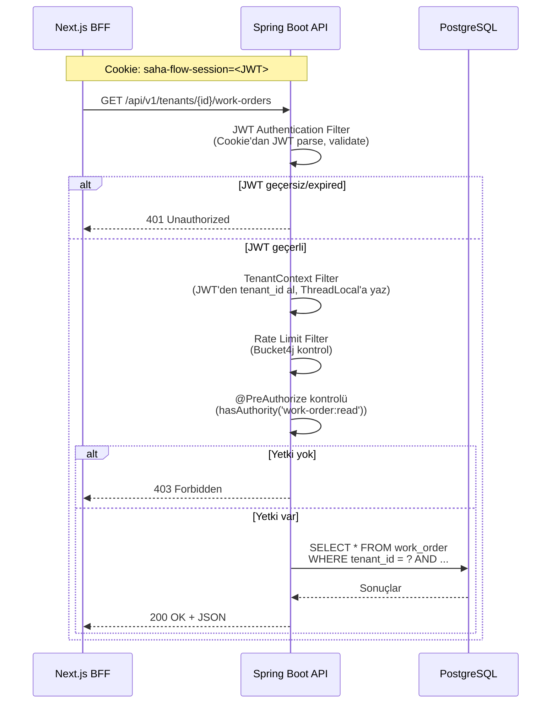
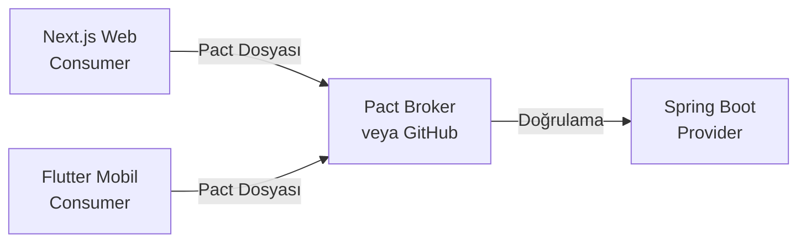

# İşAkış — 09: API ve Entegrasyonlar

> Proje: İşAkış
> Doküman: API ve Entegrasyonlar
> Durum: Draft
> Üretim tarihi: 2026-07-21
> Kaynak girdi: templates/01_PROJE_GIRDI_FORMU.yaml

---

## İçindekiler

1. [API Tasarım Standartları](#1-api-tasarım-standartları)
2. [Endpoint Kataloğu](#2-endpoint-kataloğu)
3. [OpenAPI Yaklaşımı](#3-openapi-yaklaşımı)
4. [Authentication ve Authorization (API Seviyesi)](#4-authentication-ve-authorization-api-seviyesi)
5. [Hata Sözleşmesi (RFC 7807)](#5-hata-sözleşmesi-rfc-7807)
6. [Pagination, Filter, Sort Standardı](#6-pagination-filter-sort-standardı)
7. [Idempotency](#7-idempotency)
8. [Rate Limiting](#8-rate-limiting)
9. [API Versioning](#9-api-versioning)
10. [Webhook ve Entegrasyon Güvenliği](#10-webhook-ve-entegrasyon-güvenliği)
11. [Timeout, Retry ve Circuit Breaker](#11-timeout-retry-ve-circuit-breaker)
12. [Contract Testing](#12-contract-testing)
13. [Entegrasyon Matrisi](#13-entegrasyon-matrisi)
14. [API Güvenlik Kontrol Listesi](#14-api-güvenlik-kontrol-listesi)

---

## 1. API Tasarım Standartları

### Mimari Stil

İşAkış, RESTful API mimarisini kullanır. Richardson Maturity Model seviye 2 hedeflenir (HTTP fiilleri + kaynak odaklı URL). HATEOAS (seviye 3) MVP aşamasında uygulanmaz.

### URL Tasarım Kuralları

```
Temel yapı:
  /api/v{version}/tenants/{tenantId}/{resource}[/{resourceId}][/{sub-resource}]

Kurallar:
  1. Tamamen küçük harf (lowercase)
  2. Kelime ayracı tire (-): work-orders, checklist-templates
  3. Kaynak adı çoğul: /work-orders (tekil değil)
  4. Fiil kullanılmaz: /create-work-order DEĞİL, POST /work-orders
  5. Derinlik maksimum 3 seviye: /tenants/{id}/customers/{id}/assets OK
     /tenants/{id}/customers/{id}/assets/{id}/work-orders/... ÇOK DERİN
  6. Query parametreler camelCase: ?pageSize=20&sortBy=createdAt
  7. Trailing slash YOK: /work-orders/ (sonunda / olmaz)

Örnekler:
  ✅ GET    /api/v1/tenants/{tenantId}/work-orders
  ✅ POST   /api/v1/tenants/{tenantId}/work-orders
  ✅ GET    /api/v1/tenants/{tenantId}/work-orders/{id}
  ✅ PATCH  /api/v1/tenants/{tenantId}/work-orders/{id}/status
  ✅ GET    /api/v1/tenants/{tenantId}/work-orders/{id}/checklist-results
  ❌ POST   /api/v1/work-orders/create
  ❌ GET    /api/v1/tenants/{tenantId}/getWorkOrders
```

### HTTP Fiil Kullanımı

| Fiil | Kullanım | Idempotent? | Safe? | Örnek |
|------|----------|-------------|-------|-------|
| **GET** | Kaynak okuma, listeleme | Evet | Evet | `GET /work-orders` |
| **POST** | Yeni kaynak oluşturma | Hayır (Idempotency-Key ile evet) | Hayır | `POST /work-orders` |
| **PUT** | Tam kaynak güncelleme (replace) | Evet | Hayır | `PUT /work-orders/{id}` |
| **PATCH** | Kısmi güncelleme | Duruma bağlı | Hayır | `PATCH /work-orders/{id}/status` |
| **DELETE** | Kaynak silme (soft-delete) | Evet | Hayır | `DELETE /work-orders/{id}` |
| **HEAD** | Header metaverisi (kaynak var mı?) | Evet | Evet | `HEAD /work-orders/{id}` |
| **OPTIONS** | CORS preflight, izin verilen fiiller | Evet | Evet | `OPTIONS /work-orders` |

### HTTP Durum Kodları

| Kod | Anlamı | Kullanım |
|-----|--------|----------|
| **200** | OK | Başarılı GET, PUT, PATCH |
| **201** | Created | Başarılı POST (yanıtta Location header) |
| **202** | Accepted | Asenkron işlem başlatıldı (webhook, export) |
| **204** | No Content | Başarılı DELETE, body yok |
| **304** | Not Modified | ETag/If-None-Match ile cache |
| **400** | Bad Request | Geçersiz istek formatı, eksik parametre |
| **401** | Unauthorized | Kimlik doğrulama başarısız |
| **403** | Forbidden | Yetki yok (tenant/object seviyesi) |
| **404** | Not Found | Kaynak bulunamadı |
| **409** | Conflict | Optimistic lock, duplicate, durum geçiş hatası |
| **422** | Unprocessable Entity | Doğrulama hatası (Bean Validation) |
| **429** | Too Many Requests | Rate limit aşıldı |
| **500** | Internal Server Error | Beklenmeyen hata |
| **503** | Service Unavailable | Bakım modu |

---

## 2. Endpoint Kataloğu

Aşağıda İşAkış REST API'sinin tam endpoint kataloğu yer almaktadır. Tüm endpoint'lerde `{tenantId}` path parametresi zorunludur (auth endpoint'leri hariç).

### 2.1 Kimlik Doğrulama (Auth)

| # | Method | Endpoint | Açıklama | Auth | Rol |
|---|--------|----------|----------|------|-----|
| A1 | `POST` | `/api/v1/auth/register` | Yeni kullanıcı kaydı | Yok | — |
| A2 | `POST` | `/api/v1/auth/login` | Giriş | Yok | — |
| A3 | `POST` | `/api/v1/auth/refresh` | Token yenileme | Yok (refresh token cookie) | — |
| A4 | `POST` | `/api/v1/auth/logout` | Çıkış | Giriş yapmış | Tümü |
| A5 | `POST` | `/api/v1/auth/forgot-password` | Şifre sıfırlama e-postası | Yok | — |
| A6 | `POST` | `/api/v1/auth/reset-password` | Şifre sıfırlama | Yok (token ile) | — |
| A7 | `GET`  | `/api/v1/auth/session` | Aktif oturum bilgisi | Giriş yapmış | Tümü |
| A8 | `POST` | `/api/v1/auth/mfa/setup` | MFA kurulumu (TOTP) | Giriş yapmış | Admin |
| A9 | `POST` | `/api/v1/auth/mfa/verify` | MFA doğrulama | Giriş yapmış | Admin |
| A10 | `PUT`  | `/api/v1/auth/password` | Şifre değiştirme | Giriş yapmış | Tümü |

### 2.2 Tenant Yönetimi

| # | Method | Endpoint | Açıklama | Auth | Rol |
|---|--------|----------|----------|------|-----|
| T1 | `GET`  | `/api/v1/tenants/{tenantId}` | Tenant bilgisi | Giriş yapmış | Admin |
| T2 | `PUT`  | `/api/v1/tenants/{tenantId}` | Tenant güncelleme | Giriş yapmış | Admin |
| T3 | `GET`  | `/api/v1/tenants/{tenantId}/users` | Tenant kullanıcı listesi | Giriş yapmış | Admin, Yönetici |
| T4 | `POST` | `/api/v1/tenants/{tenantId}/users` | Kullanıcı davet et | Giriş yapmış | Admin, Yönetici |
| T5 | `PUT`  | `/api/v1/tenants/{tenantId}/users/{userId}/role` | Kullanıcı rol güncelleme | Giriş yapmış | Admin |
| T6 | `DELETE` | `/api/v1/tenants/{tenantId}/users/{userId}` | Kullanıcı silme/disable | Giriş yapmış | Admin |
| T7 | `GET`  | `/api/v1/tenants/{tenantId}/roles` | Rol listesi | Giriş yapmış | Admin |
| T8 | `GET`  | `/api/v1/tenants/{tenantId}/settings` | Tenant ayarları | Giriş yapmış | Admin, Yönetici |
| T9 | `PUT`  | `/api/v1/tenants/{tenantId}/settings` | Tenant ayarlarını güncelle | Giriş yapmış | Admin |

### 2.3 Müşteri (Customer)

| # | Method | Endpoint | Açıklama | Auth | Rol |
|---|--------|----------|----------|------|-----|
| C1 | `GET`  | `/api/v1/tenants/{tenantId}/customers` | Müşteri listesi | Giriş yapmış | Tümü |
| C2 | `POST` | `/api/v1/tenants/{tenantId}/customers` | Müşteri oluştur | Giriş yapmış | Admin, Yönetici, Dispatcher |
| C3 | `GET`  | `/api/v1/tenants/{tenantId}/customers/{id}` | Müşteri detayı | Giriş yapmış | Tümü |
| C4 | `PUT`  | `/api/v1/tenants/{tenantId}/customers/{id}` | Müşteri güncelle | Giriş yapmış | Admin, Yönetici |
| C5 | `DELETE` | `/api/v1/tenants/{tenantId}/customers/{id}` | Müşteri silme | Giriş yapmış | Admin |
| C6 | `GET`  | `/api/v1/tenants/{tenantId}/customers/{id}/addresses` | Adres listesi | Giriş yapmış | Tümü |
| C7 | `POST` | `/api/v1/tenants/{tenantId}/customers/{id}/addresses` | Adres ekle | Giriş yapmış | Admin, Yönetici, Dispatcher |
| C8 | `GET`  | `/api/v1/tenants/{tenantId}/customers/{id}/assets` | Müşteriye ait varlıklar | Giriş yapmış | Tümü |
| C9 | `GET`  | `/api/v1/tenants/{tenantId}/customers/search?q=...` | Müşteri arama | Giriş yapmış | Tümü |

### 2.4 Varlık (Asset)

| # | Method | Endpoint | Açıklama | Auth | Rol |
|---|--------|----------|----------|------|-----|
| AS1 | `GET`  | `/api/v1/tenants/{tenantId}/assets` | Varlık listesi | Giriş yapmış | Tümü |
| AS2 | `POST` | `/api/v1/tenants/{tenantId}/assets` | Varlık oluştur | Giriş yapmış | Admin, Yönetici, Dispatcher |
| AS3 | `GET`  | `/api/v1/tenants/{tenantId}/assets/{id}` | Varlık detayı | Giriş yapmış | Tümü |
| AS4 | `PUT`  | `/api/v1/tenants/{tenantId}/assets/{id}` | Varlık güncelle | Giriş yapmış | Admin, Yönetici |
| AS5 | `DELETE` | `/api/v1/tenants/{tenantId}/assets/{id}` | Varlık silme | Giriş yapmış | Admin |
| AS6 | `GET`  | `/api/v1/tenants/{tenantId}/assets/{id}/work-orders` | Varlığa ait iş emirleri | Giriş yapmış | Tümü |

### 2.5 İş Emri (Work Order)

| # | Method | Endpoint | Açıklama | Auth | Rol |
|---|--------|----------|----------|------|-----|
| W1 | `GET`  | `/api/v1/tenants/{tenantId}/work-orders` | İş emri listesi | Giriş yapmış | Tümü (rol filtreli) |
| W2 | `POST` | `/api/v1/tenants/{tenantId}/work-orders` | İş emri oluştur | Giriş yapmış | Admin, Yönetici, Dispatcher |
| W3 | `GET`  | `/api/v1/tenants/{tenantId}/work-orders/{id}` | İş emri detayı | Giriş yapmış | Tümü |
| W4 | `PUT`  | `/api/v1/tenants/{tenantId}/work-orders/{id}` | İş emri güncelle | Giriş yapmış | Admin, Yönetici, Dispatcher |
| W5 | `DELETE` | `/api/v1/tenants/{tenantId}/work-orders/{id}` | İş emri silme | Giriş yapmış | Admin |
| W6 | `PATCH` | `/api/v1/tenants/{tenantId}/work-orders/{id}/status` | Durum güncelleme | Giriş yapmış | Tümü (duruma göre) |
| W7 | `POST` | `/api/v1/tenants/{tenantId}/work-orders/{id}/assign` | Teknisyen ata | Giriş yapmış | Admin, Dispatcher |
| W8 | `POST` | `/api/v1/tenants/{tenantId}/work-orders/{id}/unassign` | Atamayı kaldır | Giriş yapmış | Admin, Dispatcher |
| W9 | `GET`  | `/api/v1/tenants/{tenantId}/work-orders/{id}/history` | Durum geçmişi | Giriş yapmış | Tümü |
| W10 | `GET`  | `/api/v1/tenants/{tenantId}/work-orders/{id}/checklist-results` | Kontrol listesi sonuçları | Giriş yapmış | Tümü |
| W11 | `POST` | `/api/v1/tenants/{tenantId}/work-orders/{id}/check-in` | İş başı (check-in) | Giriş yapmış | Teknisyen |
| W12 | `POST` | `/api/v1/tenants/{tenantId}/work-orders/{id}/check-out` | İş bitişi (check-out) | Giriş yapmış | Teknisyen |
| W13 | `GET`  | `/api/v1/tenants/{tenantId}/work-orders/{id}/location-events` | Lokasyon geçmişi | Giriş yapmış | Admin, Yönetici |

### 2.6 Kontrol Listesi (Checklist)

| # | Method | Endpoint | Açıklama | Auth | Rol |
|---|--------|----------|----------|------|-----|
| CH1 | `GET`  | `/api/v1/tenants/{tenantId}/checklist-templates` | Şablon listesi | Giriş yapmış | Tümü |
| CH2 | `POST` | `/api/v1/tenants/{tenantId}/checklist-templates` | Şablon oluştur | Giriş yapmış | Admin, Yönetici |
| CH3 | `GET`  | `/api/v1/tenants/{tenantId}/checklist-templates/{id}` | Şablon detayı | Giriş yapmış | Tümü |
| CH4 | `PUT`  | `/api/v1/tenants/{tenantId}/checklist-templates/{id}` | Şablon güncelle | Giriş yapmış | Admin, Yönetici |
| CH5 | `POST` | `/api/v1/tenants/{tenantId}/work-orders/{workOrderId}/checklist-results` | Sonuç gönder | Giriş yapmış | Teknisyen |
| CH6 | `GET`  | `/api/v1/tenants/{tenantId}/checklist-results/{id}` | Sonuç detayı | Giriş yapmış | Tümü |

### 2.7 Dosya (Files)

| # | Method | Endpoint | Açıklama | Auth | Rol |
|---|--------|----------|----------|------|-----|
| F1 | `POST` | `/api/v1/tenants/{tenantId}/files/upload-request` | Presigned URL talep et | Giriş yapmış | Tümü |
| F2 | `POST` | `/api/v1/tenants/{tenantId}/files/upload-complete` | Yükleme tamamlandı bildir | Giriş yapmış | Tümü |
| F3 | `GET`  | `/api/v1/tenants/{tenantId}/files/{id}/download` | İndirme URL'i al | Giriş yapmış | Tümü |
| F4 | `DELETE` | `/api/v1/tenants/{tenantId}/files/{id}` | Dosya silme | Giriş yapmış | Admin, Yönetici |
| F5 | `GET`  | `/api/v1/tenants/{tenantId}/work-orders/{id}/files` | İş emri dosyaları | Giriş yapmış | Tümü |

### 2.8 Raporlar (Reports)

| # | Method | Endpoint | Açıklama | Auth | Rol |
|---|--------|----------|----------|------|-----|
| R1 | `GET`  | `/api/v1/tenants/{tenantId}/reports/work-order-summary` | İş emri özet raporu | Giriş yapmış | Admin, Yönetici |
| R2 | `GET`  | `/api/v1/tenants/{tenantId}/reports/technician-performance` | Teknisyen performans raporu | Giriş yapmış | Admin, Yönetici |
| R3 | `GET`  | `/api/v1/tenants/{tenantId}/reports/customer-history` | Müşteri servis geçmişi | Giriş yapmış | Admin, Yönetici |
| R4 | `POST` | `/api/v1/tenants/{tenantId}/reports/export` | Rapor dışa aktar (PDF/Excel) | Giriş yapmış | Admin, Yönetici |

### 2.9 Admin Paneli

| # | Method | Endpoint | Açıklama | Auth | Rol |
|---|--------|----------|----------|------|-----|
| AD1 | `GET`  | `/api/v1/admin/audit` | Audit log sorgulama | Giriş yapmış | Admin |
| AD2 | `GET`  | `/api/v1/admin/tenants` | Tüm tenant'ları listeleme | Giriş yapmış | Admin |
| AD3 | `GET`  | `/api/v1/admin/health` | Sistem sağlık metrikleri | Giriş yapmış | Admin |

### Genel Toplam: 45+ Endpoint

---

## 3. OpenAPI Yaklaşımı

### SpringDoc OpenAPI 3.0 (springdoc-openapi-starter-webmvc-ui)

İşAkış, SpringDoc ile otomatik OpenAPI 3.0 spesifikasyonu üretir.

```java
@Configuration
public class OpenApiConfig {

    @Bean
    public OpenAPI sahaFlowOpenAPI() {
        return new OpenAPI()
            .info(new Info()
                .title("İşAkış API")
                .description("Saha servis yönetimi SaaS platformu REST API'si")
                .version("v1")
                .contact(new Contact().name("İşAkış").email("api@sahaflow.com"))
                .license(new License().name("Proprietary"))
            )
            .addSecurityItem(new SecurityRequirement().addList("BearerAuth"))
            .components(new Components()
                .addSecuritySchemes("BearerAuth", new SecurityScheme()
                    .type(SecurityScheme.Type.HTTP)
                    .scheme("bearer")
                    .bearerFormat("JWT")
                    .description("JWT token (cookie tabanlı, BFF ile otomatik iletilir)")
                )
            );
    }
}
```

### OpenAPI Dokümanı Erişimi

| Ortam | URL |
|-------|-----|
| **Geliştirme** | `http://localhost:8080/swagger-ui.html` |
| **Staging** | `https://staging-api.sahaflow.com/swagger-ui.html` |
| **Production** | `https://api.sahaflow.com/swagger-ui.html` (sadece iç ağ/IP whitelist) |
| **Ham JSON** | `http://localhost:8080/v3/api-docs` |

### OpenAPI → Code Generation

```yaml
# openapi-generator-config.yml (Frontend TypeScript client üretimi)
generatorName: typescript-fetch
inputSpec: http://localhost:8080/v3/api-docs
outputDir: ../saha-flow-web/src/generated-api
additionalProperties:
  supportsES6: true
  typescriptThreePlus: true
  withSeparateModelsAndApi: true
  modelPropertyNaming: camelCase
```

### OpenAPI Güvenliği

| Kural | Uygulama |
|-------|----------|
| **Production'da Swagger UI** | Kapalı veya IP whitelist ile korumalı. `springdoc.swagger-ui.enabled: false` (production profile) |
| **API anahtarı dokümantasyonu** | OpenAPI spec'te örnek API anahtarı veya token GÖSTERİLMEZ |
| **Ham spec erişimi** | `/v3/api-docs` endpoint'i production'da kapalı |
| **Rate limiting** | Swagger UI ve `/v3/api-docs` endpoint'lerine de rate limiting uygulanır |

---

## 4. Authentication ve Authorization (API Seviyesi)

### API'ye Gelen İstek Akışı



### Mobil Uygulama İçin API Erişimi

Mobil (Flutter) uygulama doğrudan Spring Boot API'ye bağlanmaz. İki seçenek:

| Seçenek | Açıklama | Avantaj | Dezavantaj |
|---------|----------|---------|------------|
| **A. Next.js BFF üzerinden** | Mobil app, Next.js API route'larına bağlanır. Next.js, cookie ile backend'e proxy yapar. | Tek giriş noktası. Cookie tabanlı auth (güvenli). CSP ve security header'lar merkezi. | Ek bir hop (gecikme +10-20ms). Next.js sunucusu yükü artar. |
| **B. Doğrudan backend (API Key)** | Mobil app, Spring Boot'a doğrudan bağlanır. JWT'yi secure storage'da saklar. | Daha düşük gecikme. BFF dependency yok. | Token'ı mobil cihazda saklama riski. Sertifika pinning gerekli. |

**MVP Kararı**: Seçenek A (Next.js BFF üzerinden). 2 kişilik ekipte tek giriş noktası yönetimi daha basit. Gelecekte API key tabanlı mobil auth eklenebilir.

---

## 5. Hata Sözleşmesi (RFC 7807)

### Problem Detail Yapısı

```json
{
  "type": "https://api.sahaflow.com/errors/validation-failed",
  "title": "Doğrulama Hatası",
  "status": 422,
  "detail": "İş emri oluşturulurken doğrulama hatası oluştu",
  "instance": "/api/v1/tenants/550e8400-e29b-41d4-a716-446655440000/work-orders",
  "traceId": "a1b2c3d4e5f6a7b8c9d0e1f2a3b4c5d6",
  "errors": [
    {
      "field": "title",
      "message": "Başlık en az 5 karakter olmalıdır",
      "rejectedValue": "AB"
    },
    {
      "field": "scheduledEndAt",
      "message": "Bitiş tarihi başlangıç tarihinden sonra olmalıdır",
      "rejectedValue": null
    }
  ]
}
```

### Hata Tip Referansları

| Type URI | HTTP | Kullanım Senaryosu |
|----------|------|-------------------|
| `/errors/bad-request` | 400 | Eksik/geçersiz istek parametreleri |
| `/errors/unauthorized` | 401 | JWT geçersiz/expired, giriş yapılmamış |
| `/errors/forbidden` | 403 | Yetki yok (tenant/object/role seviyesinde) |
| `/errors/not-found` | 404 | Kaynak bulunamadı |
| `/errors/conflict` | 409 | Optimistic lock, duplicate, durum geçişi geçersiz |
| `/errors/validation-failed` | 422 | Bean validation hatası |
| `/errors/rate-limited` | 429 | Rate limit aşıldı |
| `/errors/idempotency-conflict` | 409 | Idempotency key tekrarı |
| `/errors/internal-error` | 500 | Beklenmeyen sunucu hatası |
| `/errors/service-unavailable` | 503 | Bakım modu |

### Hata Response Body Kuralları

```java
// Asla yapılmaması gerekenler:
// ❌ return ResponseEntity.status(500).body(e.getMessage());  // Stack trace sızıntısı
// ❌ return ResponseEntity.ok(Map.of("error", "Bir hata oluştu"));  // 200 OK + hata mesajı
// ❌ return ResponseEntity.status(400).body("Geçersiz istek");  // Düz string, RFC 7807 değil

// ✅ Doğru kullanım:
// ProblemDetail ile her zaman RFC 7807 formatında dönülür
// 500 hatalarında bile detay gösterilmez, genel mesaj verilir
// traceId her yanıtta bulunur (hata ayıklama için)
```

---

## 6. Pagination, Filter, Sort Standardı

### Pagination (Sayfalama)

Sayfalama için cursor-based değil, offset-based pagination kullanılır. MVP aşamasında offset daha basit implementasyon sunar.

```
GET /api/v1/tenants/{tenantId}/work-orders?page=0&size=20&sort=scheduledStartAt,DESC
```

| Parametre | Tip | Varsayılan | Açıklama |
|-----------|-----|-----------|----------|
| `page` | integer | 0 | Sayfa numarası (0-indexed, Spring Data varsayılanı) |
| `size` | integer | 20 | Sayfa başına kayıt sayısı (maksimum 100) |
| `sort` | string | `createdAt,DESC` | Sıralama: `alanAdı,ASC\|DESC`. Çoklu sıralama: `alan1,ASC&sort=alan2,DESC` |

**Yanıt Formatı:**

```json
{
  "content": [ /* ... kayıtlar ... */ ],
  "page": {
    "number": 0,
    "size": 20,
    "totalElements": 157,
    "totalPages": 8,
    "first": true,
    "last": false
  }
}
```

**Not**: Spring Data `Page` yapısı, `totalElements` için COUNT sorgusu yapar. Büyük tablolarda (location_event) bu maliyetli olabilir. Gerekirse `Slice` yapısına geçilebilir (hasNext kontrolü, toplam sayı yok).

### Filter (Filtreleme)

```
GET /api/v1/tenants/{tenantId}/work-orders
    ?status=OPEN,IN_PROGRESS
    &priority=HIGH,CRITICAL
    &customerId=550e8400-e29b-41d4-a716-446655440000
    &assignedToUserid=...
    &scheduledAfter=2026-08-01T00:00:00Z
    &scheduledBefore=2026-08-31T23:59:59Z
    &search=klima
```

| Parametre | Tip | Açıklama |
|-----------|-----|----------|
| `status` | string (CSV) | Durum filtresi, virgülle ayrılmış liste |
| `priority` | string (CSV) | Öncelik filtresi |
| `customerId` | UUID | Belirli müşteriye ait |
| `assetId` | UUID | Belirli varlığa ait |
| `assignedToUserId` | UUID | Belirli teknisyene atanan |
| `scheduledAfter` | ISO 8601 | Bu tarihten sonra planlanan |
| `scheduledBefore` | ISO 8601 | Bu tarihten önce planlanan |
| `search` | string | Başlık, açıklama, müşteri adında tam metin araması (`tsvector`) |

### Sort (Sıralama)

İzin verilen sıralama alanları her endpoint için belirlidir. İstemcinin rastgele bir kolona göre sıralama yapmasına izin verilmez (SQL injection ve performans riski).

```java
// Controller'da sıralama doğrulama
private static final Set<String> ALLOWED_SORT_FIELDS = Set.of(
    "createdAt", "updatedAt", "scheduledStartAt", "scheduledEndAt",
    "priority", "status", "title"
);

@GetMapping
public Page<WorkOrderResponse> list(
    @PathVariable UUID tenantId,
    @PageableDefault(size = 20, sort = "createdAt", direction = Sort.Direction.DESC) Pageable pageable,
    @RequestParam(required = false) String status) {

    // Sıralama alanlarını doğrula
    pageable.getSort().forEach(order -> {
        if (!ALLOWED_SORT_FIELDS.contains(order.getProperty())) {
            throw new InvalidSortFieldException(order.getProperty());
        }
    });

    return workOrderService.list(tenantId, pageable, status);
}
```

---

## 7. Idempotency

### Idempotency-Key Header

```http
POST /api/v1/tenants/{tenantId}/work-orders HTTP/1.1
Content-Type: application/json
Idempotency-Key: 5f5b7f3-8a4b-4e8d-9c6b-7a3d2f1e0a9b
```

### Idempotent Olması Gereken Endpoint'ler

Aşağıdaki POST endpoint'leri **idempotency key zorunlu** olarak işaretlenir:

| Endpoint | Gerekçe |
|----------|---------|
| `POST /work-orders` | Çift iş emri oluşturmayı engelleme |
| `POST /work-orders/{id}/assign` | Çift atamayı engelleme |
| `POST /files/upload-complete` | Çift dosya işleme engelleme |
| `POST /work-orders/{id}/check-in` | Çift check-in engelleme |
| `POST /work-orders/{id}/checklist-results` | Çift kontrol listesi gönderimi engelleme |
| `POST /customers/{id}/addresses` | Çift adres eklemeyi engelleme |

### Idempotency Açık Ama Zorunlu Olmayan Endpoint'ler

| Endpoint | Gerekçe |
|----------|---------|
| `POST /auth/login` | Zaten idempotent (aynı bilgilerle giriş aynı sonuç) |
| `POST /auth/refresh` | Refresh token rotation zaten reuse detection yapar |

### Idempotency Akışı

```
1. Client: POST /work-orders
   Header: Idempotency-Key: abc-123

2. Backend:
   a. Idempotency-Key header'ını oku
   b. idempotency_store tablosunda key var mı?
      → VAR: Daha önce işlenmiş. Kaydedilen yanıtı dön. (200 veya 201)
      → YOK: İşlemi çalıştır.
         Başarılı → Yanıtı key ile birlikte kaydet (TTL: 24 saat). 201 dön.
         Başarısız → Yanıtı kaydetme (retry yapılabilsin). Hata kodunu dön.

3. Client retry yaparsa (aynı key):
   → Kayıtlı yanıt dönülür, işlem tekrar çalıştırılmaz.
```

### Idempotency Store (Veritabanı)

```sql
CREATE TABLE idempotency_store (
    idempotency_key VARCHAR(64) PRIMARY KEY,
    tenant_id UUID NOT NULL,
    user_id UUID NOT NULL,
    http_method VARCHAR(10) NOT NULL,
    request_path VARCHAR(500) NOT NULL,
    response_status INT NOT NULL,
    response_body TEXT,
    created_at TIMESTAMP WITH TIME ZONE NOT NULL DEFAULT NOW()
);

CREATE INDEX idx_idempotency_expiry ON idempotency_store(created_at)
    WHERE created_at < NOW() - INTERVAL '24 hours';  -- Temizlik için
```

---

## 8. Rate Limiting

Bkz. [07: Backend Mimari ve Güvenlik](07_BACKEND_ARCHITECTURE_SECURITY.md) — Bölüm 11.

### API Seviyesinde Rate Limit Headers

Her API yanıtında aşağıdaki header'lar bulunur:

```http
HTTP/1.1 200 OK
X-RateLimit-Limit: 60
X-RateLimit-Remaining: 57
X-RateLimit-Reset: 1721117100
```

### Endpoint Bazlı Limitler

| Endpoint Grubu | Limit | Pencere | Anahtar | Açıklama |
|----------------|-------|---------|---------|----------|
| `/auth/login` | 5 | 1 dakika | IP | Brute force koruması |
| `/auth/*` (diğer) | 10 | 1 dakika | IP | Kimlik doğrulama işlemleri |
| `/files/upload-request` | 10 | 1 dakika | User ID | Dosya yükleme presigned URL |
| `/reports/export` | 2 | 1 dakika | User ID | Ağır rapor işlemleri |
| Diğer tüm API'ler | 60 | 1 dakika | User ID | Genel kullanım |

### 429 Yanıt Formatı

```http
HTTP/1.1 429 Too Many Requests
Retry-After: 60
Content-Type: application/json

{
  "type": "https://api.sahaflow.com/errors/rate-limited",
  "title": "Rate Limit Aşıldı",
  "status": 429,
  "detail": "Çok fazla istek gönderdiniz. Lütfen 60 saniye sonra tekrar deneyin.",
  "retryAfter": 60
}
```

---

## 9. API Versioning

### Strateji: URL Path Versioning

```
/api/v1/tenants/{tenantId}/work-orders
/api/v2/tenants/{tenantId}/work-orders   (gelecek)
```

### Neden URL Path?

| Kriter | URL Path (`/v1/`) | Header (`Accept: application/vnd.sahaflow.v1+json`) | Query Param (`?version=1`) |
|--------|-------------------|-----------------------------------------------------|---------------------------|
| **Görünürlük** | Açık, kolay anlaşılır | Gizli, hata yapmaya müsait | URL kirliliği |
| **Cache** | CDN/varnish kolay cache | Header'a göre cache zor | ?param cache varyasyonu |
| **Dokümantasyon** | Her versiyon ayrı spec | Tek spec, tüm versiyonlar | Tek spec |
| **Test** | Ayrı test suite | Header'a göre routing testi | Param'a göre routing |
| **Karar** | ✅ **Seçildi** | ❌ | ❌ |

### Version Kuralları

| Kural | Açıklama |
|-------|----------|
| **Yeni versiyon** | Geriye dönük uyumsuz (breaking) değişiklik olduğunda yeni versiyon (`/v2/`) |
| **Eski versiyon** | En az 6 ay desteklenir. Deprecation duyurusu 3 ay önceden yapılır. |
| **Breaking değişiklik** | Alan silme, alan tipi değiştirme, zorunlu alan ekleme, endpoint URL değişikliği |
| **Non-breaking değişiklik** | Yeni endpoint ekleme, opsiyonel alan ekleme, yeni enum değeri, yeni HTTP header |
| **Deprecation header** | `Sunset: Sat, 31 Dec 2026 23:59:59 GMT` ve `Deprecation: true` |
| **API değişiklik log'u** | CHANGELOG.md dosyasında her değişiklik belgelenir |

### Version Geçiş Örneği

```java
// Eski endpoint (v1) — 6 ay daha desteklenir
@RestController
@RequestMapping("/api/v1/tenants/{tenantId}/work-orders")
@Deprecated
public class WorkOrderControllerV1 {
    // ...
}

// Yeni endpoint (v2)
@RestController
@RequestMapping("/api/v2/tenants/{tenantId}/work-orders")
public class WorkOrderControllerV2 {
    // ...
}
```

---

## 10. Webhook ve Entegrasyon Güvenliği

### Giden Webhook (Outbound) — Gelecek Özelliği

İşAkış, dış sistemlere webhook gönderirken aşağıdaki güvenlik önlemlerini uygular:

```json
// Webhook payload örneği
{
  "event": "work_order.status_changed",
  "timestamp": "2026-07-21T14:30:00Z",
  "data": {
    "workOrderId": "550e8400-e29b-41d4-a716-446655440000",
    "status": "COMPLETED",
    "completedAt": "2026-07-21T14:25:00Z"
  }
}
```

```http
POST https://customer-system.com/webhooks/saha-flow HTTP/1.1
Content-Type: application/json
X-SahaFlow-Signature: sha256=9f86d081884c7d659a2feaa0c55a4b9d9c4e4e5c
X-SahaFlow-Timestamp: 1721133440000
X-SahaFlow-Event: work_order.status_changed
X-SahaFlow-Delivery: a1b2c3d4-e5f6-4a7b-8c9d-0e1f2a3b4c5d
```

### HMAC İmzalama Algoritması

```
signature = HMAC-SHA256(
    secret = webhook_secret,
    message = timestamp + "." + json_payload
)

// Doğrulama (alıcı tarafta):
// 1. Timestamp kontrolü: |now - timestamp| < 5 dakika → replay attack engelleme
// 2. HMAC hesapla: HMAC-SHA256(secret, timestamp + "." + body)
// 3. Hesaplanan değer == X-SahaFlow-Signature header'ı mı?
```

### Gelen Webhook (Inbound) — MVP'de Yok

Üçüncü parti sistemlerden (ERP, muhasebe) İşAkış'a webhook alınması durumunda:

| Kontrol | Uygulama |
|---------|----------|
| **HMAC doğrulama** | Gelen webhook'un HMAC imzası doğrulanır |
| **Timestamp kontrolü** | Replay attack önleme (5 dakika tolerans) |
| **IP whitelist** | Webhook kaynağının IP adresi whitelist'te olmalı |
| **Payload size limit** | Maksimum 1MB |
| **HTTPS only** | HTTP webhook'ları reddedilir |
| **Idempotency** | Webhook event ID'si ile tekrar işleme engelleme |

### Retry Stratejisi

```
Başarısız webhook gönderimi:
  Deneme 1: Hemen
  Deneme 2: 1 dakika sonra
  Deneme 3: 5 dakika sonra
  Deneme 4: 25 dakika sonra
  Deneme 5: 125 dakika sonra (son deneme)
  5 deneme sonunda başarısız → webhook DEAD, manuel müdahale gerekir
```

---

## 11. Timeout, Retry ve Circuit Breaker

### Timeout Politikası

| Katman | Timeout | Gerekçe |
|--------|---------|---------|
| **Client → Next.js BFF** | 30 saniye | Kullanıcı deneyimi, tarayıcı varsayılanı |
| **Next.js BFF → Spring Boot** | 10 saniye | Backend'in yanıt vermesi için yeterli süre |
| **Spring Boot → PostgreSQL** | 5 saniye (query timeout) | Veritabanı sorguları maksimum 5 saniye |
| **Spring Boot → S3** | 5 saniye | Presigned URL oluşturma, metadata sorguları |
| **Webhook gönderimi** | 10 saniye | Dış sistem yanıt süresi |

### Retry Stratejisi

```java
// Spring Retry ile otomatik retry (sadece idempotent işlemler!)
@Retryable(
    retryFor = {TransientException.class},
    maxAttempts = 3,
    backoff = @Backoff(delay = 1000, multiplier = 2)
)
public void sendEmail(EmailRequest request) {
    emailProvider.send(request);  // Geçici hatalarda 3 kez dene
}

// Dış servis çağrıları için:
// - Sadece idempotent işlemlerde retry
// - Exponential backoff: 1s, 2s, 4s
// - Maksimum 3 deneme
// - Timeout her denemede ayrı
```

### Circuit Breaker (Gelecek Özelliği)

Birden fazla dış entegrasyon eklendiğinde Resilience4j Circuit Breaker kullanılacak:

```java
// Gelecek implementasyon referansı:
@CircuitBreaker(
    name = "emailService",
    fallbackMethod = "emailFallback"
)
public void sendEmail(EmailRequest request) {
    emailProvider.send(request);
}

// Yapılandırma:
// failureRateThreshold: %50
// waitDurationInOpenState: 30 saniye
// slidingWindowSize: 10
// permittedNumberOfCallsInHalfOpenState: 3
```

### Transaction Timeout

```java
// Spring transaction timeout (varsayılan: veritabanı varsayılanı, -1 = sonsuz)
// İşAkış'ta 30 saniye olarak ayarlanır
spring:
  transaction:
    default-timeout: 30s
```

---

## 12. Contract Testing

### Pact ile Sözleşme Testi

İşAkış'ta consumer-driven contract testing için Pact kullanılır.



### Consumer (Next.js) Tarafı

```typescript
// pact/consumer/work-order.spec.ts
import { PactV4, MatchersV3 } from '@pact-foundation/pact';

const provider = new PactV4({
  consumer: 'saha-flow-web',
  provider: 'saha-flow-backend',
  dir: './pacts',
});

describe('Work Order API', () => {
  it('iş emri listesi döner', async () => {
    await provider
      .given('tenant has work orders')
      .uponReceiving('list work orders request')
      .withRequest({
        method: 'GET',
        path: '/api/v1/tenants/abc-123/work-orders',
        query: { page: '0', size: '20' },
        headers: { Accept: 'application/json' },
      })
      .willRespondWith({
        status: 200,
        headers: { 'Content-Type': 'application/json' },
        body: {
          content: MatchersV3.eachLike({
            id: MatchersV3.uuid(),
            title: MatchersV3.string('Klima Bakımı'),
            status: MatchersV3.string('OPEN'),
          }),
          page: {
            number: 0,
            size: 20,
            totalElements: 1,
          },
        },
      });

    // Test...
    await provider.executeTest(async (mockserver) => {
      const response = await fetch(`${mockserver.url}/api/v1/tenants/abc-123/work-orders?page=0&size=20`);
      expect(response.status).toBe(200);
    });
  });
});
```

### Provider (Spring Boot) Tarafı

```java
@Provider("saha-flow-backend")
@PactBroker(url = "https://pact-broker.sahaflow.com")  // veya GitHub
@SpringBootTest(webEnvironment = SpringBootTest.WebEnvironment.RANDOM_PORT)
class WorkOrderProviderPactTest {

    @LocalServerPort
    int port;

    @TestTemplate
    @ExtendWith(PactVerificationInvocationContextProvider.class)
    void pactVerificationTestTemplate(PactVerificationContext context) {
        context.verifyInteraction();
    }

    @BeforeEach
    void setUp(PactVerificationContext context) {
        context.setTarget(new HttpTestTarget("localhost", port));
    }

    @State("tenant has work orders")
    void tenantHasWorkOrders() {
        // Test verisi hazırla
        TenantContext.setCurrentTenantId(tenantId);
        workOrderRepository.save(WorkOrder.builder()
            .tenantId(tenantId)
            .title("Klima Bakımı")
            .status(WorkOrderStatus.OPEN)
            .build());
    }
}
```

### Pact Dosyası CI Entegrasyonu

```yaml
# .github/workflows/contract-test.yml
name: Contract Tests

on: [pull_request]

jobs:
  consumer-test:
    runs-on: ubuntu-latest
    steps:
      - uses: actions/checkout@v4
      - run: npm run pact:test  # Consumer test → pact dosyası oluştur
      - uses: pactflow/actions/publish-pact-files@v1
        with:
          pactfiles: pacts/*.json
          broker-url: ${{ secrets.PACT_BROKER_URL }}
          token: ${{ secrets.PACT_BROKER_TOKEN }}

  provider-verify:
    runs-on: ubuntu-latest
    steps:
      - uses: actions/checkout@v4
      - run: ./gradlew pactVerify  # Provider doğrulama
```

---

## 13. Entegrasyon Matrisi

### Mevcut ve Planlanan Entegrasyonlar

| # | Entegrasyon | Yön | Kritiklik | Durum | Protokol |
|---|-------------|-----|-----------|-------|----------|
| 1 | **E-posta servisi** (Resend / SendGrid / Postal) | Giden | Yüksek | MVP'de | SMTP veya REST API |
| 2 | **SMS servisi** (Netgsm / TFon) | Giden | Orta | MVP sonrası | REST API |
| 3 | **Push notification** (Firebase FCM) | Giden | Orta | MVP sonrası | FCM HTTP v1 |
| 4 | **Ödeme sistemi** (İyzico / PayTR) | Çift yönlü | Yüksek | MVP sonrası | REST API + Webhook |
| 5 | **Muhasebe/ERP** (Logo, Mikro) | Çift yönlü | Düşük | Gelecek | REST API |
| 6 | **Harita servisi** (Google Maps / Mapbox) | Giden | Orta | MVP'de | REST API |
| 7 | **E-imza entegrasyonu** | Giden | Düşük | Gelecek | REST API |
| 8 | **Dış takvim** (Google Calendar, Outlook) | Giden | Düşük | Gelecek | CalDAV / REST API |

### Entegrasyon Güvenlik Matrisi

| Entegrasyon | Auth Yöntemi | Hassas Veri? | Timeout | Retry | Circuit Breaker |
|-------------|-------------|--------------|---------|-------|-----------------|
| E-posta | API Key | Kısmen (içerik) | 10s | 3 kez | Yok (MVP) |
| SMS | API Key + IP whitelist | Telefon numarası | 10s | 3 kez | Yok (MVP) |
| Ödeme | API Key + HMAC | Evet (tutar) | 15s | Yok (idempotent) | Var (production) |
| Harita | API Key | Kısmen (adres) | 5s | 2 kez | Yok |
| ERP | HMAC + IP whitelist | Evet (müşteri verisi) | 30s | 5 kez | Var |

---

## 14. API Güvenlik Kontrol Listesi

| No | Kontrol | Durum | Doğrulama | OWASP API Ref |
|----|---------|-------|-----------|---------------|
| API-01 | Tüm endpoint'ler HTTPS zorunlu | ✅ Zorunlu | `curl http://` → redirect | API2:2019 |
| API-02 | Authentication tüm endpoint'lerde (public hariç) | ✅ Zorunlu | 401 testi | API1:2019 |
| API-03 | Object-level authorization (IDOR önleme) | ✅ Zorunlu | Tenant-A kullanıcısı, Tenant-B verisine erişemez | API1:2019 |
| API-04 | Rate limiting tüm endpoint'lerde | ✅ Zorunlu | 429 testi | API4:2019 |
| API-05 | Input validation (Bean Validation) | ✅ Zorunlu | 422 testi | API6:2019 |
| API-06 | Pagination maksimum size sınırı (100) | ✅ Zorunlu | `?size=99999` → 400 | API4:2019 |
| API-07 | Hatalarda stack trace yok | ✅ Zorunlu | Exception testi | API7:2019 |
| API-08 | CORS sadece bilinen origin'ler | ✅ Zorunlu | `Origin: evil.com` → yanıt yok | API5:2019 |
| API-09 | Security headers (HSTS, XFO, CSP) | ✅ Zorunlu | `curl -I` | API7:2019 |
| API-10 | Idempotency-Key desteği (POST) | ✅ Zorunlu | Aynı key ile 2 POST | API6:2019 |
| API-11 | JWT expiry 15 dakika | ✅ Zorunlu | Expired token ile 401 | API2:2019 |
| API-12 | Refresh token rotation + reuse detection | ✅ Zorunlu | Reuse testi | API2:2019 |
| API-13 | OpenAPI spec production'da kapalı | ✅ Zorunlu | `/swagger-ui.html` → 404/403 | API8:2019 |
| API-14 | Dosya yükleme: MIME/boyut kontrolü | ✅ Zorunlu | Geçersiz MIME ile 400 | API6:2019 |
| API-15 | GraphQL introspection kapalı (kullanılmıyor) | N/A | — | API8:2019 |
| API-16 | Mass assignment koruması (DTO kullanımı) | ✅ Zorunlu | Entity doğrudan request body DEĞİL | API6:2019 |
| API-17 | API key rotasyonu manuel | ✅ Zorunlu | Rotasyon testi | API2:2019 |
| API-18 | Staging ve production secret'ları ayrı | ✅ Zorunlu | Environment kontrolü | API7:2019 |

---

## Karar Bekleyen Konular

1. **API Gateway**: Şu anda Spring Boot doğrudan Traefik arkasında. İleride API Gateway (Kong, Apache APISIX) eklenmeli mi? Rate limiting, auth, request transformation için faydalı olabilir. MVP'de gerekli değil.
2. **API Analytics / Monetization**: Kim hangi endpoint'i ne kadar kullanıyor? API kullanım metrikleri ve limit aşımı için tier bazlı kısıtlama. MVP sonrası değerlendirilecek.
3. **Public API**: Üçüncü parti geliştiriciler için public API yayınlama planı. API key yönetimi, developer portal, rate limit tier'ları. Faz 2'de değerlendirilecek.
4. **GraphQL alternatifi**: Mobil uygulamanın farklı veri ihtiyaçları REST ile karşılanamaz hale gelirse, GraphQL gateway değerlendirilebilir.
5. **Pact Broker**: Self-hosted mi, PactFlow (cloud) mu? Self-hosted için ek sunucu yükü, PactFlow için maliyet ve KVKK. MVP'de GitHub Actions'a pact dosyası commit edilerek basit doğrulama.
6. **Webhook UI**: Müşterilerin kendi webhook endpoint'lerini yönetebileceği bir arayüz. MVP'de yok, talep gelirse eklenir.

---

## İlgili Dokümanlar

- [05: Teknoloji Yığını Kararları](05_TECH_STACK_DECISIONS.md)
- [06: Frontend Mimari ve Güvenlik](06_FRONTEND_ARCHITECTURE_SECURITY.md)
- [07: Backend Mimari ve Güvenlik](07_BACKEND_ARCHITECTURE_SECURITY.md)
- [08: Veritabanı ve Veri Güvenliği](08_DATABASE_AND_DATA_SECURITY.md)
