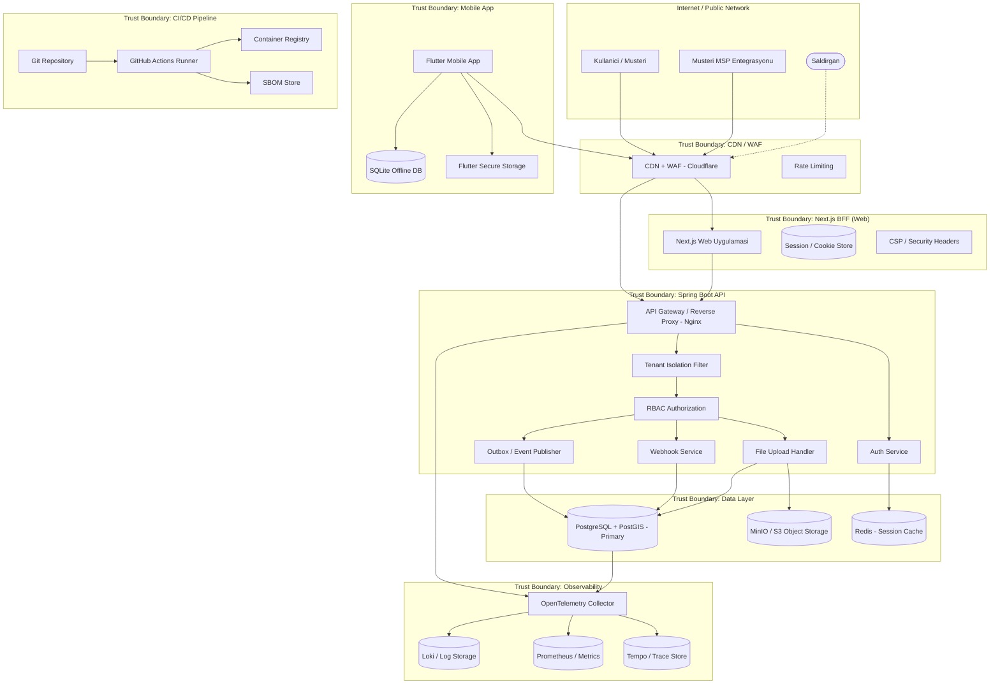

# Tehdit Modeli (Threat Model)

> Proje: Saha Flow
> Dokuman: Tehdit Modeli (Threat Model)
> Durum: Draft
> Uretim tarihi: 2026-07-21
> Kaynak girdi: templates/01_PROJE_GIRDI_FORMU.yaml

---

## 1. OWASP Dort Sorusu

### 1.1 Ne Insa Ediyoruz?

Teknik servis firmalarinin (5-50 teknisyen) saha operasyonlarini yoneten SaaS uygulamasi. Web arayuzu (Next.js 14), REST API (Spring Boot 3.x), mobil uygulama (Flutter 3.x), PostgreSQL+PostGIS veri tabani, S3 uyumlu dosya depolama (MinIO), Docker Compose ile konteyner orkestrasyonu. Coklu musteri (tenant) destegi, shared database / shared schema mimarisi, `tenant_id` bazli satir seviyesi izolasyon.

Temel varliklar:
- Musteri ve teknisyen kisisel verileri (KVKK kapsaminda)
- Is emirleri, saha raporlari, fotograflar, imzalar
- Konum (GPS) verileri
- Fatura ve odeme bilgileri
- Kullanici kimlik bilgileri ve oturum token'lari
- Webhook ve entegrasyon uclari

### 1.2 Neler Yanlis Gidebilir?

- Yetkisiz tenant verisine erisim (IDOR / tenant atlama)
- Kotu niyetli dosya yukleme (malware, zip bomb, XSS payload)
- Kimlik bilgisi doldurma (credential stuffing) saldirisi
- Yetki yukseltme (role escalation) ile admin fonksiyonlarina erisim
- Mobil cihaz kaybi sonucu offline veri sizintisi
- Webhook uzerinden SSRF / veri disari cikarma
- Tedarik zinciri saldirisi (bagimli kutuphane, CI/CD)
- SQL/NoSQL injection, XSS, CSRF
- Konum verisi uzerinden musteri/temsilci takibi
- API rate limiting eksikligi nedeniyle DoS
- Yedeklerin yetkisiz erisime acik olmasi
- S3 bucket misconfiguration (public read/write)
- JWT/Cookie hijacking veya replay
- Migration sirasinda veri kaybi veya tutarsizlik

### 1.3 Bu Tehditler Karsisinda Ne Yapacagiz?

- **Onleme:** Tenant izolasyonu icin tum sorgularda `WHERE tenant_id = :tenant_id` zorunlu; her API isteginde `X-Tenant-Id` header dogrulamasi; yetkilendirme icin Spring Security method-level `@PreAuthorize`
- **Tespit:** WAF/rate limiting loglari, SIEM alert'leri, anormal tenant sorgu pattern'leri, OpenTelemetry tracing ile supheli istek zincirlerinin izlenmesi
- **Yanit:** Incident response playbook, otomatik oturum sonlandirma, hesap kilitleme, rollback proseduru
- **Iyilestirme:** Her sprint sonrasi threat modeling guncellemesi, penetration test bulgulari ile karsilastirma

### 1.4 Yeterince Iyi Is Cikardigimizi Nereden Bilecegiz?

- OWASP ASVS Level 2 kontrollerinin tumu karsilanmis olmali
- Her tehdit icin en az bir otomatik test (SAST/DAST/unit/integration) mevcut olmali
- 6 ayda bir bagimsiz pentest yapilmali
- CI/CD pipeline'inda tum guvenlik taramalari hatasiz gecmeli
- KVKK denetimine hazir durumda olunmali

---

## 2. Guven Siniri Diyagrami (Trust Boundary)



---

## 3. STRIDE Tehdit Listesi

| ID | STRIDE Kategorisi | Varlik | Aktor | Guven Siniri | Tehdit Tanimi | Onkosul | Etki (1-5) | Olasilik (1-5) | Risk Seviyesi | Kontrol | Test Yontemi | Kanit | Sahip |
|---|---|---|---|---|---|---|---|---|---|---|---|---|---|
| T-001 | Spoofing | Kullanici Oturumu | Saldirgan | Internet -> BFF | Kimlik bilgisi doldurma (credential stuffing) ile baska tenant kullanicisinin hesabina erisim | Saldirgan daha once sizdirilmis parola listesine sahip | 4 | 3 | Yuksek (12) | Brute-force korumasi (Redis rate limit, 5 basarisiz deneme sonrasi 15dk kilit), MFA destegi | OWASP ZAP ile brute-force testi, JMeter ile eszamanli giris denemeleri | Redis'teki kilit kayitlari, SIEM loglari | Backend Lead |
| T-002 | Tampering | API Istekleri | Saldirgan / Kotu Niyetli Kullanici | Internet -> API | Tenant ID parametresini degistirerek baska tenant verisine yetkisiz erisim (IDOR) | Kullanici kendi tenant ID'sini header/parametrede goruntuleyip degistirebiliyor | 5 | 3 | Kritik (15) | Tum sorgularda `WHERE tenant_id = :tenant_id`, JWT'den gelen tenant_id ile URL/body tenant_id eslesme kontrolu, `@TenantFiltered` annotation | Integration test: A tenant'i B tenant'inin verilerini sorgulamaya calisir | Test raporu: `TenantIsolationTest.java` | Backend Lead |
| T-003 | Repudiation | Is Emri Durum Guncellemesi | Teknisyen | Mobile App -> API | Teknisyen is emri uzerinde yaptigi degisikligi inkar eder (ornegin, "servisi tamamlamadim" iddiasi) | Uygulama denetim logu yetersiz | 3 | 4 | Orta (12) | Tum is emri durum gecisleri audit log tablosuna `actor_id, timestamp, old_status, new_status, ip_address` ile kaydedilir | pgAudit ile SQL seviyesinde denetim, integration test ile audit log varligi kontrolu | `audit_log` tablosu ve pgAudit yapilandirmasi | Backend Lead |
| T-004 | Information Disclosure | Konum (GPS) Verisi | Kotu Niyetli Teknisyen | API -> Veritabani | Teknisyen kendi is emrine ait olmayan diger teknisyenlerin konum gecmisini goruntuler | API endpoint'inde yetki kontrolu eksik | 4 | 2 | Yuksek (8) | Konum verileri sadece kullaniciya atanmis is emirleri icin goruntulenebilir, row-level security kontrolu, `@PreAuthorize` ile role bazli erisim | Test: Teknisyen A, Teknisyen B'nin konum gecmisini API'den talep eder -> 403 | `LocationControllerSecurityTest.java` | Backend Lead |
| T-005 | Denial of Service | API Gateway | Saldirgan | Internet -> API | API uzerine yuksek hacimli istek ile servis kullanilamaz hale gelir (L7 DDoS) | Rate limiting eksik veya yetersiz | 4 | 3 | Yuksek (12) | Nginx seviyesinde `limit_req_zone`, her tenant icin dakikada 100 istek limiti, Cloudflare DDoS korumasi, circuit breaker | `wrk` veya `k6` ile yuk testi, rate limit asimi sonrasi 429 donusu dogrulamasi | `nginx-rate-limit.conf`, k6 test raporu | DevOps Lead |
| T-006 | Elevation of Privilege | Admin Fonksiyonlari | Teknisyen | API -> Admin Panel | Normal teknisyen admin endpoint'lerine erisir (tenant yonetimi, kullanici ekleme, fatura ayarlari) | Endpoint seviyesinde `@PreAuthorize("hasRole('ADMIN')")` eksik | 5 | 2 | Kritik (10) | Tum admin endpoint'leri Spring Security `@PreAuthorize` ile korunur, admin fonksiyonlari ayri bir controller paketinde toplanir | Her admin endpoint icin teknisyen token'i ile 403 testi, `AdminAccessControlTest.java` | Backend Lead |
| T-007 | Information Disclosure | Dosya Yukeleme (Fotograf/Imza) | Saldirgan | Internet -> S3 | Kotu niyetli dosya yukeleme (web shell, .jsp, .php, .svg XSS, zip bomb, polyglot file) | Dosya turu ve icerik dogrulamasi yetersiz | 5 | 3 | Kritik (15) | Magic byte kontrolu, izin verilen MIME turleri (image/jpeg, image/png, application/pdf), ClamAV taramasi, 10MB boyut limiti, rastgele dosya adi atamasi, S3 bucket'ta public read kapali | Fuzzing testi: zararli payload iceren dosya yukleme denemesi (EICAR test dosyasi, .php uzantili), OWASP ZAP file upload scan | `FileUploadSecurityTest.java`, ClamAV loglari | Backend Lead |
| T-008 | Information Disclosure | Offline Mobil Veri | Mobil Cihaz Calinmasi | Mobile App -> OfflineDB | Teknisyenin cihazi calinir veya kaybolur, SQLite'taki offline veriye (is emirleri, musteri adresleri, fotograflar) yetkisiz erisim | Cihazda sifreleme yok veya root/jailbreak tespiti yetersiz | 4 | 3 | Yuksek (12) | Flutter `flutter_secure_storage` ile hassas veri sifreleme, SQLite `sqlcipher` ile sifreli veri tabani, 15 dakika inaktivite sonrasi uygulama kilitlenmesi, uzaktan veri silme komutu destegi | Frida/Objection ile runtime analiz, cihazdan SQLite dosyasinin cikarilip acilmaya calisilmasi | `MobileSecurityTest.md`, sqlcipher konfigurasyonu | Mobil Lead |
| T-009 | Tampering | Webhook Payload | Saldirgan | Internet -> API | Saldirgan webhook endpoint'ine sahte payload gondererek sistemde yetkisiz islem yapar (ornegin, sahte odeme onayi) | Webhook imza dogrulamasi eksik | 5 | 2 | Kritik (10) | HMAC-SHA256 webhook imza dogrulamasi, IP whitelist, webhook payload replay korumasi (timestamp + nonce), idempotency key | Sahte webhook payload ile imzasiz gonderim testi, replay testi | `WebhookSignatureVerificationTest.java` | Backend Lead |
| T-010 | Information Disclosure | JWT / Session Cookie | Saldirgan | BFF -> API | XSS ile cookie hirsizligi veya man-in-the-middle ile JWT ele gecirme | `HttpOnly` ve `Secure` flag eksik, XSS acigi mevcut | 4 | 3 | Yuksek (12) | Cookie: `HttpOnly=true; Secure=true; SameSite=Strict`, JWT suresi 15 dakika, refresh token httpOnly cookie, CSP header ile inline script engeli | OWASP ZAP ile cookie guvenlik taramasi, CSP header dogrulamasi | CSP header raporu, ZAP scan sonucu | Frontend Lead |
| T-011 | Information Disclosure | API Hata Mesajlari | Saldirgan | API -> Internet | API hata mesajlarinda stack trace, veritabani surumu, ic IP adresleri gibi hassas bilgiler sizar | Hata yonetimi uygulamasi yetersiz | 2 | 4 | Orta (8) | Spring Boot `application-prod.yml` icinde `server.error.include-stacktrace=never`, ozel `ErrorAttributes` implementasyonu, hata mesajlari client'a generic (ornegin "Bir hata olustu, lutfen destek ile iletisime gecin") doner | Tum endpoint'lerde hata firlatma testi, yanitta stack trace / IP adresi aramasi | `ErrorHandlingSecurityTest.java`, prod yapilandirma kontrolu | Backend Lead |
| T-012 | Spoofing | E-posta Bildirimleri | Saldirgan | Uygulama -> SMTP | SPF/DKIM/DMARC eksikligi nedeniyle saldirgan uygulama adina musteriye phishing e-postasi gonderir | DNS kayitlari yapilandirilmamis | 3 | 4 | Yuksek (12) | Gonderici domain icin SPF, DKIM ve DMARC kayitlari, e-posta iceriginde marka tutarliligi | MXToolbox ile DNS kayit kontrolu, sahte e-posta gonderim testi | DNS SPF/DKIM/DMARC kayit ekran goruntusu | DevOps Lead |
| T-013 | Elevation of Privilege | DB Baglantisi | Saldirgan / Ic Tehdit | Uygulama -> Veritabani | Uygulama veri tabanina admin yetkisiyle baglanir, SQL injection ile tum tablolara erisir | Tek bir DB kullanicisi ve connection string kullaniliyor | 5 | 2 | Kritik (10) | DB rol ayrimi: uygulama icin `app_user` (CRUD yetkili), migration icin `app_migration` (DDL yetkili), audit icin `app_audit` (salt okunur), read-only baglanti havuzu | `pg_stat_activity` uzerinden baglanti rollerinin dogrulanmasi, SQL injection testinde rol yetki kontrolu | DB rol script'leri, `DbRoleSeparationTest.java` | Backend Lead |
| T-014 | Information Disclosure | Yedekler (Backup) | Ic Tehdit / Saldirgan | Veritabani -> Backup Storage | Veri tabani yedegi sifresiz veya public bucket'ta saklanir, yetkisiz erisimle tum musteri verisi sizar | Backup bucket ACL yanlis yapilandirilmasi | 5 | 2 | Kritik (10) | MinIO bucket private, AES-256 server-side encryption, backup dosyasi GPG ile sifreli, erisim log'u aktif, yilda bir restore tatbikati | MinIO bucket ACL kontrolu, backup dosyasi uzerinde `gpg --list-packets` ile sifreleme dogrulamasi | Backup restore tatbikat raporu, ACL audit log | DevOps Lead |
| T-015 | Tampering | Migration Script'leri | Ic Tehdit | CI/CD -> Veritabani | Kotu niyetli veya hatali Flyway migration script'i ile veri tabani tahrip edilir veya veri degistirilir | Migration review sureci yetersiz, migration geri alma (undo) stratejisi yok | 5 | 2 | Kritik (10) | Tum migration'lar PR ile review edilir, staging'de once calistirilir, geri alinamaz migration'lar isaretlenir, migration oncesi otomatik backup alinir | Staging ortaminda her migration'in calistirilmasi ve verify script'i, geri alma drill'i | PR review loglari, staging migration loglari | DevOps Lead |
| T-016 | Information Disclosure | API Dokumantasyonu (Swagger) | Saldirgan | Internet -> API | Swagger UI / OpenAPI dokumantasyonu production'da acik kalir, API yapisi ve endpoint'ler kesfedilir | Production profile'da Swagger kapatilmamis | 2 | 3 | Orta (6) | `springdoc.swagger-ui.enabled` sadece dev/staging profile'da true, production'da kapali | Production ortaminda `/swagger-ui.html` ve `/v3/api-docs` endpoint'lerine istek | Profile yapilandirmasi kontrolu | Backend Lead |
| T-017 | Tampering | CI/CD Pipeline | Saldirgan / Ic Tehdit | CI/CD -> Deployment | CI/CD pipeline'ina yetkisiz erisim veya pipeline injection ile kotu niyetli kod deployment'i | GitHub Actions secrets korumasi yetersiz, pipeline'da branch koruma kurali yok | 5 | 2 | Kritik (10) | Branch koruma kurallari (PR zorunlu, 1 reviewer, CI gecmesi zorunlu), GitHub Actions secrets'a sadece protected branch'lerden erisim, `GITHUB_TOKEN` minimal yetkili, OIDC ile AWS/MinIO erisimi | Pipeline injection testi (pull_request_target), secrets sizinti taramasi | Branch protection rules ekran goruntusu, Gitleaks raporu | DevOps Lead |
| T-018 | Tampering | Tedarik Zinciri (Bagimli Kutuphaneler) | Saldirgan | Acik Kaynak -> Uygulama | Kotu niyetli bir NPM/Maven paketi uygulamaya dahil edilir (supply chain attack) | Bagimlilik guvenligi taramasi yetersiz | 5 | 3 | Kritik (15) | `npm audit` / `mvn dependency-check` CI'da zorunlu, Dependabot ile otomatik guncelleme PR'lari, lockfile (`package-lock.json`, `pom.xml` checksum), 3. parti paketler icin SCA taramasi (Trivy), SBOM uretimi | `npm audit --audit-level=critical` CI kontrolu, Trivy SCA taramasi, SBOM incelemesi | Dependabot alert loglari, SBOM dosyasi (`sbom.spdx.json`) | DevOps Lead |
| T-019 | Spoofing | Mobil Uygulama Sertifikasi | Saldirgan | Mobile App -> API | Saldirgan API'ye mobil uygulama yerine sahte istemci ile baglanir, sertifika pinning yok | API client authentication'i sadece token bazli, uygulama/sertifika dogrulamasi yok | 3 | 3 | Orta (9) | SSL pinning (flutter `http_certificate_pinning` paketi), uygulama attestation (Firebase App Check veya Play Integrity / App Attest) | Burp Suite proxy ile SSL pinning bypass testi, Frida script ile hook denemesi | SSL pinning yapilandirmasi, bypass test raporu | Mobil Lead |
| T-020 | Information Disclosure | Log Kayitlari | Ic Tehdit | Uygulama -> Log Storage | Uygulama loglarinda kullanici parolasi, token, TC kimlik numarasi, kredi karti gibi hassas veriler acik metin olarak loglanir | Hassas veri maskeleme (data masking) uygulanmamis | 4 | 3 | Yuksek (12) | Hassas veriler icin ozel `@Masked` annotation, logback `PatternLayout` ile maskeleme, loki'de PII taramasi, log retention 90 gun | Log ciktilarinda regex taramasi (TC kimlik, kredi karti pattern), test senaryolu log uretimi ve dogrulamasi | Log maskeleme testi (`LogMaskingTest.java`), Loki PII alert | Backend Lead |
| T-021 | Elevation of Privilege | Password Reset Akisi | Saldirgan | Internet -> Auth Service | Saldirgan password reset token'ini tahmin ederek veya enumeration yaparak hesap ele gecirir | Reset token'i tahmin edilebilir (sequential ID) veya token suresi cok uzun | 4 | 2 | Yuksek (8) | Reset token'i `crypto.randomUUID()` ile uretilir, 15 dakika TTL, kullanim sonrasi invalidasyon, "Bu e-posta sistemde kayitliysa sifirla baglantisi gonderilmistir" mesaji ile kullanici enumeration engeli | Sifirla akis testi: tahmin edilebilir token, suresi gecmis token, tekrar kullanim | `PasswordResetSecurityTest.java` | Backend Lead |
| T-022 | Repudiation | Fatura Kesme Islemi | Kotu Niyetli Admin | API -> Veritabani | Admin fatura keser ancak islemi inkar eder, "ben bu faturayi kesmedim" der | Fatura islemleri icin dijital imza veya cift onay mekanizmasi yok | 3 | 2 | Orta (6) | Fatura kesme islemi icin cift onay (4-eyes principle: bir kisi olusturur, digeri onaylar), tum fatura islemleri `audit_log`'a kaydedilir, fatura PDF'i hashlenip DB'ye yazilir | Entegrasyon testi: tek basina fatura kesme denemesi reddedilir, onay akisi dogrulanir | `InvoiceApprovalFlowTest.java` | Backend Lead |
| T-023 | Denial of Service | S3 / MinIO Storage | Saldirgan | Internet -> S3 | Saldirgan surekli dosya yukleyerek storage'i doldurur, mesru dosya yuklemeleri basarisiz olur | Dosya yukleme kotasi yok | 3 | 3 | Orta (9) | Her tenant icin 5GB toplam storage kotasi, kullanici basina gunluk 50 dosya limiti, S3 bucket lifecycle policy (90 gun sonra silinen temp dosyalar) | Kotasi dolmus tenant ile dosya yukleme testi, bucket quota alert testi | MinIO bucket quota yapilandirmasi, alert test raporu | DevOps Lead |
| T-024 | Information Disclosure | CORS Yapilandirmasi | Saldirgan | Internet -> API | Yanlis CORS yapilandirmasi (`Access-Control-Allow-Origin: *`) nedeniyle baska domain'lerden API'ye erisim ve hassas veri calma | CORS konfigurasyonu production'da test amacli genis birakilmis | 3 | 2 | Orta (6) | CORS: izin verilen domain whitelist'i, `credentials: true` sadece guvenli domain'lere, `Access-Control-Allow-Origin` dinamik olarak origin kontrolu ile set edilir | CORS header testi: izinsiz origin'den `withCredentials` istek -> hata | `CorsSecurityTest.java`, OWASP ZAP CORS scan | Backend Lead |
| T-025 | Elevation of Privilege | Teknisyen Is Emri Atlamasi | Kotu Niyetli Teknisyen | Mobile App -> API | Teknisyen kendisine atanmamis bir is emrini kendisine atar veya durumunu degistirir | Is emri atama islemi icin yetki kontrolu sadece UI'da yapilmis, API'de eksik | 4 | 3 | Yuksek (12) | Is emri atamasi ve durum guncellemesi backend'de `@PreAuthorize` ile sadece supervisor/admin rolune izinli veya `assigned_to = current_user_id` kontrolu | API testi: Teknisyen A, B'ye atanmis is emrini guncellemeye calisir -> 403 | `WorkOrderAssignmentSecurityTest.java` | Backend Lead |
| T-026 | Spoofing | Tenant Kaydi | Saldirgan | Internet -> Auth | Saldirgan sahte veya bot hesapla cok sayida tenant kaydi olusturarak kaynak tuketimi yapar | Kayit isleminde CAPTCHA veya e-posta dogrulamasi yok | 3 | 3 | Orta (9) | Kayit isleminde Turnstile/turnstile CAPTCHA, e-posta dogrulamasi zorunlu, ayni IP'den gunde en fazla 3 kayit, kayit sonrasi manuel onay (opsiyonel) | Otomatik kayit script'i ile coklu kayit denemesi, rate limit kontrolu | CAPTCHA yapilandirmasi, rate limit test raporu | Backend Lead |

---

## 4. Risk Matrisi

```
                  Etki
              1   2   3   4   5
Olasilik  5
Olasilik  4   T-011  T-003      T-022
Olasilik  3   T-016  T-004      T-019  T-010  T-001     T-007
                                                     T-018
Olasilik  2   T-012  T-021      T-006  T-028  T-005
                                 T-013  T-009  T-020
Olasilik  1
```

**Risk Seviyesi Esikleri:**
- Dusuk: 1-4 (Yesil) — Kabul edilebilir, izlenir
- Orta: 5-8 (Sari) — 3 ay icinde giderilmeli
- Yuksek: 9-12 (Turuncu) — Sprint icinde giderilmeli
- Kritik: 13-25 (Kirmizi) — Canliya cikistan once giderilmeli, mevcut ise acil hotfix

---

## 5. Guvenlik Kontrolleri Ozeti

| Kontrol Katmani | Kontroller |
|---|---|
| Ag | WAF, DDoS korumasi, Nginx rate limiting, TLS 1.3, private subnet |
| Uygulama (Web) | CSP, HttpOnly/Secure/SameSite cookie, XSS korumasi, CSRF token, Content-Type nosniff |
| Uygulama (API) | JWT dogrulama, tenant izolasyonu, RBAC, input validation, output encoding, rate limiting |
| Uygulama (Mobil) | SSL pinning, sqlcipher, flutter_secure_storage, biometric auth, root/jailbreak tespiti, app attestation |
| Veri Tabani | `tenant_id` satir seviyesi izolasyon, DB rol ayrimi, row-level security, pgAudit, prepared statements |
| Dosya Depolama | Private bucket, presigned URL (15dk TTL), magic byte kontrolu, ClamAV, AES-256 SSE, boyut kotasi |
| CI/CD | Branch koruma, PR review, SAST/SCA/Secret scanning, SBOM, signed artifacts |
| Operasyon | Audit logging, SIEM, OpenTelemetry tracing, alerting, incident response playbook, backup encryption |

---

## 6. Periyodik Gozden Gecirme

| Periyot | Faaliyet | Sorumlu |
|---|---|---|
| Her sprint | Tehdit listesine yeni tehdit ekleme / var olani guncelleme | Backend Lead |
| Aylik | Guvenlik tarama sonuclarinin gozden gecirilmesi | DevOps Lead |
| 6 aylik | Bagimsiz penetration test | Dis Guvenlik Firmasi |
| Yillik | Kapsamli threat model gozden gecirmesi, KVKK uyumluluk kontrolu | Tum Ekip + Hukuk Danismani |
| Olay bazli | Buyuk mimari degisiklik sonrasi yeniden threat modeling | Backend Lead |

---

## Karar Bekleyen Konular

1. WAF icin Cloudflare Pro seviyesi mi yoksa ucretsiz katman mi kullanilacak? (Butce etkisi)
2. MFA'nin TOTP mi yoksa FIDO2/WebAuthn mi olacagi (ilk fazda TOTP yeterli goruluyor, karar bekleniyor)
3. Bagimsiz pentest firmasi secimi ve butce onayi
4. SIEM urunu secimi (acik kaynak Wazuh vs. ucretli cozum)
5. Uzaktan veri silme (remote wipe) ozelliginin MVP kapsaminda olup olmayacagi

## Ilgili Dokumanlar

- `11_PRIVACY_KVKK.md` — KVKK Uyumluluk ve Gizlilik
- `12_SECURE_SDLC_CICD.md` — Guvenli SDLC ve CI/CD
- `13_TEST_STRATEGY.md` — Test Stratejisi
- `14_DEVOPS_OBSERVABILITY_DR.md` — DevOps, Gozlemlenebilirlik ve Felaket Kurtarma
- `15_ADR.md` — Mimari Karar Kayitlari
