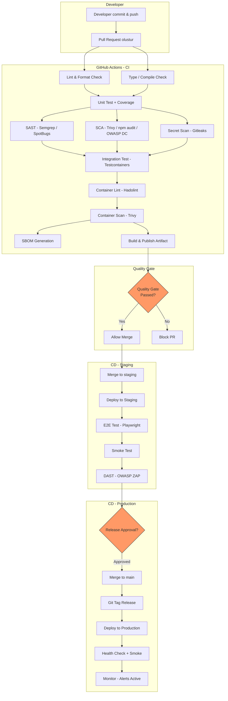

# Guvenli SDLC ve CI/CD Dokumani

> Proje: İşAkış
> Dokuman: Guvenli SDLC ve CI/CD (Secure SDLC & CI/CD)
> Durum: Draft
> Uretim tarihi: 2026-07-21
> Kaynak girdi: templates/01_PROJE_GIRDI_FORMU.yaml

---

## 1. Repository Stratejisi

### 1.1 Monorepo Yapisi

```
saha-flow/
├── .github/
│   ├── workflows/
│   │   ├── ci-web.yml
│   │   ├── ci-api.yml
│   │   ├── ci-mobile.yml
│   │   ├── security-scan.yml
│   │   ├── deploy-staging.yml
│   │   └── deploy-prod.yml
│   └── CODEOWNERS
├── web/                          # Next.js 14 Web Uygulamasi
│   ├── package.json
│   └── ...
├── api/                          # Spring Boot 3.x REST API
│   ├── pom.xml
│   └── ...
├── mobile/                       # Flutter 3.x Mobil Uygulama
│   ├── pubspec.yaml
│   └── ...
├── infrastructure/
│   ├── docker/
│   │   ├── docker-compose.yml
│   │   ├── docker-compose.staging.yml
│   │   └── docker-compose.prod.yml
│   ├── nginx/
│   ├── flyway/
│   └── terraform/                # Ileride IaC gecisi
├── docs/
├── .github/
│   └── dependabot.yml
├── .trivy.yaml
├── .hadolint.yaml
├── sbom.spdx.json
└── README.md
```

### 1.2 Erisim Kontrolu

- GitHub Organization altinda ozel repo
- Iki kisi yazma yetkili (ekip)
- Dis katkilar fork + PR ile

---

## 2. Branch Kurallari

### 2.1 Branch Stratejisi

```
main (production-ready, protected)
├── develop (integration, protected)
│   ├── feature/TKT-001-is-emri-olusturma
│   ├── feature/TKT-002-teknisyen-atama
│   └── ...
├── staging (staging deployment, protected)
└── hotfix/TKT-999-kritik-guvenlik-yamasi
```

### 2.2 Branch Koruma Kurallari (Branch Protection Rules)

| Kural | `main` | `develop` | `staging` |
|---|---|---|---|
| PR zorunlu | Evet | Evet | Evet |
| En az 1 reviewer onayi | Evet | Evet | Evet |
| CI gecmesi zorunlu | Evet | Evet | Evet |
| SAST taramasi gecmesi zorunlu | Evet | Evet | Evet |
| Secret scanning gecmesi zorunlu | Evet | Evet | Evet |
| Dismiss stale reviews | Evet | Evet | Hayir |
| Branch up-to-date zorunlu | Evet | Evet | Hayir |
| Dogrudan push yasak | Evet | Evet | Evet |
| Force push yasak | Evet | Evet | Evet |
| Branch silme kisitlamasi | Evet | Evet | Hayir |
| CODEOWNERS onayi zorunlu | Evet | Hayir | Hayir |

---

## 3. Code Review Sureci

### 3.1 PR Olusturma

- PR boyutu: Maksimum 400 satir (buyuk PR'lar bolunur)
- PR sablonu (`.github/PULL_REQUEST_TEMPLATE.md`):
  - **Degisiklik aciklamasi**
  - **Ilgili ticket/link**
  - **Test edildi mi?** (unit/integration/E2E)
  - **Guvenlik kontrolleri:** Yeni endpoint varsa `@PreAuthorize` kontrol edildi mi? Yeni kullanici girdisi varsa input validation eklendi mi? Yeni bagimlilik eklendiyse SCA taramasi yapildi mi?
  - **Migration script** varsa rollback plani belirtildi mi?
  - **Checklist:** Code review, CI gecti, SAST gecti, testler calisti, belgeleme guncellendi

### 3.2 Review Kalite Kapilari

| Kapi | Aciklama | Araclar |
|---|---|---|
| **Linting** | Kod stili ve biçimlendirme kontrolu | ESLint (web), Checkstyle (api), dart format (mobil) |
| **Tip kontrolu** | Tip guvenligi | TypeScript strict mode, Java compiler, `flutter analyze` |
| **Unit test** | En az %80 coverage (yeni kod icin %85) | Vitest, JUnit, flutter_test |
| **SAST** | Statik guvenlik analizi | Semgrep (web), SpotBugs + FindSecBugs (api), `flutter pub outdated --dependency-overrides` |
| **SCA** | Bagimlilik guvenligi | Trivy, Dependabot, `npm audit`, `mvn dependency-check` |
| **Secret scanning** | Kazaen commit edilmis secret | Gitleaks, GitHub Secret Scanning |
| **Container scanning** | Docker imaji guvenligi | Trivy, Hadolint |
| **IaC scanning** | Altyapi kodu guvenligi | Trivy (docker-compose.yml), Checkov (terraform - ileri faz) |
| **SBOM** | Software Bill of Materials | `cyclonedx-npm`, `cyclonedx-maven-plugin`, SBOM dosyasinin commit edilmesi |

---

## 4. CI/CD Pipeline

### 4.1 Mermaid CI/CD Akis Diyagramlari



### 4.2 Web CI Pipeline (`ci-web.yml`)

```yaml
name: CI - Web
on:
  pull_request:
    paths: ['web/**']
    branches: [develop, staging, main]

jobs:
  lint:
    runs-on: ubuntu-latest
    steps:
      - uses: actions/checkout@v4
      - uses: actions/setup-node@v4
        with: { node-version: '20' }
      - run: npm ci
        working-directory: web
      - run: npm run lint
      - run: npm run typecheck

  test:
    needs: lint
    runs-on: ubuntu-latest
    steps:
      - uses: actions/checkout@v4
      - uses: actions/setup-node@v4
        with: { node-version: '20' }
      - run: npm ci
        working-directory: web
      - run: npm run test -- --coverage
      - uses: actions/upload-artifact@v4
        with:
          name: web-coverage
          path: web/coverage/

  security:
    needs: lint
    runs-on: ubuntu-latest
    steps:
      - uses: actions/checkout@v4
      - name: Semgrep SAST
        uses: semgrep/semgrep-action@v1
        with:
          config: p/default
          working-directory: web
      - name: npm audit
        run: npm audit --audit-level=moderate
        working-directory: web
      - name: Gitleaks
        uses: gitleaks/gitleaks-action@v2
```

### 4.3 API CI Pipeline (`ci-api.yml`)

```yaml
name: CI - API
on:
  pull_request:
    paths: ['api/**']
    branches: [develop, staging, main]

jobs:
  build-test:
    runs-on: ubuntu-latest
    services:
      postgres:
        image: postgis/postgis:15-3.4
        env:
          POSTGRES_DB: sahaflow_test
          POSTGRES_USER: test_user
          POSTGRES_PASSWORD: test_pass
        ports: ['5432:5432']

    steps:
      - uses: actions/checkout@v4
      - uses: actions/setup-java@v4
        with:
          java-version: '21'
          distribution: 'temurin'

      - name: Maven Build + Unit Tests
        run: mvn verify -pl api -Punit-tests

      - name: Integration Tests (Testcontainers)
        run: mvn verify -pl api -Pintegration-tests

      - name: SAST - SpotBugs + FindSecBugs
        run: mvn spotbugs:check -pl api

      - name: SCA - OWASP Dependency Check
        run: mvn dependency-check:check -pl api

      - name: SBOM Generation
        run: mvn cyclonedx:makeAggregateBom -pl api

      - name: Upload SBOM
        uses: actions/upload-artifact@v4
        with:
          name: api-sbom
          path: api/target/bom.json

  container:
    needs: build-test
    runs-on: ubuntu-latest
    steps:
      - uses: actions/checkout@v4
      - name: Hadolint
        run: hadolint infrastructure/docker/Dockerfile.api
      - name: Build Image
        run: docker build -t sahaflow-api:${{ github.sha }} -f infrastructure/docker/Dockerfile.api api/
      - name: Trivy Container Scan
        uses: aquasecurity/trivy-action@master
        with:
          image-ref: sahaflow-api:${{ github.sha }}
          format: 'sarif'
          output: 'trivy-api.sarif'
          severity: 'CRITICAL,HIGH'
          exit-code: 1
```

### 4.4 Mobil CI Pipeline (`ci-mobile.yml`)

```yaml
name: CI - Mobile
on:
  pull_request:
    paths: ['mobile/**']
    branches: [develop, staging, main]

jobs:
  analyze-test:
    runs-on: ubuntu-latest
    steps:
      - uses: actions/checkout@v4
      - uses: subosito/flutter-action@v2
        with:
          flutter-version: '3.24'
          channel: 'stable'

      - run: flutter pub get
        working-directory: mobile

      - name: Static Analysis
        run: flutter analyze
        working-directory: mobile

      - name: Format Check
        run: dart format --set-exit-if-changed lib/ test/
        working-directory: mobile

      - name: Unit + Widget Tests
        run: flutter test --coverage
        working-directory: mobile

      - name: Pub Outdated Check
        run: flutter pub outdated --dependency-overrides --no-dev-dependencies
        working-directory: mobile
```

---

## 5. Secret Yonetimi

| Ortam | Yontem | Arac |
|---|---|---|
| Yerel gelistirme | `.env` dosyasi (`.gitignore`'da), `application-local.yml` | dotenv |
| CI/CD | GitHub Actions Secrets, OIDC (OpenID Connect) | GitHub Secrets |
| Staging | Docker Compose `.env.staging` (manuel deployment), HashiCorp Vault (ileri faz) | - |
| Production | HashiCorp Vault (hedef), gecis donemi Docker Compose `.env.prod` (sunucuda, erisim kisitli) | Vault |
| Mobil | Build-time environment degiskenleri, flutter_secure_storage (runtime) | --dart-define |

**Secret Turleri:**
- `DB_PASSWORD`, `DB_MIGRATION_PASSWORD`, `DB_AUDIT_PASSWORD`: Veri tabani sifreleri
- `JWT_SIGNING_KEY`: JWT imzalama anahtari (en az 256-bit)
- `S3_ACCESS_KEY`, `S3_SECRET_KEY`: MinIO erisim anahtari
- `WEBHOOK_SIGNING_KEY`: Webhook HMAC anahtari
- `EMAIL_API_KEY`: E-posta servisi API anahtari
- `ENCRYPTION_KEY`: Uygulama icinde hassas veri sifreleme anahtari

---

## 6. Bagimlilik Guncelleme Politikasi

| Bilesen | Guncelleme Araci | Periyot | Politika |
|---|---|---|---|
| NPM paketleri (web) | Dependabot | Haftalik | Patch: otomatik merge. Minor: review sonrasi merge. Major: ayri planlama. |
| Maven bagimliliklari (api) | Dependabot | Haftalik | Patch: otomatik merge. Minor: review sonrasi merge. Major: ayri planlama. |
| Flutter / Dart paketleri (mobil) | Dependabot | Haftalik | Patch: otomatik merge. Minor: review sonrasi merge. |
| Docker base image | Dependabot | Haftalik | Eclipse Temurin 21 (Java), Node 20 Alpine, Flutter 3.24, PostgreSQL 15, MinIO RELEASE |
| Guvenlik zafiyeti (kritik/yuksek) | Manuel + Dependabot | Surekli | 48 saat icinde patch cikilmasi, gerekiyorsa acil hotfix sureci |
| Guvenlik zafiyeti (orta/dusuk) | Dependabot | Haftalik | Sonraki planli surume dahil edilir |

---

## 7. Artifact Butunlugu

| Yontem | Aciklama |
|---|---|
| Git tag imzalama | Annotated tag + GPG ile imzalanir |
| Docker imaji Ozel Registry | GitHub Container Registry (GHCR) veya Docker Hub (private repo) |
| Image tag | Semantic versioning: `v1.2.3`, `latest` sadece staging'de |
| Manifest digest | Deployment'ta `image@sha256:...` kullanilir, floating tag kullanilmaz |
| SBOM | Her build'de CycloneDX formatinda SBOM uretilir, artifact ile birlikte saklanir |
| Provenance attestation | SLSA Level 2, OIDC bazli, Cosign ile imza (hedef) |

---

## 8. Ortam Ayrimi (Environment Separation)

| Ortam | Amac | Veri | Deployment |
|---|---|---|---|
| **Local** | Gelistirme | Docker Compose, test verisi, local DB | Manuel |
| **CI** | Pipeline | Gecici (ephemeral) PostgreSQL container | Otomatik (PR'da) |
| **Staging** | Production benzeri, test | Anonimlestirilmis production kopyasi, sentetik veri | Otomatik (`develop` merge sonrasi) |
| **Production** | Canli | Gercek veri | Otomatik (manuel release onayi sonrasi) |

**Kesin Kurallar:**
- Production verisi asla staging veya dev ortamina kopyalanmaz (anonimlestirilmedikce)
- Production ortamina sadece CI/CD pipeline'i uzerinden deployment yapilir
- Staging ve production icin farkli secret set'leri kullanilir
- Staging ve production farkli sunucularda / VPS'lerde calisir (minimum ayrim)
- Docker Compose dosyalari her ortam icin ayridir

---

## 9. Deployment Sirasi

### 9.1 Staging Deployment

```
PR merge to develop
  -> CI API build + test
  -> CI Web build + test
  -> CI Mobile build + test
  -> Docker image build + push (staging tag)
  -> SSH to staging server
  -> docker compose pull
  -> Flyway migration (staging DB)
  -> docker compose up -d
  -> Health check (HTTP 200 loop)
  -> E2E test (Playwright)
  -> Smoke test
  -> DAST (OWASP ZAP)
  -> Başarılı: staging deploy complete
```

### 9.2 Production Deployment

```
Staging tum testlerden gecmis
  -> Release Manager onayi (manuel)
  -> PR merge develop to main
  -> Git tag: vX.Y.Z (semver)
  -> CI API build + test (main branch)
  -> CI Web build + test (main branch)
  -> Docker image build + push (production tag + vX.Y.Z)
  -> SBOM + attestation uretimi
  -> SSH to production server
  -> Otomatik backup (pre-deployment)
  -> Flyway migration (production DB)
  -> docker compose pull
  -> Rolling update (docker compose up -d --no-deps)
  -> Health check (max 30 saniye retry)
  -> Smoke test (critical path API calls)
  -> Monitor (ilk 15 dakika yakin takip)
  -> Deploy success notification
```

### 9.3 Rollback Planlari

| Senaryo | Rollback Yontemi | Geri Donus Suresi |
|---|---|---|
| Migration hatasi | Flyway undo (geri alinabilir migration'lar icin) veya migration oncesi backup'tan restore | ~30 dakika |
| Kod hatasi (bug) | `docker compose up -d` ile onceki image tag'ine donme (image silinmemis) | ~5 dakika |
| Veri bozulmasi | Son yedekten Point-in-Time Recovery (PITR) | ~2 saat |
| Tam sistem cokusu | Felaket kurtarma plani (DR) | ~4 saat |

---

## 10. Kanit ve Rapor Saklama

| Rapor Turu | Saklama Suresi | Saklama Yeri |
|---|---|---|
| CI/CD pipeline loglari | 90 gun | GitHub Actions (varsayilan) |
| SAST/SCA raporlari | 1 yil | Build artifact + loki |
| SBOM dosyasi | Surum yasam dongusu boyunca | Repo + artifact store |
| Container scanning raporu | 1 yil | Build artifact |
| Test coverage raporu | 90 gun | Artifact store |
| E2E test raporu | 90 gun | Artifact store |
| Deployment denetim logu | 2 yil | Loki + PostgreSQL `deployment_log` tablosu |
| Release onayi | 1 yil | GitHub Release + commit mesaji |

---

## 11. Tedarik Zinciri Guvenligi (Supply Chain Security)

| Kontrol | Deger |
|---|---|
| Bagimlilik pinning | Tum bagimliliklar kilit dosyasinda sabitlenir (`package-lock.json`, `pom.xml` checksum, `pubspec.lock`) |
| Private package registry | NPM/Maven/Dart packages sadece resmi registry'den |
| Image base scanning | Tum Docker base imagel'er Trivy ile taranir |
| Image signing | Cosign ile imzalama (hedef) |
| SBOM | Her surumde CycloneDX SBOM uretimi ve saklama |
| Provenance | SLSA Level 2 uyumluluk (hedef) |
| Dependabot | Tum bagimlilik ekosistemleri icin aktif |
| Fork guvenligi | Fork'tan gelen PR'lar secrets'a erisemez |

---

## 12. KVKK Uyumluluk Kontrolleri (CI/CD Icinde)

| Kontrol | Entegrasyon Noktasi |
|---|---|
| Hassas veri taramasi (log) | CI log ciktisinda regex taramasi (TC kimlik, kredi karti pattern) |
| Veri maskeleme dogrulamasi | Integration test: log ciktilari regex ile taranir |
| KVKK meta kontrol | PR checklist: yeni veri toplaniyorsa KVKK dokumani guncellendi mi? |

---

## Karar Bekleyen Konular

1. GitHub Actions maliyet kontrolu: Aylik free tier dakikasi (2000dk) 2 kisilik ekip icin yeterli mi? (Su an yeterli gorunuyor.)
2. HashiCorp Vault entegrasyon zamani: MVP sonrasi mi, MVP sirasinda mi?
3. SLSA Level 2 / Cosign imzalama: Hangi fazda devreye alinacak?
4. Staging ortami icin ayri VPS bütcesi onayi
5. OIDC ile MinIO baglantisi: GitHub Actions'tan self-hosted MinIO'ya OIDC dogrulamasi kurulumu

## Ilgili Dokumanlar

- `10_THREAT_MODEL.md` — Tehdit Modeli
- `11_PRIVACY_KVKK.md` — KVKK Uyumluluk ve Gizlilik
- `13_TEST_STRATEGY.md` — Test Stratejisi
- `14_DEVOPS_OBSERVABILITY_DR.md` — DevOps, Gozlemlenebilirlik ve Felaket Kurtarma
- `15_ADR.md` — Mimari Karar Kayitlari
